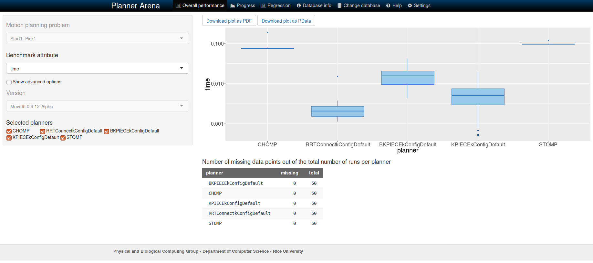

Benchmarking
=====================

Getting Started
---------------
If you haven't already done so, make sure you've completed the steps in `Getting Started <../getting_started/getting_started.html>`_.

The :moveit_codedir:`benchmarking package <moveit_ros/benchmarks>` provides methods to benchmark motion planning algorithms and aggregate/plot statistics using the OMPL Planner Arena.
The example below demonstrates how the benchmarking can be run for a Panda robot arm.

Example
-------
An example is provided in the ``examples`` folder. The launch file requires a MoveIt configuration package
for the Panda robot arm available from `here <https://github.com/ros-planning/panda_moveit_config>`_.

To run:

#. Launch the panda_moveit_config ``demo.launch``: ::

    roslaunch panda_moveit_config demo.launch db:=true

#. Within the *Motion Planning* RViz plugin, connect to the database by pressing the *Connect* button in the *Context* tab.
#. Save a scene on the *Stored Scenes* tab and name it ``Kitchen1`` by double clicking the scene in the list.
#. Move the start and goal states of the Panda arm by using the interactive markers.
#. Save an associated query for the ``Kitchen1`` scene and name the query ``Pick1``.
#. Also save a start state for the robot on the *Stored States* tab and name it ``Start1``.
#. The config file ``moveit_ros/benchmarks/examples/demo1.yaml`` refers to the scenes, queries and start states used for benchmarking. Modify them appropriately.
#. Bring down your previous launch file (``ctrl+c``).
#. Change the location ``output_directory`` to export the benchmarked files::

    rosed moveit_ros_benchmarks demo1.yaml

#. Run the benchmarks: ::

    roslaunch moveit_ros_benchmarks demo_panda.launch

Viewing Results
---------------

The benchmarks are executed and many interesting parameters are aggregated and written to a log file.  A script (``moveit_benchmark_statistics.py``) is supplied to parse this data and plot the statistics.

Run: ::

  rosrun moveit_ros_benchmarks moveit_benchmark_statistics.py <path_of_logfile>

To generate a PDF of plots: ::

  python moveit_benchmark_statistics.py -p <plot_filename> <path_of_logfile>

Alternatively, upload the database file generated by ``moveit_benchmark_statistics.py`` to `plannerarena.org <http://plannerarena.org>`_ and interactively visualize the results.

Parameters of the BenchmarkOptions Class
----------------------------------------

This class reads in parameters and options for the benchmarks to run from the ROS parameter server.  The format of the parameters is assumed to be in the following form: ::

  benchmark_config:

    warehouse:
        host: [hostname/IP address of ROS Warehouse node]                            # Default localhost
        port: [port number of ROS Warehouse node]                                    # Default 33829
        scene_name: [Name of the planning scene to use for benchmarks]               # REQUIRED

    parameters:
        runs: [Number of runs for each planning algorithm on each request]           # Default 10
        group: [The name of the group to plan]                                       # REQUIRED
        timeout: [The maximum time for a single run; seconds]                        # Default 10.0
        output_directory: [The directory to write the output to]                     # Default is current working directory

        start_states: [Regex for the stored start states in the warehouse to try]    # Default ""
        path_constraints: [Regex for the path constraints to benchmark]              # Default ""
        queries: [Regex for the motion plan queries in the warehouse to try]         # Default .*
        goal_constraints: [Regex for the goal constraints to benchmark]              # Default ""
        trajectory_constraints: [Regex for the trajectory constraints to benchmark]  # Default ""

        workspace: [Bounds of the workspace the robot plans in.  This is an AABB]    # Optional
            frame_id: [The frame the workspace parameters are specified in]
            min_corner: [Coordinates of the minimum corner of the AABB]
                x: [x-value]
                y: [y-value]
                z: [z-value]
            max_corner: [Coordinates of the maximum corner of the AABB]
                x: [x-value]
                y: [y-value]
                z: [z-value]

    planning_pipelines:
        - name: [Name of the planning pipeline used as relative parameter namespace] # REQUIRED
          planners:                                                                  # REQUIRED
            - A list of planners
            - available in the
            - planning pipeline
            - to benchmark the
            - queries in.
        - name: ...
            - ...

Parameters of the BenchmarkExecutor Class
-----------------------------------------

This class creates a set of ``MotionPlanRequests`` that respect the parameters given in the supplied instance of ``BenchmarkOptions`` and then executes the requests on each of the planners specified.  From the ``BenchmarkOptions``, queries, ``goal_constraints``, and ``trajectory_constraints`` are treated as separate queries.  If a set of ``start_states`` is specified, each query, ``goal_constraint``, and ``trajectory_constraint`` is attempted with each start state (existing start states from a query are ignored).  Similarly, the (optional) set of path constraints is combined combinatorially with the start query and start ``goal_constraint`` pairs (existing ``path_constraint`` from a query are ignored).  The workspace, if specified, overrides any existing workspace parameters.

The benchmarking pipeline does not utilize ``MoveGroup``.
Instead, the planning pipelines are initialized and run directly including all specified ``PlanningRequestAdapters``.
This is especially useful for benchmarking the effects of smoothing adapters.

It is possible to customize a benchmark run by deriving a class from ``BenchmarkExecutor`` and overriding one or more of the virtual functions.
For instance, overriding the functions ``initializeBenchmarks()`` or ``loadBenchmarkQueryData()`` allows to specify the benchmark queries directly and to provide a custom planning scene without using ROS warehouse.
An example is the custom benchmark ``CombinePredefinedPosesBenchmark`` which expects a list of predefined joint states and then creates queries for all pair-wise combinations.
See the config file ``demo_panda_predefined_poses.yaml`` for how to configure the poses.
You can run this example with: ::

  roslaunch moveit_ros_benchmarks demo_panda_predefined_poses.launch

Additionally, a set of functions exists for ease of customization in derived classes:

- ``preRunEvent``: invoked immediately before each call to solve
- ``postRunEvent``: invoked immediately after each call to solve
- ``plannerSwitchEvent``: invoked when the planner changes during benchmarking
- ``querySwitchEvent``: invoked before a new benchmark problem begin execution

Note, in the above, a benchmark is a concrete instance of a ``PlanningScene``, start state, goal constraints / ``trajectory_constraints``, and (optionally) ``path_constraints``.  A run is one attempt by a specific planner to solve the benchmark.

Benchmarking of Different Motion Planners: CHOMP, STOMP and OMPL
----------------------------------------------------------------

This section contains the instructions for benchmarking different motion planners present in MoveIt: CHOMP, STOMP and OMPL. These planners can be compared with each other for a well defined benchmark (which is for the same environment, start states, queries and goal states). Different metrics for each of the planners can be reported to get quantitative statistics which could aid in proper selection of a particular planner in a defined environment. The statistics reported for each of the planners includes: time taken to compute the path, path length, path time, whether a valid path was found or not, etc.

Benchmarking in a scene without obstacles
+++++++++++++++++++++++++++++++++++++++++

To benchmark different planners in a simple environment without obstacles, open one terminal and follow the steps in the `Example section <../benchmarking/benchmarking_tutorial.html#example>`_ at the top of this page. In the last two steps instead of editing ``demo1.yaml`` and launching ``demo_panda.launch``, edit ``demo_panda_all_planners.yaml`` and launch ``demo_panda_all_planners.launch``.

Benchmarking in a scene with obstacles
++++++++++++++++++++++++++++++++++++++

To benchmark motion planners in a scene filled with obstacles, open two terminals. In the first terminal start RViz and wait for everything to finish loading: ::

  roslaunch panda_moveit_config demo.launch db:=true

In the second terminal, run either of the two commands: ::

  rosrun moveit_tutorials collision_scene_example.py sparse

or: ::

  rosrun moveit_tutorials collision_scene_example.py cluttered

Now follow these steps:

#. Within the *Motion Planning* RViz plugin, connect to the database by pressing the *Connect* button in the *Context* tab.
#. Save a scene on the *Stored Scenes* tab and name it ``ObstaclesScene`` by double clicking the scene in the list.
#. Move the start and goal states of the Panda arm by using the interactive markers.
#. Save an associated query for the ``ObstaclesScene`` scene and name the query ``Pick1``.
#. Also save a start state for the robot on the *Stored States* tab and name it ``Start1``.
#. The config file ``moveit_ros/benchmarks/examples/demo_obstacles.yaml`` refers to the scenes, queries and start states used for benchmarking. Modify them appropriately.
#. Bring down your previous launch file (``ctrl+c``).
#. Change the location ``output_directory`` to export the benchmarked files::

    rosed moveit_ros_benchmarks demo_obstacles.yaml

#. Run the benchmarks: ::

    roslaunch moveit_ros_benchmarks demo_panda_all_planners_obstacles.launch

To view the results follow the same steps as listed in the `Viewing Results <../benchmarking/benchmarking_tutorial.html#viewing-results>`_ section above. After loading the database into Planner arena, different statistics can be analysed about each of the planners by choosing the required benchmark attribute from the drop down list (see `figure <../../_images/planners_benchmark.png>`_). See image below for analysis of time taken by each of the planners to compute the solution for a sample benchmark.

