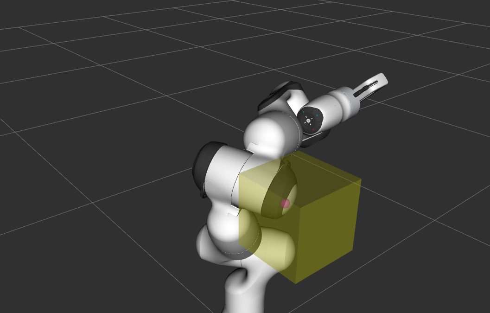
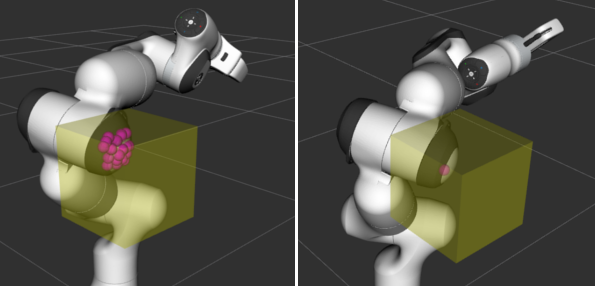
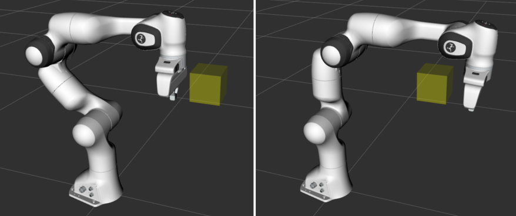
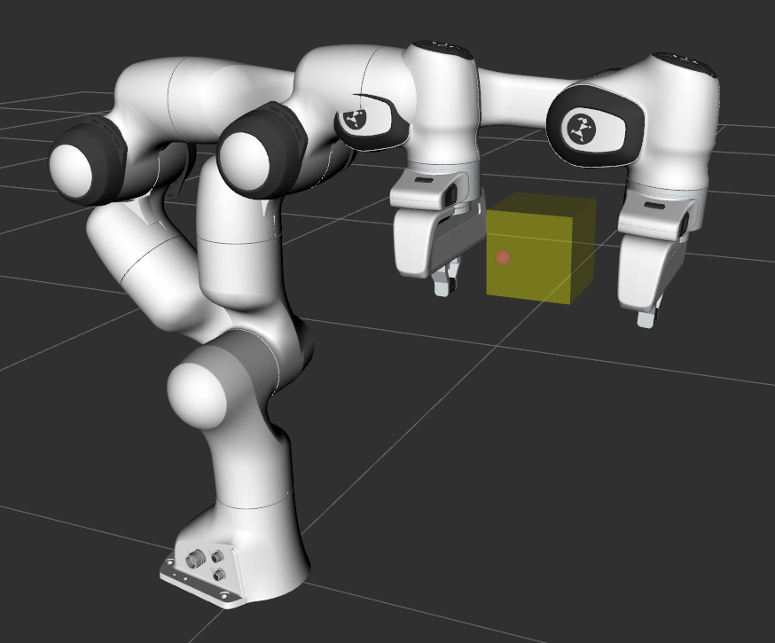

Using Bullet for Collision Checking
===================================

In addition to the Flexible Collision Library (FCL), `Bullet Collision Detection <https://pybullet.org/wordpress/>`_ is available as a collision checker. The tutorial builds on top of the `Visualizing Collisions <../visualizing_collisions/visualizing_collisions_tutorial.html>`_ tutorial to show collisions.

Furthermore, Continuous Collision Detection (CCD) is available and demonstrated with Bullet.

Getting Started
---------------
If you haven't already done so, make sure you've completed the steps in `Getting Started <../getting_started/getting_started.html>`_.

Running the Code
----------------
Roslaunch the launch file to run the code directly from moveit_tutorials: ::

 roslaunch moveit_tutorials bullet_collision_checker_tutorial.launch

You should now see the Panda robot and a box both with interactive markers which you can drag around. Note that different to FCL, Bullet does not calculate all individual contact points for a shape but only the point of deepest penetration.

   ..

   Left: FCL collision results. Right: Bullet collision results.

Please note that the current implementation of Bullet as a collision detector is not thread safe as the internal collision managers are mutable members.

Continuous Collision Detection
^^^^^^^^^^^^^^^^^^^^^^^^^^^^^^

Additionally, Bullet has continuous collision capabilities. This means that it can be guaranteed that no collision occurs during the transition between two discrete robot states with the environment. To get a demonstration of the CCD click the ``Next`` button of the ``moveit_visual_tools`` panel on the bottom left in RViz. The interactive robot disappears and the robot appears in a state where its hand is just behind a box. On pressing next again, the robot jumps to a configuration where the hand is right in front of the box. In both states, no collision is detected (see terminal output).

   ..

   Left: robot in configuration 1. Right: robot in configuration 2.

On a following ``Next``, CCD is performed using a casted robot model between the two discrete poses. A collision is reported
(see terminal output for details).

Pressing ``Next`` one more time finishes the tutorial.

Relevant Code
-------------
The entire code can be seen :codedir:`here <bullet_collision_checker>` in the moveit_tutorials GitHub project. A lot of information necessary for understanding how this demo works is left out to keep this tutorial focused on Bullet. Please see `Visualizing Collisions <../visualizing_collisions/visualizing_collisions_tutorial.html>`_ for code explanation regarding the visualizing of the collisions.

.. tutorial-formatter:: ./src/bullet_collision_checker_tutorial.cpp

Launch file
-----------
The entire launch file is  :codedir:`here <bullet_collision_checker>` on GitHub. All the code in this tutorial can be compiled and run from the ``moveit_tutorials`` package.
