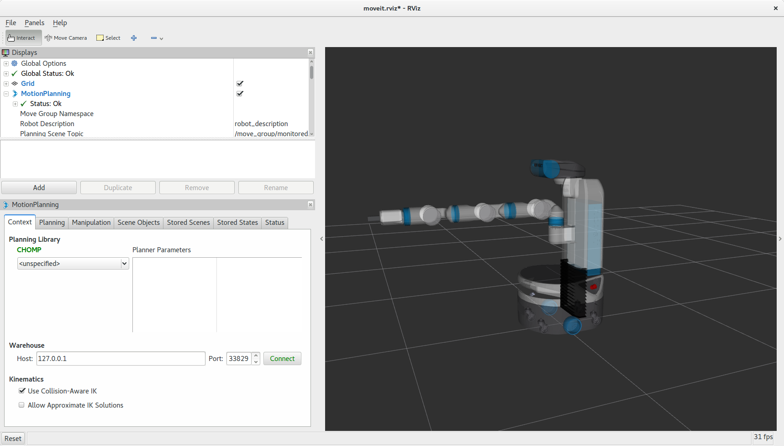

CHOMP Interface
===============

**Note:** *The chomp planner has not been tested extensively yet.*

Run Generic Demo for Fanuc M-10iA
---------------------------------

To run the demo you'll need the `moveit_resources <https://github.com/ros-planning/moveit_resources>`_ package.

Once you have this package simply run::

 roslaunch moveit_resources demo_chomp.launch

Applying CHOMP with your own robot
-------------------------------

Assumptions
============

 1. You have the latest version of moveit installed. On ROS kinetic you may need to build it from source.
 2. You have a moveit configuration package for your robot already. For example, if you have a `Fetch robot <http://fetchrobotics.com/platforms-research-development>`_, it's probably called `fetch_moveit_config <https://github.com/fetchrobotics/fetch_ros/tree/indigo-devel/fetch_moveit_config>`_. This is typically built using the Moveit Setup Assistant.

Step to apply CHOMP
====================

1. Simply download `chomp_planning_pipeline.launch.xml <https://github.com/ros-planning/moveit_resources/blob/master/fanuc_moveit_config/launch/chomp_planning_pipeline.launch.xml>`_ file into the launch directory of your moveit config package. So into the *fetch_moveit_config/launch* directory.
2. Adjust the line `<rosparam command="load" file="$(find moveit_resources)/fanuc_moveit_config/config/chomp_planning.yaml" />` to `<rosparam command="load" file="$(find fetch_moveit_config)/config/chomp_planning.yaml" />`
3. Download `chomp_planning.yaml <https://github.com/ros-planning/moveit_resources/blob/master/fanuc_moveit_config/config/chomp_planning.yaml>`_ file into the config directory of your moveit config package. So into the *fetch_moveit_config/config* directory.
4. Copy the *demo.launch* file to *demo_chomp.launch*. Note that this file is also in the launch directory of the *fetch_moveit_config* package.
5. Find the lines where *move_group.launch* is included and change it to::

    <include file="$(find fetch_moveit_config)/launch/move_group.launch">
      <arg name="allow_trajectory_execution" value="true"/>
      <arg name="fake_execution" value="true"/>
      <arg name="info" value="true"/>
      <arg name="debug" value="$(arg debug)"/>
      <arg name="pipeline" value="chomp" />
    </include>

You probably only need to change/add the `pipeline` arg to `chomp`.

6. Run the demo::
       
    roslaunch fetch_moveit_config demo_chomp.launch

7. On `Context` tab on RViz, you should be able to choose `CHOMP` in `Planning Library` pulldown menu (see the image).

