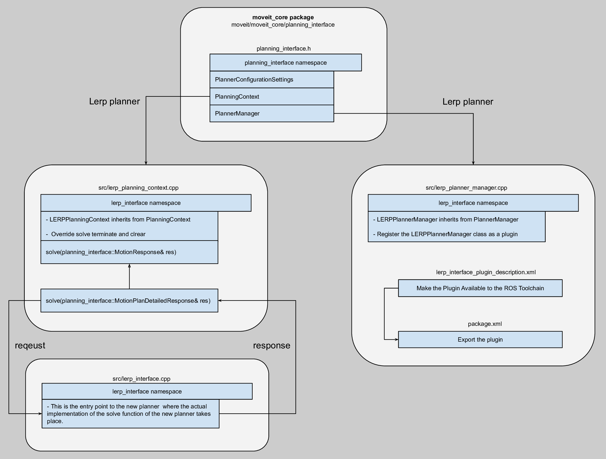

Creating MoveIt Plugins
========================
`This Page <http://wiki.ros.org/pluginlib>`_ gives a detailed explanation of how to add plugins in ROS in general. The two necessary elements are base and plugin classes. The plugin class inherits from the base class and overrides its virtual functions. The main library used for this purpose is pluginlib. This tutorials contains three different types of plugins, namely, motion planner, controller manager and constraint sampler.

Motion Planner Plugin
----------------------
In this section, we will show how to add a new motion planner to MoveIt as a plugin. The base class in MoveIt is ``planning_interface`` from  which any new planner plugin should inherit. For demonstration purposes, a linear interpolation planner (lerp) which plans the motion between two states in joint space is created. This planner could be used as a start point for adding any new planner as it contains the necessary basics. The final source files designed in this tutorial are available :codedir:`here <creating_moveit_plugins/lerp_motion_planner/src>`. The following graph shows a brief overall view of the relation between classes for adding a new planner in MoveIt.

First we create the plugin class in the  ``moveit_tutorials`` package. To make the plugin class for ``lerp``, create a file named ``lerp_planner_manager.cpp`` in src folder. In this file, ``LERPPlanPlannerManager`` overrides the functions of ``PlannerManager`` class from ``planning_interface``. In the end of this file, we need to register ``LERPPlanPlannerManager`` class as a plugin, this is done by ``CLASS_LOADER_REGISTER_CLASS`` macro from ``class_loader``: ::

  CLASS_LOADER_REGISTER_CLASS(emptyplan_interface::EmptyPlanPlannerManager, planning_interface::PlannerManager);

Next we create the ``LERPPlanningContext`` class that overrides the functions of ``PlanningContext``. This class will override the solve function where the planner solves the problem and returns the solution. As the solve function implementation may need many classes from the planner code base, it is more readable to make another class called ``LERPInterface`` where the actual implementation of the planner solve method will take place. Basically, this class is the entry point to the new motion planner algorithm. The response in this solve function is prepared in the type of ``moveit_msgs::MotionPlanDetailedResponse`` which is converted to ``planning_interface::MotionPlanDetailedResponse`` in ``LERPPlanningContext`` class.

Moreover, ``PlannerConfigurationSettings`` could be used to pass the planner-specific parameters. Another way to pass these parameters is using ROS param server which reads from a yaml file. In this tutorial, for our lerp planner, we use ``lerp_planning.yaml`` in ``panda_moveit_config`` package that contains only one parameter, ``num_steps`` which gets loaded in ``lerp_interface`` whenever its solve function is called.

Export the plugin
^^^^^^^^^^^^^^^^^^

First, we need to make the plugin available to the ROS Toolchain. To this end, a plugin description xml file (``emptyplan_interface_plugin_description.xml``) containing the ``library`` tag with the following options should be created: ::

  <library  path="libmoveit_emptyplan_planner_plugin">
    <class name="emptyplan_interface/EmptyPlanPlanner" type="emptyplan_interface::EmptyPlanPlannerManager" base_class_type="planning_interface::PlannerManager">
     <description>
     </description>
    </class>
  </library>

Then, to export the plugin, we use the address of the above xml file and the ``export`` tag in package.xml file: ::

 <export>
    <moveit_core plugin="${prefix}/emptyplan_interface_plugin_description.xml"/>
 </export>

Note that the name of the tag, ``moveit_core``, is the same as that of the package where the base class, ``planning_interface``, lives in.

Check the plugin
^^^^^^^^^^^^^^^^^
With the following command, one can verify if the new plugin is created and exported correctly or not: ::

  rospack plugins --attrib=plugin moveit_core

The result should contain ``moveit_planners_lerp`` with the address of the plugin description xml file: ::

  moveit_tutorials <ros_workspace>/src/moveit_tutorials/creating_moveit_plugins/lerp_motion_planner/lerp_interface_plugin_description.xml

Plugin usage
^^^^^^^^^^^^^

In this subsection, we explain how to load and use the lerp planner that we have created previously. To this end, a ros node called ``lerp_example.cpp`` is created. The first step is to get the state and  group of joints of the robot that are related to the requested planning group as well as the planning scene by the following lines of code: ::

  moveit::core::RobotStatePtr robot_state(new moveit::core::RobotState(robot_model));
  const moveit::core::JointModelGroup* joint_model_group = robot_state->getJointModelGroup(PLANNING_GROUP);
  const std::vector<std::string>& joint_names = joint_model_group->getVariableNames();
  planning_scene::PlanningScenePtr planning_scene(new planning_scene::PlanningScene(robot_model));

The next step is to load the planner using pluginlib and set the parameter ``planner_plugin_name`` to the one that we have created: ::

    boost::scoped_ptr<pluginlib::ClassLoader<planning_interface::PlannerManager>> planner_plugin_loader;
    planning_interface::PlannerManagerPtr planner_instance;
    std::string planner_plugin_name =  "lerp_interface/LERPPlanner";
    node_handle.setParam("planning_plugin", planner_plugin_name);

Having the planner loaded, it is time to set the start and goal state for the motion planning problem. The start state is the current state of the robot which is set to ``req.start_state``. On the other hand, the goal constraint is set by creating a ``moveit_msgs::Constraints`` using the goal state and the joint model group. This constraint is fed to ``req.goal_constraint``. The following code shows how to do these steps: ::

  // Get the joint values of the start state and set them in request.start_state
  std::vector<double> start_joint_values;
  robot_state->copyJointGroupPositions(joint_model_group, start_joint_values);
  req.start_state.joint_state.position = start_joint_values;

  // Goal constraint
  moveit::core::RobotState goal_state(robot_model);
  std::vector<double> joint_values = { 0.8, 0.7, 1, 1.3, 1.9, 2.2, 3 };
  goal_state.setJointGroupPositions(joint_model_group, joint_values);
  moveit_msgs::Constraints joint_goal = kinematic_constraints::constructGoalConstraints(goal_state, joint_model_group);
  req.goal_constraints.clear();
  req.goal_constraints.push_back(joint_goal);

So far, we have loaded the planner and created the start and goal state for the motion planning problem but we have not solved the problem yet. Solving the motion planning problem in the joint state by the given information about the start and goal state is done by creating a ``PlanningContext`` instance and call its solve function. Remember that the response passed to this solve function should be of type ``planning_interface::MotionPlanResponse``: ::

    planning_interface::PlanningContextPtr context = planner_instance->getPlanningContext(planning_scene, req, res.error_code_);

Finally, to run this node, we need to roslaunch lerp_example.launch in launch folder. This launch file launches the ``demo.launch`` of package ``panda_moveit_config`` by passing ``lerp`` as the name of the planner. Then, ``lerp_example`` gets launched and ``lerp_planning.yaml`` is loaded to set the lerp-specific parameters to ROS Parameter Server.

Example Controller Manager Plugin
----------------------------------

MoveIt controller managers, somewhat a misnomer, are the interfaces to your custom low level controllers. A better way to think of them are *controller interfaces*. For most use cases, the included :moveit_codedir:`MoveItSimpleControllerManager <moveit_plugins/moveit_simple_controller_manager>` is sufficient if your robot controllers already provide ROS actions for FollowJointTrajectory. If you use *ros_control*, the included :moveit_codedir:`MoveItRosControlInterface <moveit_plugins/moveit_ros_control_interface>` is also ideal.

However, for some applications you might desire a more custom controller manager. An example template for starting your custom controller manager is provided :codedir:`here <controller_configuration/src/moveit_controller_manager_example.cpp>`.

Example Constraint Sampler Plugin
----------------------------------

* Create a ``ROBOT_moveit_plugins`` package and within that a sub-folder for your ``ROBOT_constraint_sampler`` plugin. Modify the template provided by ``ROBOT_moveit_plugins/ROBOT_moveit_constraint_sampler_plugin``
* In your ``ROBOT_moveit_config/launch/move_group.launch`` file, within the ``<node name="move_group">``, add the parameter: ::

  <param name="constraint_samplers" value="ROBOT_moveit_constraint_sampler/ROBOTConstraintSamplerAllocator"/>

* Now when you launch move_group, it should default to your new constraint sampler.
