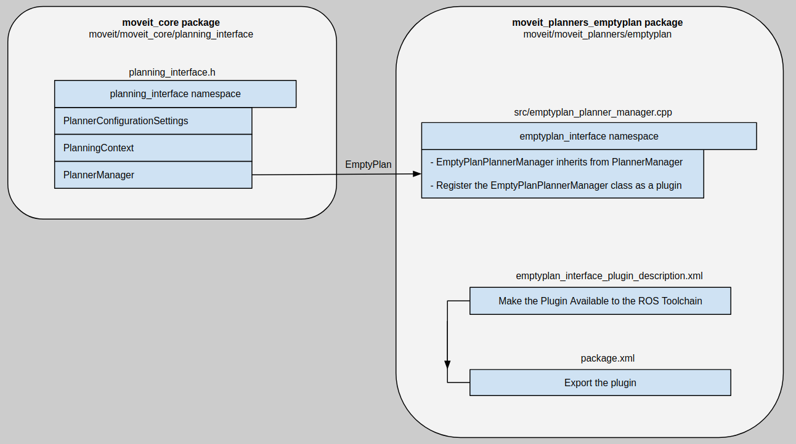

Creating Planner Plugin Template
===============================
In this section, we will show how to add a new motion planner to MoveIt as a plugin. This is going to be a template planner which has the basics to run as a plugin for MoveIt. It does not actually do any sort of planning but it is just a start point for adding new planners.

`This <http://wiki.ros.org/pluginlib>`_ gives a detailed explanantion of how to add plugins in ROS in general. The two necessary elements are base and plugin classes. The plugin class inherits from the base class and overrides its virtual functions. In MoveIt, ``planning_interface`` is defined as the base class from which any new planner plugin should inherit. For demonstration purposes, let's call the new planner ``emptyplan``. Create a folder with this name in the src directory. The following graph shows a brief overall view of the relation between packages and classes for adding a new template planner in MoveIt.

``moveit_planners_emptyplan`` is the the plugin package. To make the plugin class for ``emptyplan``, create a file named ``emptyplan_planner_manager.cpp`` in src folder. In this file, ``EmptyPlanPlannerManager`` overrides the functions of ``PlannerManager`` class from ``planning_interface``. Moreover, ``PlanningContext`` is another class containing solve function where the planner solves the problem and returns the solution. However, in this tutorial we do not define this function as we only have a template planner. In the end, we need to register ``EmptyPlanPlannerManager`` class as a plugin, this is done by ``CLASS_LOADER_REGISTER_CLASS`` macro from ``class_loader``: ::

  CLASS_LOADER_REGISTER_CLASS(emptyplan_interface::EmptyPlanPlannerManager, planning_interface::PlannerManager);

Export the plugin
-----------------

First, we need to make the plugin available to the ROS Toolchin. To this end, a plugin description xml file (``emptyplan_interface_plugin_description.xml``) containing the ``library`` tag with the following options should be created: ::

  <library  path="libmoveit_emptyplan_planner_plugin">
    <class name="emptyplan_interface/EmptyPlanPlanner" type="emptyplan_interface::EmptyPlanPlannerManager" base_class_type="planning_interface::PlannerManager">
     <description>
     </description>
    </class>
  </library>

Then, to export the plugin, we use the address of the above xml file and the ``export`` tag in package.xml file: ::

 <export>
    <moveit_core plugin="${prefix}/emptyplan_interface_plugin_description.xml"/>
 </export>

Note that the name of the tag, ``moveit_core``, is the same as that of the package where the base class, ``planning_interface``, lives in.

Check the plugin
-----------------
With the following command, one can verify if the new plugin is created and exported correctly or not: ::

  rospack plugins --attrib=plugin moveit_core

The result should containt ``moveit_planners_emptyplan`` with the address of the plugin description xml file: ::

  moveit_planners_empty <ros_workspace>/src/moveit/moveit_planners/emptyplan/emptyplan_interface_plugin_description.xml
