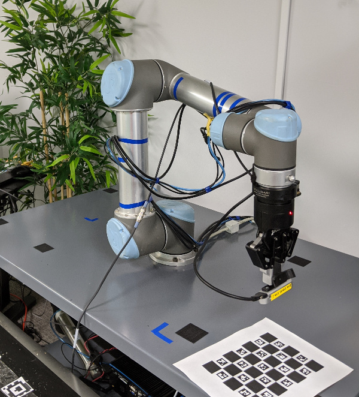
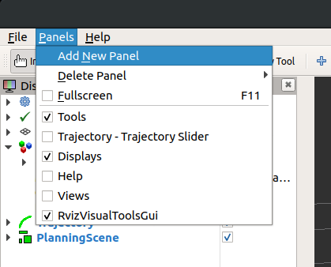
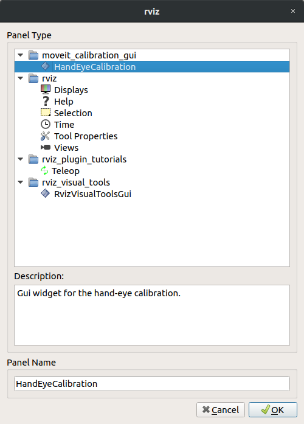
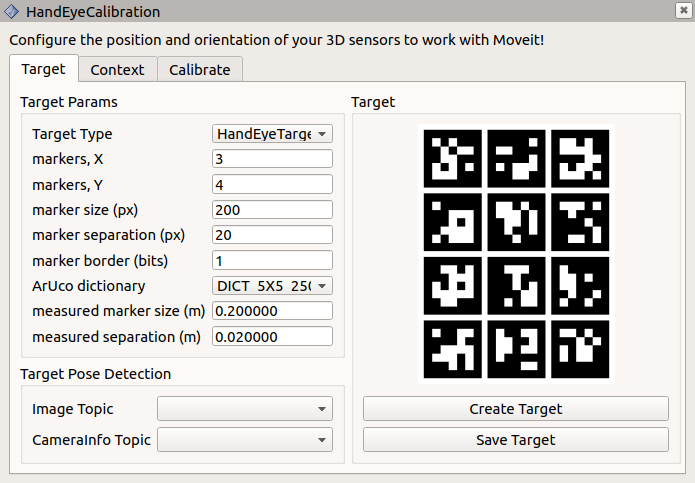
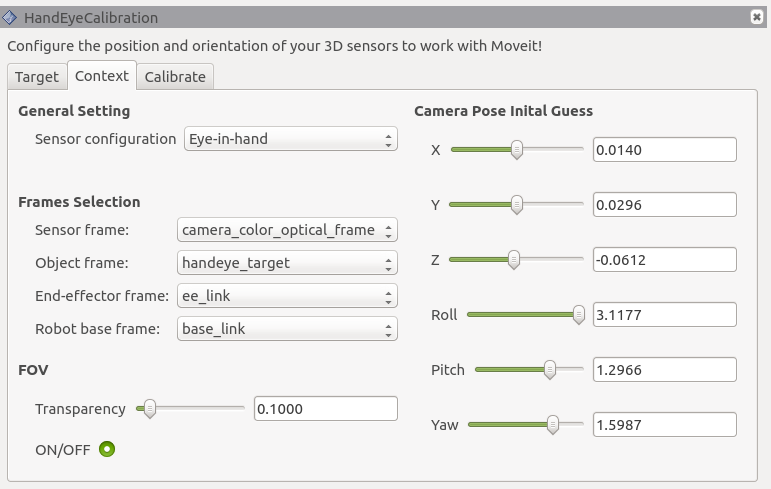
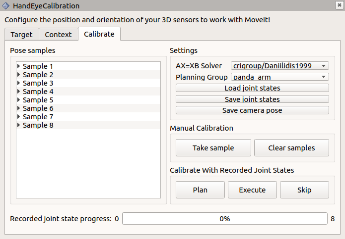

Hand-Eye Calibration
====================
The `MoveIt Calibration <http://www.github.com/ros-planning/moveit_calibration>`_ package provides plugins and a graphical
interface for conducting a hand-eye camera calibration. Calibrations can be performed for cameras rigidly mounted in the
robot base frame (eye-to-hand) and for cameras mounted to the end effector (eye-in-hand). This tutorial presents the
eye-in-hand case.

Getting Started
---------------
While it is possible to go through most of this tutorial using just a simulation, to actually complete a calibration you
will need a robotic arm and a camera.

If you haven't already done so, be sure to complete the steps in `Getting Started
<../getting_started/getting_started.html>`_. Also, set your arm up to work with MoveIt (as described in the `Setup
Assistant Tutorial <../setup_assistant/setup_assistant_tutorial.html>`_).

This tutorial also requires a camera, publishing images and a ``sensor_msgs/CameraInfo`` topic with good intrinsic
calibration parameters and an accurate coordinate frame. (Conduct an intrinsic camera calibration by using the
`camera_calibration <http://wiki.ros.org/camera_calibration>`_ package, if necessary.)

Clone and Build the MoveIt Calibration Repo
-------------------------------------------
In your workspace ``src`` directory, clone MoveIt Calibration::

  git clone git@github.com:ros-planning/moveit_calibration.git

Then, make sure you have the appropriate dependencies and build the package::

  rosdep install -y --from-paths . --ignore-src --rosdistro melodic
  catkin build
  source devel/setup.sh

Launch RViz and Load Calibration Plugin
---------------------------------------
Launch the appropriate MoveIt demo for your robot. For instance, ``roslaunch panda_moveit_config demo.launch``.
In the RViz "Panels" menu, choose "Add New Panel":

Then, select the "HandEyeCalibration" panel type:

The panel will be added with the "Target" tab active.

Create and Print a Target
-------------------------
Now we will create a visual calibration target. This target has distinctive patterns that are easy to identify in the
image data, and by providing a measurement of the target size, the pose of the target in the camera's coordinate frame
can be estimated. When conducting a hand-eye calibration, we do not need to know the target's precise location--as long
as the target is stationary in the robot's base frame, the hand-eye calibration can be estimated from a sequence of 5 or
more poses.

In the "Target Params" section of the "Target" tab, we will use the default target parameters:

- **markers, X**: 3
- **markers, Y**: 4
- **marker size (px)**: 200
- **marker separation (px)**: 20
- **marker border (bits)**: 1
- **ArUco dictionary**: DICT_5X5_250

Press the "Create Target" button to create the target image:

Save the target image using the "Save Target" button, and print out the image. Feel free to experiment with the target
parameters to see how they affect the target, but be sure to remember the parameters used for the target you print--you
will need to input the same parameters for the target to be recognized.

The target must be flat to be reliably localized by the camera. Laying it on a flat surface is sufficient, or it can be
mounted to a board. Measure the marker width (the outside dimension of one of the black squares), as well as the
separation distance between markers. Enter these values, in meters, in the appropriate boxes in the "Target Params"
section. Also, select the appropriate topics in the "Image Topic" and "CameraInfo Topic" drop-down menus.

Finally, place the target near the robot, where it can be easily seen by the camera.

Geometric Context
-----------------
The second tab, labeled "Context", contains the geometric information necessary to conduct the calibration.

1. Set the "Sensor configuration" to "Eye-in-hand".
2. The "Sensor frame" is the camera optical frame (using the right-down-forward standard, as specified in `REP 103
   <https://www.ros.org/reps/rep-0103.html>`_).
3. The "Object frame" is the frame defined by the calibration target, which is called "handeye_target" by default.
4. The "End-effector frame" is the robot link rigidly attached to the camera.
5. The "Robot base frame" is the frame in which the calibration target is stationary.

The FOV section controls the rendering of the camera's field of view in RViz. To see the FOV, add a "MarkerArray"
display, and set it to listen to the "/rviz_visual_tools" topic. (It may not appear immediately.)

Finally, it is not necessary to set an initial guess for the camera pose, but it is worth noting that once a calibration
has been calculated, these fields will be updated with the new calibration.

Collect Dataset
---------------
Next, we will capture a calibration dataset. We need to capture several samples to ensure a good calibration. The robot
kinematics provide the end-effector's pose in the robot base frame, and the calibration target's pose in the camera
frame can be estimated, as mentioned above. If the target's pose in the robot base frame were known accurately, only a
single observation of the camera-target transform would be necessary to recover the camera's pose in the end-effector
frame. The direct camera-to-end-effector transform is equivalent to the composite
camera-to-target-to-base-link-to-end-effector transform. A better option, however, is to combine the information from
several poses to eliminate the target pose in the base frame from the equation, as described in `this paper by Kostas
Daniilidis <https://scholar.google.com/scholar?cluster=11338617350721919587>`_.

Each sample in our calibration dataset, then, comprises a pair of poses: the end-effector's pose in the robot base frame
paired with the calibration target's pose in the camera frame. Once five such samples have been collected, the
calibration can be calculated.

The "Calibrate" tab provides the tools to collect the dataset and calculate and export the calibration. At this point,
it is also helpful to add an image panel to the RViz display to see the target detection in the camera view, which is
published on ``/handeye_calibration/target_detection``.

On the "Calibrate" tab, you can select which calibration solver to use in the "AX=XB Solver" drop-down. The Daniilidis
solver (from the paper referenced, above) is the default and is a good choice in most situations. The "Planning Group"
is the joint group that will be recorded, so should be set to the appropriate group for the arm (in the
``panda_moveit_config`` package, the ``panda_arm`` group should be used).

When the target is visible in the arm camera, and the axis is rendered on the target in the target detection image, you
are ready to take your first calibration sample (pose pair). Click the "Take sample" button in the "Manual calibration"
section, and a new sample will be added to the "Pose samples" list on the left side of the panel. If you expand a
sample, you will see it contains two transforms, base-to-end-effector, and camera-to-target.

Next, you can move the arm to a new pose using the "MotionPlanning" panel, or use your robot's teaching pendant or free
drive mode, if it has one, and click "Take sample" again. Be sure to include some rotation between each pair of poses,
and don't always rotate around the same axis--at least two rotation axes are needed to uniquely solve for the
calibration (see the Daniilidis paper, linked above, for the explanation why).

As you take manual samples, the robot joint states are recorded, so that the same poses can be used again to
recalibrate in the future. The number of recorded states is shown to the right of the progress bar at the bottom of the
panel, and the states can be saved to a file using the "Save joint states" button in the "Settings" section.

Calculate a Calibration
-----------------------
Once you have collected five samples, a calibration will be performed automatically, and updated each time a new sample
is added. The calibration will improve significantly with a few more samples, and will typically plateau after about 12
or 15 samples. The position and orientation will be displayed on the "Context" tab, as mentioned above, and the
published TF will be updated as well. Click "Save camera pose" to export the calibration result. This will create a
launch file with a static transform publisher containing the calibrated camera transform.
