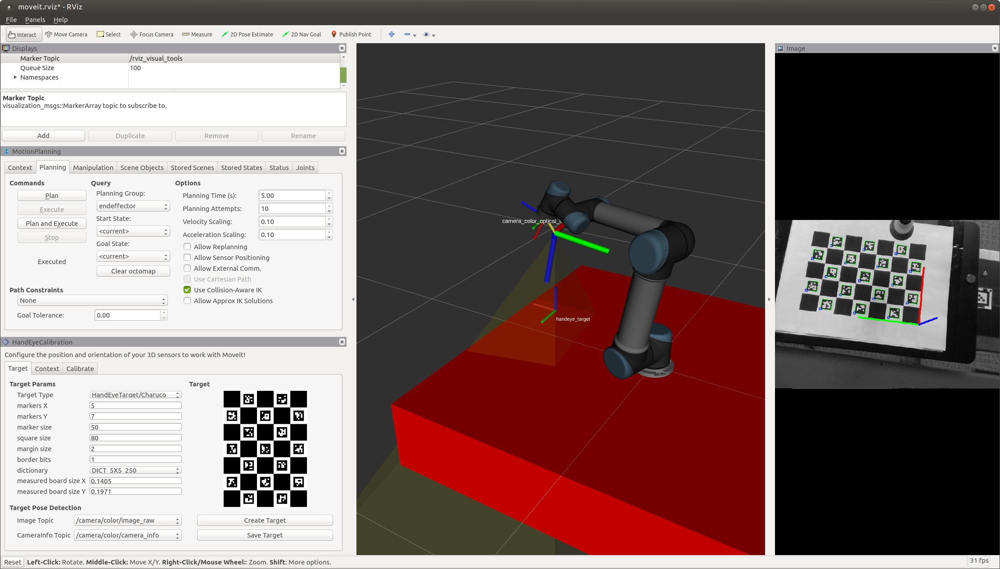
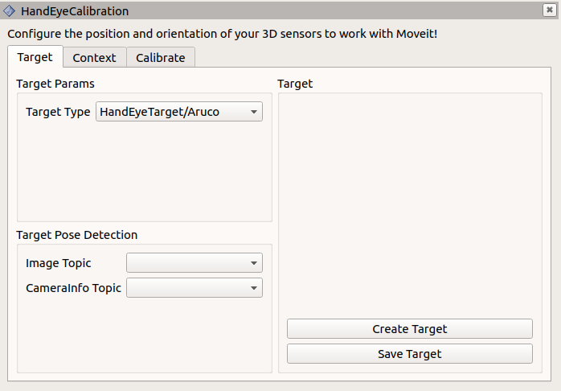
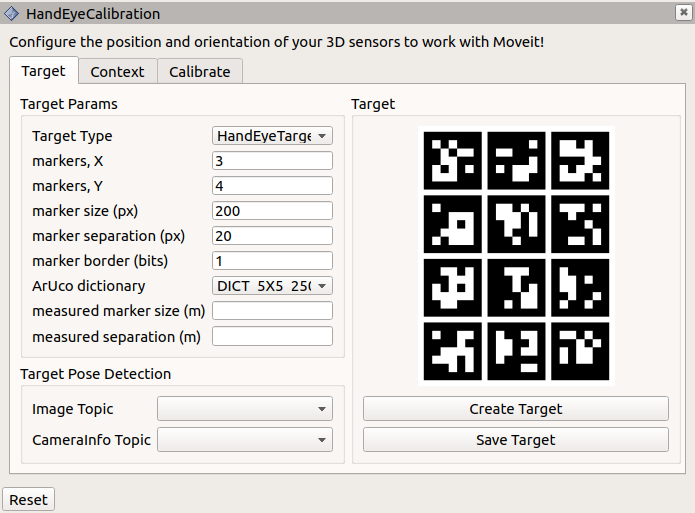

Hand-Eye Calibration
====================
The `MoveIt Calibration <www.github.com/ros-planning/moveit_calibration>` package provides plugins and a graphical
interface for conducting a hand-eye camera calibration. Calibrations can be performed for cameras rigidly mounted in the
robot base frame (eye-to-hand) and for cameras mounted to the end effector (eye-in-hand). This tutorial presents the
eye-in-hand case.

Getting Started
---------------
Unlike many of the other MoveIt tutorials, to actually complete this tutorial, you will need a robotic arm and a camera.

If you haven't already done so, make sure you've completed the steps in `Getting Started
<../getting_started/getting_started.html>`_. Also, set your arm up to work with MoveIt (as described in the `Setup
Assistant Tutorial <../setup_assistant/setup_assistant.html>`_).

This tutorial also requires a camera.  Be sure your camera node is publishing a ``sensor_msgs/CameraInfo`` topic with good
intrinsic calibration parameters and an accurate coordinate frame. (Conduct an intrinsic camera calibration by using the
`camera_calibration <http://wiki.ros.org/camera_calibration>` package, if necessary.)

Clone and Build the MoveIt Calibration Repo
-------------------------------------------
In your workspace ``src`` directory, clone MoveIt Calibration::

  git clone git@github.com:ros-planning/moveit_calibration.git

Then, make sure you have the appropriate dependencies and build the package::

  rosdep install -y --from-paths . --ignore-src --rosdistro melodic
  catkin build
  source devel/setup.sh

Launch RViz and Load Calibration Plugin
---------------------------------------
Launch the appropriate MoveIt demo for your robot. For instance, ``roslaunch panda_moveit_config demo.launch``.
In the RViz "Panels" menu, choose "Add New Panel":

.. image:: choose_add_new_panel.png

Then, select the "HandEyeCalibration" panel:

.. image:: add_handeye_panel.png

This will add a mostly-blank panel.

Create and Print a Target
-------------------------
Now we will create a visual calibration target. This target has distinctive patterns that are easy to identify in the
image data, and by providing a measurement of the target size, the pose of the target in the camera's coordinate frame
can be estimated. When conducting a hand-eye calibration, we do not need to know the target's precise location--as long
as the target is stationary in the robot's base frame, the hand-eye calibration can be estimated from a sequence of 5 or
more poses.

In the Target Params section of the Target tab, select the Target Type drop-down and click "HandEyeTarget/Aruco".
(Although this option is already selected, the parameters for an ArUco target are not loaded until you click it.) Enter
the following parameters:

- **markers, X**: 3
- **markers, Y**: 4
- **marker size (px)**: 200
- **marker separation (px)**: 20
- **marker border (bits)**: 1
- **ArUco dictionary**: DICT_5X5_250

Then press the "Create Target" button to create the target image:

Save the target image using the "Save Target" button, and print out the image. Feel free to experiment with the target
parameters, to see how they affect the target, but be sure to remember the parameters used for the target you print--you
will need to input the same parameters for the target to be recognized.

The target must be flat to be reliably localized by the camera. Laying it on a flat surface is sufficient, or it can be
mounted to a flat board. Measure the marker width (the outside dimension of one of the black squares), as well as the
separation distance. Enter these values, in meters, in the appropriate boxes in the Target Params section.

Finally, place the target near the robot, where it can be easily seen by the camera.

Plan Poses
----------

Calculate a Calibration
-----------------------
