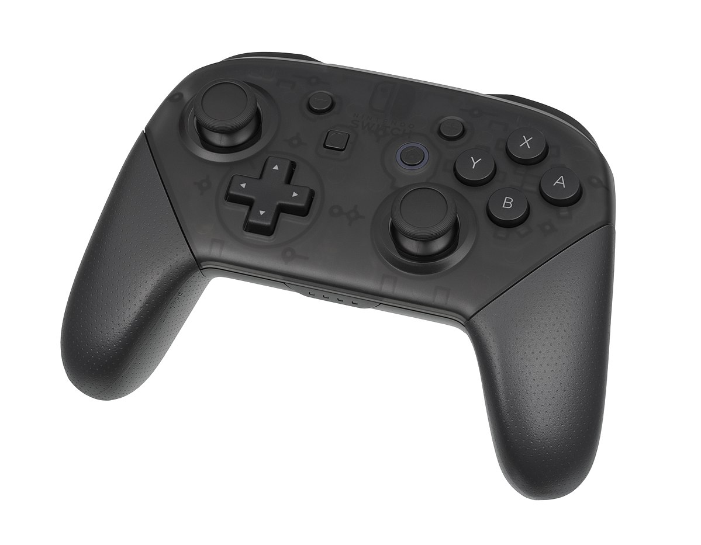

Joystick Control Teleoperation
==========================================

Check out this cool demo that uses a `joystick controller and MoveIt to control a PR2 <https://youtu.be/p_x-HRagLpo>`_

Getting Started
---------------
If you haven't already done so, make sure you've completed the steps in `Getting Started <../getting_started/getting_started.html>`_.

Running the Code
----------------
Open two shells and make sure you have re-sourced the setup files in both of them: ::

  source ~/ws_moveit/devel/setup.bash

In the first shell start RViz and wait for everything to finish loading: ::

  roslaunch panda_moveit_config demo.launch

In the Motion Planning plugin of RViz, enable **Allow External Comm.** checkbox in the *Planning* tab. Enable the **Query Goal State** robot display in the MoveIt Motion Planning Plugins' *Planning Request* section.

Now launch in the second shell, run the ``joystick_control.launch`` file: ::

    roslaunch panda_moveit_config joystick_control.launch

The script defaults to using ``/dev/input/js0`` for your game controller port. To customize, you can also use, for example: ::

    roslaunch panda_moveit_config joystick_control.launch dev:=/dev/input/js1

This script can handle the following types of joysticks:

1. PS3 Controller via USB
2. PS3 Controller via Bluetooth (Please use ps3joy package at `http://wiki.ros.org/ps3joy <http://wiki.ros.org/ps3joy>`_)
3. PS4 Controller via USB
4. PS4 Controller via Bluetooth (Please use ds4_driver package at `http://wiki.ros.org/ds4_driver <http://wiki.ros.org/ds4_driver>`_) 
5. XBox360 Controller via USB
6. Arctic USB Wireless `Gamepad <https://www.arctic.ac/eu_en/usb-wireless-gamepad.html>`_

Joystick Command Mappings
-------------------------

=====================   ==================   ===================== ==================
Command                 PS3/4 Controller     Xbox Controller       Arctic Controller
=====================   ==================   ===================== ==================
+-x/y                   left analog stick    left analog stick     left analog stick
+-z                     L2/R2                LT/RT                 L2/R2
+-yaw                   L1/R1                LB/RB                 L1/R1
+-roll                  left/right           left/right            left/right
+-pitch                 up/down              up/down               up/down
change planning group   select/start         Y/A                   9/10
change end effector     triangle/cross       back/start            1/3
plan                    square               X                     4
execute                 circle               B                     2
=====================   ==================   ===================== ==================

Debugging
---------
Add "Pose" to RViz Displays and subscribe to ``/joy_pose`` in order to see the output from joystick.

Note that only planning groups that have IK solvers for all their End Effector parent groups will work.
