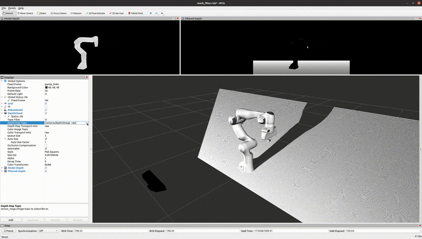
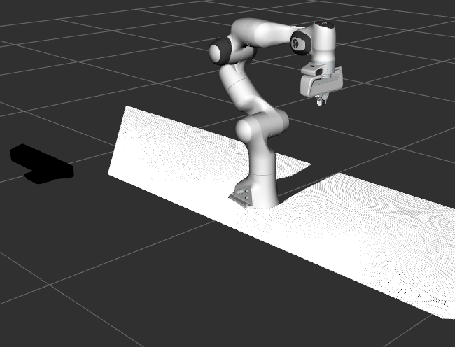
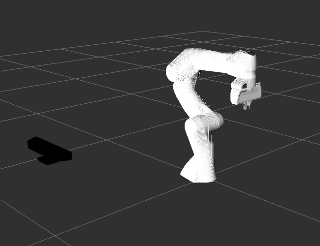

Mesh Filter with UR5 and Kinect
===============================

MoveIt's mesh filter functionality removes your robot's geometry from a point cloud! If your robot's arm is in your depth sensor's view, the points associated with the arm are subtracted from the point cloud.

This is accomplished by giving the original point cloud, the robot's transforms (``\tf``) and the robot's URDF as inputs.
The filter then publishes a modified point cloud which does not contain the points that overlaps with the current robot state.

Getting Started
---------------

* Follow the instructions for :moveit_website:`installing MoveIt<install>`
  first if you have not already done that.

* Clone the `Universal Robot package <https://github.com/ros-industrial/universal_robot>`_ to your workspace for Melodic. Remember to rebuild your workspace after cloning.

* Install `Gazebo <http://gazebosim.org/tutorials?tut=install_ubuntu&cat=install>`_. You need to install ros-${ROS_DISTRO}-gazebo-plugins too.

Running the Demo
-----------------

Roslaunch the launch file to run the code directly from moveit_tutorials: ::

 roslaunch moveit_tutorials mesh_filter.launch

The above command opens a UR5 arm with Kinect sensor on Gazebo and Rviz

Topic ``/filtered/depth`` produces the modified point cloud with points subtracted that overlaps with the robot state.

Topic ``/model/depth`` gives the points that overlap with the current robot state

Check out the mesh filter code `here <https://github.com/ros-planning/moveit/blob/master/moveit_ros/perception/mesh_filter/src/depth_self_filter_nodelet.cpp>`_

How to add sensor to arm in simulation
--------------------------------------

Include sensor plugin in a ``.gazebo`` file. In this tutorial, a kinect sensor plugin is added to ``kinect_camera.gazebo`` ::

    <gazebo reference="camera_depth_frame">
        <sensor name="kinect_camera" type="depth">
            <update_rate>20</update_rate>
            <camera>
                <horizontal_fov>1.047198</horizontal_fov>
                <image>
                    <width>640</width>
                    <height>480</height>
                    <format>B8G8R8</format>
                </image>
                <clip>
                    <near>0.05</near>
                    <far>3</far>
                </clip>
            </camera>
            <plugin name="kinect_controller" filename="libgazebo_ros_openni_kinect.so">
            <baseline>0.1</baseline>
            <alwaysOn>true</alwaysOn>
            <updateRate>10</updateRate>
            <cameraName>camera_ir</cameraName>
            <imageTopicName>/camera/color/image_raw</imageTopicName>
            <cameraInfoTopicName>/camera/color/camera_info</cameraInfoTopicName>
            <depthImageTopicName>/camera/depth/image_raw</depthImageTopicName>
            <depthImageCameraInfoTopicName>/camera/depth/camera_info</depthImageCameraInfoTopicName>
            <pointCloudTopicName>/camera/depth/points</pointCloudTopicName>
            <frameName>camera_depth_optical_frame</frameName>
            <distortion_k1>0.0</distortion_k1>
            <distortion_k2>0.0</distortion_k2>
            <distortion_k3>0.0</distortion_k3>
            <distortion_t1>0.0</distortion_t1>
            <distortion_t2>0.0</distortion_t2>
            <pointCloudCutoff>0.16</pointCloudCutoff>
            <pointCloudCutoffMax>10.0</pointCloudCutoffMax>
            </plugin>
        </sensor>
    </gazebo>

Attach sensor to `base urdf <https://github.com/ros-industrial/universal_robot/blob/melodic-devel/ur_description/urdf/ur5.urdf.xacro>`_ of UR5 using links and joints as shown in ``ur5_sensor.urdf.xacro`` ::

    <!-- ur5 -->
    <xacro:include filename="$(find ur_description)/urdf/ur5.urdf.xacro" />

    <!-- Attach UR5 to table -->
    <joint name="table_joint" type="fixed">
        <parent link="table"/>
        <child link="base_link"/>
    </joint>

    <!-- Attach Kinect to table -->
    <joint type="fixed" name="table_camera_joint">
        <origin xyz="0.15 -1 0.1" rpy="0 0 1.57"/>
        <child link="camera_rgb_frame"/>
        <parent link="table"/>
        <axis xyz="0 0 0" rpy="0 0 0"/>
        <limit effort="10000" velocity="1000"/>
        <dynamics damping="1.0" friction="1.0"/>
    </joint>

References
----------
`Understanding ROS Nodelets <https://medium.com/@waleedmansoor/understanding-ros-nodelets-c43a11c8169e>`_
