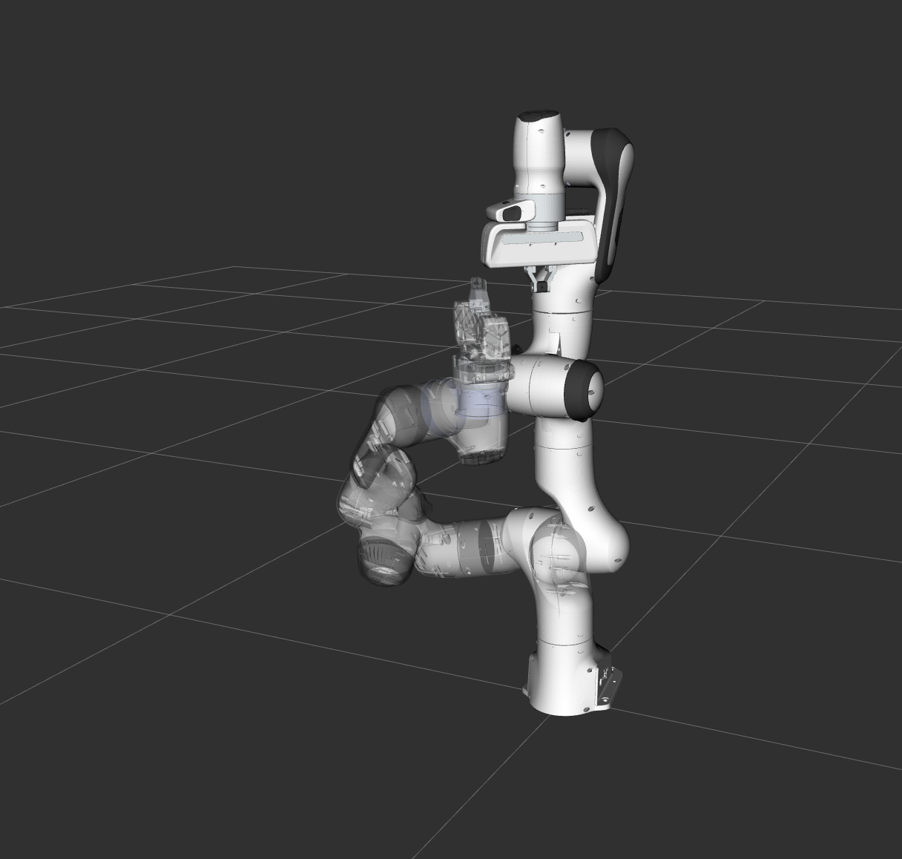
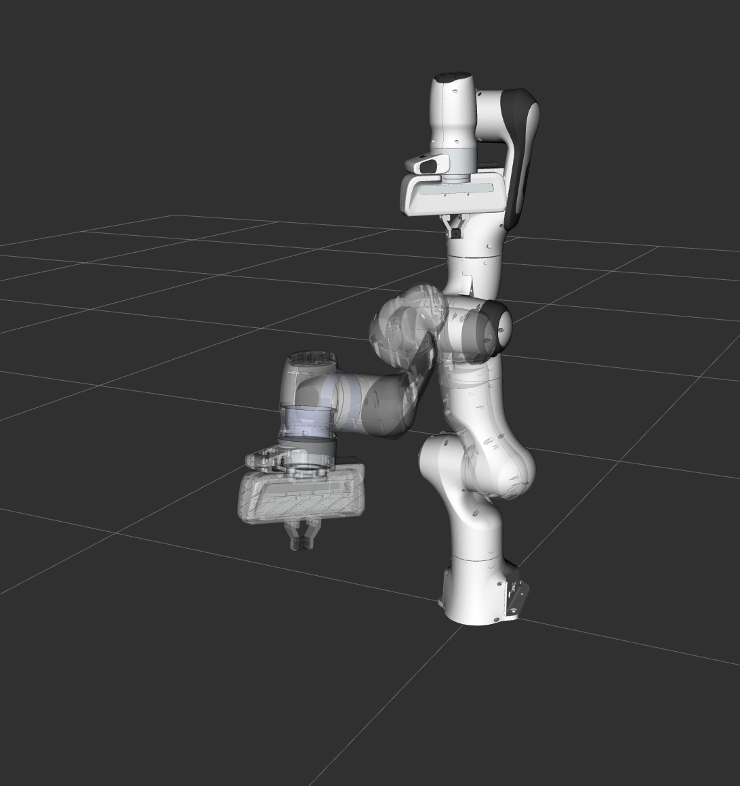
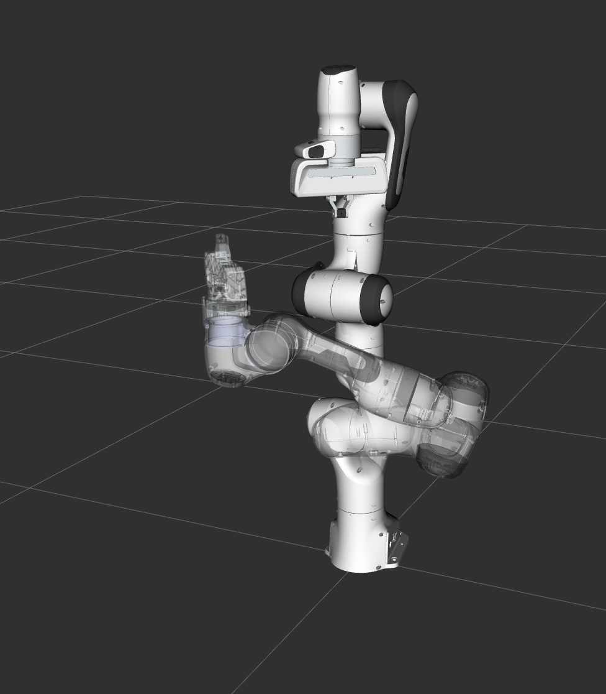

Motion Planning API
==================================

In MoveIt!, the motion planners are loaded using a plugin infrastructure. This
allows MoveIt! to load motion planners at runtime. In this example, we will
run through the C++ code required to do this.

Getting Started
---------------
If you haven't already done so, make sure you've completed the steps in `Getting Started <../getting_started/getting_started.html>`_.

The entire code
---------------
The entire code can be seen :codedir:`here in the moveit_tutorials github project<motion_planning_api>`.

.. tutorial-formatter:: ./src/motion_planning_api_tutorial.cpp

The launch file
---------------
The entire launch file is :codedir:`here <motion_planning_api/launch/motion_planning_api_tutorial.launch>` on github. All the code in this tutorial can be compiled and run from the moveit_tutorials package.

Running the code
----------------
Make sure you have sourced the setup files::

 source ~/ws_moveit/devel/setup.bash

Roslaunch the launch file to run the code directly from moveit_tutorials::

 roslaunch moveit_tutorials motion_planning_api_tutorial.launch

Expected Output
---------------
In Rviz, we should be able to see four trajectories being replayed eventually:

 1. The robot moves its arm to the first pose goal,

    |A|

 2. The robot moves its arm to the joint goal,

    |B|

 3. The robot moves its arm back to the original pose goal,
 4. The robot moves its arm to a new pose goal while maintaining the end-effector level.

    |C|

