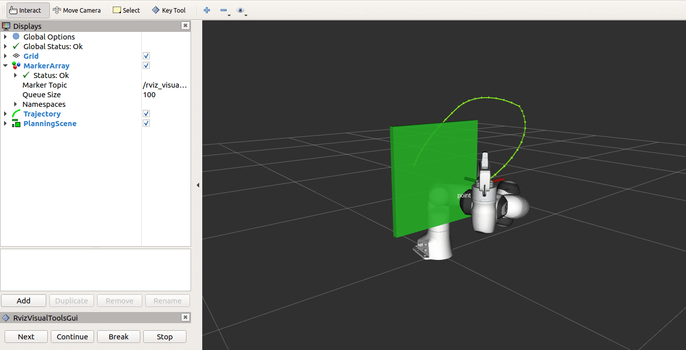
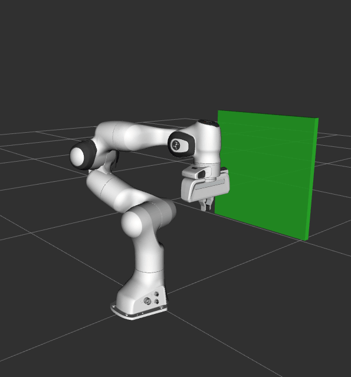

Move Group C++ Interface
==================================

In MoveIt, the simplest user interface is through the :planning_interface:`MoveGroupInterface` class. It provides easy to use functionality for most operations that a user may want to carry out, specifically setting joint or pose goals, creating motion plans, moving the robot, adding objects into the environment and attaching/detaching objects from the robot. This interface communicates over ROS topics, services, and actions to the `MoveGroup Node <http://docs.ros.org/indigo/api/moveit_ros_move_group/html/annotated.html>`_.

Watch this quick `YouTube video demo <https://youtu.be/_5siHkFQPBQ>`_ to see the power of the move group interface!

Getting Started
---------------
If you haven't already done so, make sure you've completed the steps in `Getting Started <../getting_started/getting_started.html>`_.

Running the Code
----------------
Open two shells. In the first shell start RViz and wait for everything to finish loading: ::

  roslaunch panda_moveit_config demo.launch

In the second shell, run the launch file: ::

  roslaunch moveit_tutorials move_group_interface_tutorial.launch

**Note:** This tutorial uses the **RvizVisualToolsGui** panel to step through the demo. To add this panel to RViz, follow the instructions in the `Visualization Tutorial <../quickstart_in_rviz/quickstart_in_rviz_tutorial.html#rviz-visual-tools>`_.

After a short moment, the RViz window should appear and look similar to the one at the top of this page. To progress through each demo step either press the **Next** button in the **RvizVisualToolsGui** panel at the bottom of the screen or select **Key Tool** in the **Tools** panel at the top of the screen and then press **N** on your keyboard while RViz is focused.

Expected Output
---------------
See the `YouTube video <https://youtu.be/_5siHkFQPBQ>`_ at the top of this tutorial for expected output. In RViz, we should be able to see the following:
 1. The robot moves its arm to the pose goal to its front.
 2. The robot moves its arm to the joint goal at its side.
 3. The robot moves its arm back to a new pose goal while maintaining the end-effector level.
 4. The robot moves its arm along the desired Cartesian path (a triangle down, right, up+left).
 5. A box object is added into the environment to the right of the arm.
    |B|

 6. The robot moves its arm to the pose goal, avoiding collision with the box.
 7. The object is attached to the wrist (its color will change to purple/orange/green).
 8. The object is detached from the wrist (its color will change back to green).
 9. The object is removed from the environment.

The Entire Code
---------------
The entire code can be seen :codedir:`here in the MoveIt GitHub project<move_group_interface/src/move_group_interface_tutorial.cpp>`. Next we step through the code piece by piece to explain its functionality.

.. tutorial-formatter:: ./src/move_group_interface_tutorial.cpp

The Launch File
---------------
The entire launch file is :codedir:`here<move_group_interface/launch/move_group_interface_tutorial.launch>` on GitHub. All the code in this tutorial can be run from the **moveit_tutorials** package that you have as part of your MoveIt setup.

A Note on Setting Tolerances
----------------------------
Note that the `MoveGroupInterface's <http://docs.ros.org/melodic/api/moveit_ros_planning_interface/html/classmoveit_1_1planning__interface_1_1MoveGroupInterface.html>`_ `setGoalTolerance()` and related methods sets the tolerance for **planning**, not execution.

If you want to configure the execution tolerances, you will have to edit the `controller.yaml` file if using a FollowJointTrajectory controller, or manually add it into the generated trajectory message from the planner.
