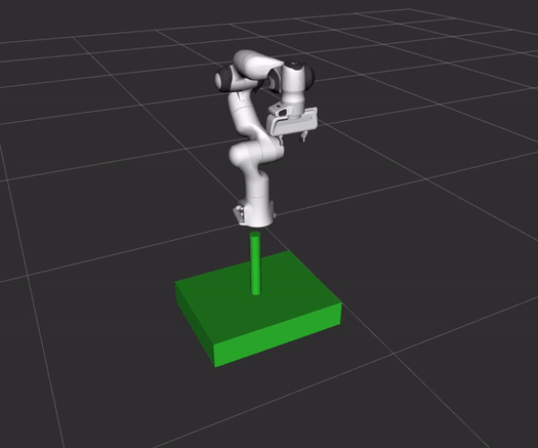
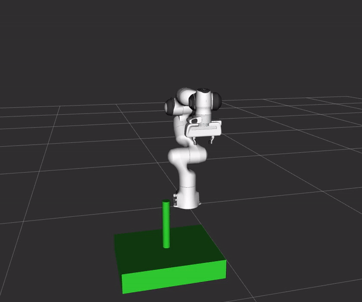
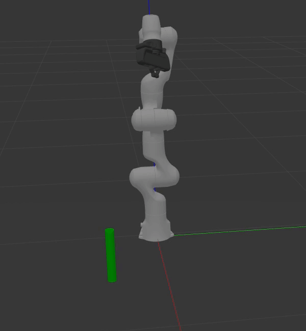
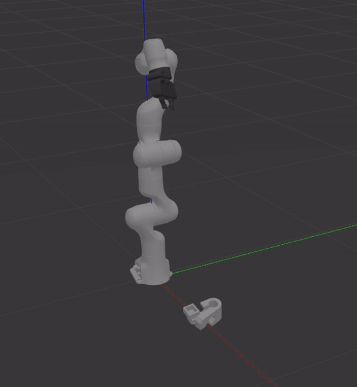

MoveIt Deep Grasps
==================

This tutorial demonstrates how to use `Grasp Pose Detection (GPD) <https://github.com/atenpas/gpd>`_ and
`Dex-Net <https://berkeleyautomation.github.io/dex-net/>`_ within the MoveIt Task Constructor.

GPD (left) and Dex-Net (right) were used to generate the grasp pose to pick up the cylinder.

|gif1| |gif2|

Getting Started
---------------
If you haven't already done so, make sure you've completed the steps in `Getting Started <../getting_started/getting_started.html>`_.
It is also worthwhile to complete the steps in `MoveIt Task Constructor <../moveit_task_constructor/moveit_task_constructor_tutorial.html>`_.

There are additional dependencies to install in order to run the demos. Therefore, the deep grasping packages are
located in their own repository. Please see `Deep Grasp Demo <https://github.com/PickNikRobotics/deep_grasp_demo>`_.
This repository contains detailed instructions for installation, running the demos, simulating depth sensors, and tips for performance.

The demos will allow you to visualize the results in rviz and use Gazebo if desired.

Conceptual Overview
-------------------
The MoveIt Task Constructor contains a ``DeepGraspPose`` generator stage. This stage does not directly contain
the implementation of either GPD or Dex-Net. Instead, communication with the MoveIt Task Constructor is achieved through
ROS action messages. The ``DeepGraspPose`` stage contains an action client that communicates with an action server. The implementation of the action server is in
both the ``moveit_task_constructor_gpd`` and ``moveit_task_constructor_dexnet`` packages. The action server sends the grasp
candidates along with the associated costs back to the action client as feedback.

The relevant fields for the message can be seen in ``moveit_task_constructor_msgs/action/SampleGraspPoses.action``.

Using the ``DeepGraspPose`` stage is easy. Add the stage below to the current task. The implementation can be seen in `Deep Grasp Task <https://github.com/PickNikRobotics/deep_grasp_demo/blob/master/deep_grasp_task/src/deep_pick_place_task.cpp#L207>`_.

.. code-block:: c++

   auto stage = std::make_unique<stages::DeepGraspPose<moveit_task_constructor_msgs::SampleGraspPosesAction>>(
     action_name, "generate grasp pose");

The template parameter is the action message. Specify the ``action_name`` which is the namespace for communication between
the server and the client. Optionally, the timeouts for grasp sampling and server connection can be supplied. By default these are
set to unlimited time.

Grasp Pose Detection
--------------------
GPD samples grasp candidates from a point cloud and uses a CNN to classify whether the grasp candidate will be successful. The table plane is automatically segmented from the point cloud in the demo. This is
useful because GPD will sample grasp candidates around this plane if not removed.

The ``workspace`` and  ``num_samples`` parameters in `gpd_config.yaml <https://github.com/PickNikRobotics/deep_grasp_demo/blob/master/moveit_task_constructor_gpd/config/gpd_config.yaml>`_ can improve performance.
The first  parameter specifies the volume of a cube to search for grasp candidates centered at the origin of the point cloud frame. The second
specifies the number of samples from the cloud to detect grasp candidates.

Dex-Net
-------
Dex-Net will sample grasp candidates from images. A color and depth image must be supplied. Dex-Net uses a grasp quality
convolutional neural network (GQ-CNN) to predict the probability a grasp candidate will be successful. The GQ-CNN was trained
on images using a downward facing camera. Therefore, the network is sensitive to the camera view point and will perform best
when the camera is facing down.

Set the ``deterministic`` parameter to 0 in  `dex-net_4.0_pj.yaml <https://github.com/BerkeleyAutomation/gqcnn/blob/master/cfg/examples/replication/dex-net_4.0_pj.yaml#L11>`_ for nondeterministic grasp sampling.

Running the Demos
-----------------
The point cloud and images for the demo are provided but you can optionally
use sensor data from a simulated depth camera in Gazebo.

Due to the sensitivity of the camera view point, it is recommended to use the images of the cylinder that are provided for the Dex-Net demo.

The `Camera View Point <https://github.com/PickNikRobotics/deep_grasp_demo#Camera-View-Point>`_ section shows
how to change the camera to different positions. This will improve performance depending on the object.

The `Depth Sensor Data <https://github.com/PickNikRobotics/deep_grasp_demo#Depth-Sensor-Data>`_ section shows
how to collect data using the simulated depth camera.

Fake Controllers
^^^^^^^^^^^^^^^^^^^

First, launch the basic environment: ::

  roslaunch moveit_task_constructor_demo demo.launch

Next, launch either the GPD or Dex-Net demo: ::

  roslaunch moveit_task_constructor_gpd gpd_demo.launch
  roslaunch moveit_task_constructor_dexnet dexnet_demo.launch

The results should appear similar to the two animations at the top of the tutorial.

Gazebo
^^^^^^
Make sure you complete the `deep grasp demo install guide <https://github.com/PickNikRobotics/deep_grasp_demo#Install>`_ for Gazebo support.

The `load_cloud` argument in `gpd_demo.launch` and the `load_images` argument in `dexnet_demo.launch` specifies
whether or not to load the sensor data from a file. Set either one of these arguments to false to use the simulated depth camera.

First, launch the Gazebo environment: ::

    roslaunch deep_grasp_task gazebo_pick_place.launch

Next, launch either the GPD or Dex-Net demo: ::

    roslaunch moveit_task_constructor_gpd gpd_demo.launch
    roslaunch moveit_task_constructor_dexnet dexnet_demo.launch

The animations below demonstrate the capabilities of Dex-Net for grasp pose generation using the simulated depth camera in Gazebo.
You may notice GPD can successfully pick up the cylinder. However, the algorithm will struggle with more complicated objects
such as the bar clamp (seen on the right). Experiment with the ``workspace`` and  ``num_samples`` parameters to see if you can generate a successful grasp using GPD.

|gif3| |gif4|

