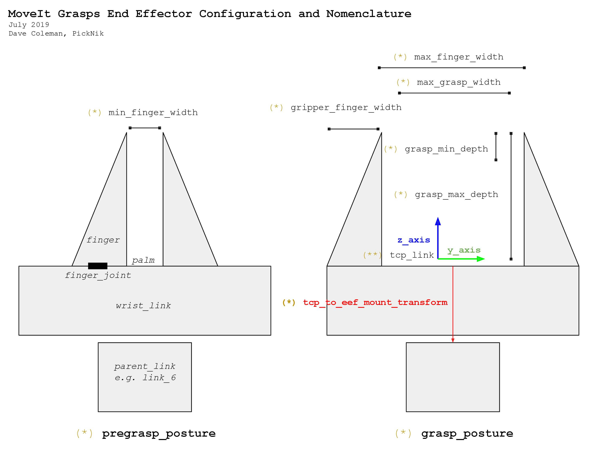

MoveIt Grasps
=============

.. image:: moveit_grasps.png
   :width: 500pt

MoveIt Grasps is a grasp generator for objects such as blocks or cylinders and can be used as a replacement for the MoveIt pick and place pipeline. MoveIt Grasps provides functionality for filtering grasps based on reachability and Cartesian planning of approach, lift and retreat motions.

The grasp generation algorithm is based on simple cuboid shapes and does not consider friction cones or other grasp dynamics.

MoveIt Grasps can be used with both parallel finger grippers and suction grippers.

Getting Started
---------------
If you haven't already done so, make sure you've completed the steps in `Getting Started <../getting_started/getting_started.html>`_.

Installing MoveIt Grasps
------------------------

Install From Source
^^^^^^^^^^^^^^^^^^^

Clone the `moveit_grasps <https://github.com/ros-planning/moveit_grasps>`_ repository into a `catkin workspace <https://ros-planning.github.io/moveit_tutorials/doc/getting_started/getting_started.html#create-a-catkin-workspace>`_. For this tutorial we use Franka Emika's Panda robot setup from `panda_moveit_config <https://github.com/ros-planning/panda_moveit_config>`_::

    cd ~/ws_moveit/src
    git clone -b $ROS_DISTRO-devel https://github.com/ros-planning/moveit_grasps.git

Use the rosdep tool to automatically install its dependencies::

    rosdep install --from-paths . --ignore-src --rosdistro $ROS_DISTRO

Build the workspace::

    catkin build

Install From Debian
^^^^^^^^^^^^^^^^^^^

**Note:** this package has not been released as of 4/11/19::

    sudo apt-get install ros-$ROS_DISTRO-moveit-grasps

Demo Scripts
------------

We have provided 4 demo scripts showcasing MoveIt Grasps, and for visualizing MoveIt Grasps configuration parameters.

Before running any of the Demos, you must first start Rviz with::

    roslaunch moveit_grasps rviz.launch

The default setup uses a two finger gripper.
For running Demos using a suction gripper, specify the gripper when launching Rviz::

    roslaunch moveit_grasps rviz.launch gripper:=suction

**NOTE:** The released versions of `panda_moveit_config <https://github.com/ros-planning/panda_moveit_config>`_ may lag behind the source versions. If you have issues with the demos, a good first step would be to download and build `panda_moveit_config <https://github.com/ros-planning/panda_moveit_config>`_ from source.

1) The Entire MoveIt Grasps Pipeline
^^^^^^^^^^^^^^^^^^^^^^^^^^^^^^^^^^^^
To see the entire MoveIt Grasps pipeline in action run::

    roslaunch moveit_grasps grasp_pipeline_demo.launch

.. image:: grasp_pipeline_demo.gif
   :width: 500pt

2) Visualize Gripper Parameters
^^^^^^^^^^^^^^^^^^^^^^^^^^^^^^^
To visualize gripper specific parameters::

    roslaunch moveit_grasps grasp_poses_visualizer_demo.launch

The result should look something like this:

.. image:: moveit_grasps_poses.jpg
   :width: 500pt

3) Visualize Grasp Generation
^^^^^^^^^^^^^^^^^^^^^^^^^^^^^

This tool demonstrates several concepts around how scoring works during grasp generation.
It bases the chosen grasp using the following approaches:

 - *Ideal TCP Grasp Pose*: the generator will bias the chosen grasp based on an input of a preferred grasp. This allows you to say, for example, 'I want the end-effector to be pointed down left when grasping the object'.
 - *Pose-Based Grasp Score Weighting*: Bias certain translation or rotation axes to score higher, by increasing the weight of that specific axis.
 - *Depth-Based Grasp Score Weighting*: Bias a deeper grasp depth (how enveloped the fingers are around the object) over other parameters
 - *Width-Based Grasp Score Weighting*: (For parallel finger grippers only) Bias a wider finger grasp (how much space is available between the object and the finger pads) over other parameters
 - *Overhang Grasp Score Weighting*: (For suction grippers only) Bias a suction grasp towards full overlap with the object. This scoring metric uses the square of the percent of the suction region that is in contact with the object. By using the square, suction grippers with multiple suction regions (voxels) bias towards solutions with 100% overlap with one voxel rather than 50% of one and 50% of another.

To visualize::

    roslaunch moveit_grasps grasp_generator_demo.launch

.. image:: grasp_generator_demo.png
   :width: 500pt

4) Grasp Filter
^^^^^^^^^^^^^^^
To demo the grasp filtering::

    roslaunch moveit_grasps grasp_filter_demo.launch

When filtered, the colors represent the following:

* RED - grasp filtered by ik
* PINK - grasp filtered by collision
* MAGENTA - grasp filtered by cutting plane
* YELLOW - grasp filtered by orientation
* BLUE - pregrasp filtered by ik
* CYAN - pregrasp filtered by collision
* GREEN - valid

5) Suction Grasp Pipeline
^^^^^^^^^^^^^^^^^^^^^^^^^
To demo the pipeline when using a suction gripper, run::

    roslaunch moveit_grasps suction_grasp_pipeline_demo.launch

Conceptual Overview
-------------------

MoveIt Grasps is based on the three main components:

 - *Grasp Generator* uses the end effector kinematic and the object shape for sampling grasp poses and optimizing them using geometric scoring functions.
 - *Grasp Filter* validates the feasibility of grasp candidates by searching for IK solutions to verify their reachability.
 - *Grasp Planner* computes Cartesian approach, lift, and retreat trajectories that compose a complete grasp motion.

Note: ideally the *Grasp Planner* will be eventually phased out in favor of the new *MoveIt Task Constructor*.

In order to run the full grasp pipeline the three components need to be applied in sequence.

In addition, the *Grasp Generator* uses the following component:

 - *Grasp Scorer* supports a number of heuristics for judging which grasps are favorable, given known information about the problem / application

An example for generating, filtering and planning grasp motions can be found inside the file `src/grasp_pipeline_demo.cpp  <https://github.com/ros-planning/moveit_grasps/blob/melodic-devel/src/demo/grasp_pipeline_demo.cpp>`_. Instructions for running are below.

Robot-Agnostic Configuration
^^^^^^^^^^^^^^^^^^^^^^^^^^^^

MoveIt Grasps requires two configuration files to be specified at launch:

- *ROBOT_grasp_data.yaml* describes the robot's end effector geometry and is custom for each robot
- *moveit_grasps_config.yaml* configures the behavior of *Grasp Generator*, *Grasp Filter* and *Grasp Planner*. Additionally, it contains many optional debugging and visualizations options to make usage of MoveIt Grasps far easier.

In addition to this tutorial, see the comments in the following example files for further explanation of the parameters:

**ROBOT_grasp_data.yaml**

The canonical example end effector configuration uses Franka Emika's Panda: `config_robot/panda_grasp_data.yaml <https://github.com/ros-planning/moveit_grasps/blob/melodic-devel/config_robot/panda_grasp_data.yaml>`_.

In that file you will find all of the gripper specific parameters necessary for customizing MoveIt Grasps with suction or finger grippers.

Illustration diagrams for the parameters inside *ROBOT_grasp_data.yaml* file

1) Finger gripper parameters

2) Suction gripper parameters

``*`` These variables can be directly configured in the *ROBOT_grasp_data.yaml* file.

``**`` The name of your tool center point link can be configured by setting the *tcp_name* variable in the *ROBOT_grasp_data.yaml* file.

**moveit_grasps_config.yaml**

An example configuration file for the *Grasp Generator*, *Grasp Filter* and *Grasp Planner* can be found in `config/moveit_grasps_config.yaml <https://github.com/ros-planning/moveit_grasps/blob/melodic-devel/config/moveit_grasps_config.yaml>`_.

Applying Robot-Agnostic Configuration
^^^^^^^^^^^^^^^^^^^^^^^^^^^^^^^^^^^^^

To apply your yaml configurations, load them as rosparams with your grasping application / ROS node.
For an example, see the segment below from the file `launch/grasp_pipeline_demo.launch <https://github.com/ros-planning/moveit_grasps/blob/melodic-devel/launch/grasp_pipeline_demo.launch>`_::

    <node name="moveit_grasps_demo" pkg="moveit_grasps" type="moveit_grasps_pipeline_demo">
      <param name="ee_group_name" value="hand"/>
      <param name="planning_group_name" value="panda_arm"/>
      <rosparam command="load" file="$(find moveit_grasps)/config_robot/panda_grasp_data.yaml"/>
      <rosparam command="load" file="$(find moveit_grasps)/config/moveit_grasps_config.yaml"/>
    </node>

Note that the robot's planning group and end effector group must be specified external from the two yaml files, under the parameters ``ee_group_name`` and ``planning_group_name``.

Since the set of parameters is quite extensive, there are different demo launch files that you can use to visualize the effects. You can apply your configurations to the demo launch files described later in this tutorial.

Additional Configuration Notes
^^^^^^^^^^^^^^^^^^^^^^^^^^^^^^

**tcp_to_eef_mount_transform**

The ``tcp_to_eef_mount_transform`` represents the transform from the tool center point used for grasp poses to the mount link of the end effector.
This parameter is provided to allow different URDF end effectors to all work together without recompiling code.

In MoveIt the actuated end effector fingers should always has a parent link, typically the wrist link or palm link.
This wrist_link should have its palm with a Z-axis pointing towards the object you want to grasp i.e. where your pointer finger is pointing.

This is the convention laid out in "Robotics" by John Craig in 1955.
However, a lot of URDFs do not follow this convention, so this transform allows you to fix it.

Additionally, the x-axis should be pointing up along the grasped object, i.e. the circular axis of a (beer) bottle if you were holding it.

The y-axis should be point towards one of the fingers.

**Switch from Bin to Shelf Picking**

The ``setIdealGraspPoseRPY()`` and ``setIdealGraspPose()`` methods in GraspGenerator can be used to select an ideal grasp orientation for picking.

These methods is used to score grasp candidates favoring grasps that are closer to the desired orientation.

This is useful in applications such as bin and shelf picking where you would want to pick the objects from a bin with a grasp that is vertically alligned and you would want to pick obejects from a shelf with a grasp that is horozontally alligned.

Tested Robots
-------------

* UR5
* Jaco2
* Baxter
* `REEM <http://wiki.ros.org/Robots/REEM>`_
* Panda
