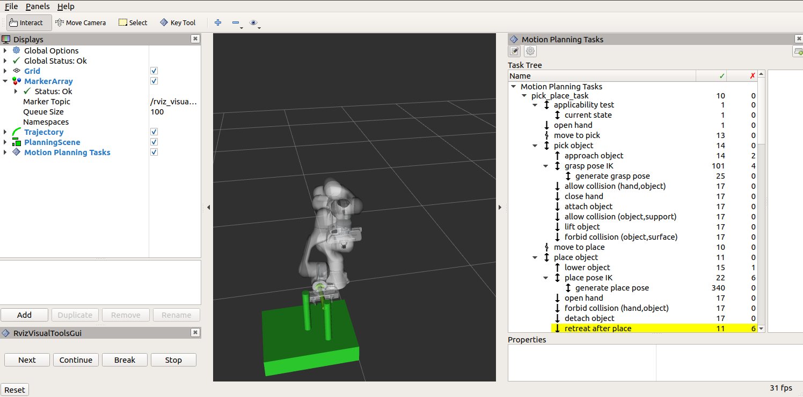
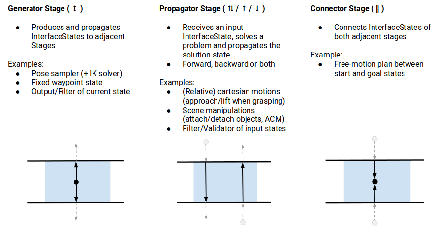

MoveIt Task Constructor
=======================

The Task Constructor framework provides a flexible and transparent way to define and plan actions that consist of multiple interdependent subtasks. It draws on the planning capabilities of MoveIt to solve individual subproblems in black-box planning stages. A common interface, based on MoveIt's PlanningScene is used to pass solution hypotheses between stages. The framework enables the hierarchical organization of basic stages using containers, allowing for sequential as well as parallel compositions. For more details, please refer to the associated `ICRA 2019 publication`_.

.. _ICRA 2019 publication: https://pub.uni-bielefeld.de/download/2918864/2933599/paper.pdf

Getting Started
---------------

If you have not already done so, make sure you have completed the steps in `Getting Started <../getting_started/getting_started.html>`_.

Installing MoveIt Task Constructor
----------------------------------

Install From Source
^^^^^^^^^^^^^^^^^^^

Go into your catkin workspace and initialize wstool if necessary (assuming `~/ws_moveit` as workspace path): ::

  cd ~/ws_moveit/src
  git clone https://github.com/ros-planning/moveit_task_constructor.git

Install missing packages with rosdep: ::

  rosdep install --from-paths . --ignore-src --rosdistro $ROS_DISTRO

Build the workspace: ::

  catkin build

Running the Demo
----------------

The MoveIt Task Constructor package contains several basic examples and a pick-and-place demo.
For all demos you should launch the basic environment: ::

  roslaunch moveit_task_constructor_demo demo.launch

Subsequently, you can run the individual demos: ::

  rosrun moveit_task_constructor_demo cartesian
  rosrun moveit_task_constructor_demo modular
  roslaunch moveit_task_constructor_demo pickplace.launch

On the right side you should see the `Motion Planning Tasks` panel outlining the hierarchical stage structure of the tasks.
When you select a particular stage, the list of successful and failed solutions will be
shown in the right-most window. Selecting one of those solutions will start its visualization.

.. image:: mtc_show_stages.gif
   :width: 700px

Basic Concepts
--------------

The fundamental idea of MTC is that complex motion planning problems can be composed into a set of simpler subproblems.
The top-level planning problem is specified as a **Task** while all subproblems are specified by **Stages**.
Stages can be arranged in any arbitrary order and hierarchy only limited by the individual stages types.
The order in which stages can be arranged is restricted by the direction in which results are passed.
There are three possible stages relating to the result flow: generator, propagator, and connector stages:

**Generators** compute their results independently of their neighbor stages and pass them in both directions, backwards and forwards.
An example is an IK sampler for geometric poses where approaching and departing motions (neighbor stages) depend on the solution.

**Propagators** receive the result of one neighbor stage, solve a subproblem and then propagate their result to the neighbor on the opposite site.
Depending on the implementation, propagating stages can pass solutions forward, backward or in both directions separately.
An example is a stage that computes a Cartesian path based on either a start or a goal state.

**Connectors** do not propagate any results, but rather attempt to bridge the gap between the resulting states of both neighbors.
An example is the computation of a free-motion plan from one given state to another.

Additional to the order types, there are different hierarchy types allowing to encapsulate subordinate stages.
Stages without subordinate stages are called **primitive stages**, higher-level stages are called **container stages**.
There are three container types:

**Wrappers** encapsulate a single subordinate stage and modify or filter the results.
For example, a filter stage that only accepts solutions of its child stage that satisfy a certain constraint can be realized as a wrapper.
Another standard use of this type includes the IK wrapper stage, which generates inverse kinematics solutions based on planning scenes annotated with a pose target property.

**Serial Containers** hold a sequence of subordinate stages and only consider end-to-end solutions as results.
An example is a picking motion that consists of a sequence of coherent steps.

**Parallel Containers** combine set of subordinate stages and can be used for passing the best of alternative results, running fallback solvers or for merging multiple independent solutions.
Examples are running alternative planners for a free-motion plan, picking objects with the right hand or with the left hand as a fallback, or moving the arm and opening the gripper at the same time.

Stages not only support solving motion planning problems.
They can also be used for all kinds of state transitions, as for instance modifying the planning scene.
Combined with the possibility of using class inheritance it is possible to construct very complex behavior while only relying on a well-structured set of primitive stages.
