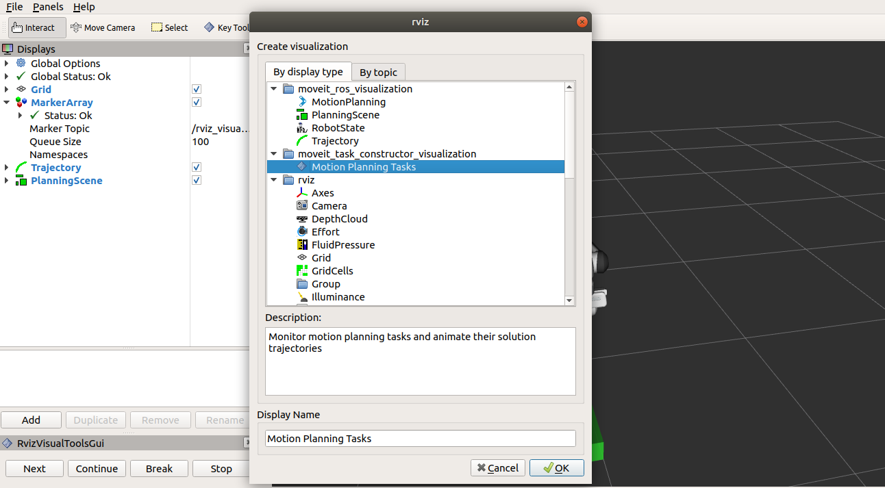

MoveIt Task Constructor
=======================

.. image:: mtc_example.png
   :width: 700px

The Task Constructor framework provides a flexible and transparent way to define and plan actions that consist of multiple interdependent subtasks. It draws on the planning capabilities of MoveIt to solve individual subproblems in black-box planning stages. A common interface, based on MoveIt's PlanningScene is used to pass solution hypotheses between stages. The framework enables the hierarchical organization of basic stages using containers, allowing for sequential as well as parallel compositions. For more details, please refer to the associated `ICRA 2019 publication`_.

.. _ICRA 2019 publication: https://pub.uni-bielefeld.de/download/2918864/2933599/paper.pdf

Getting Started
---------------

If you haven't already done so, make sure you've completed the steps in `Getting Started <../getting_started/getting_started.html>`_.

Installing MoveIt Task Constructor
----------------------------------

**Note:** Currently, it's required to build `moveit` and `moveit_msgs` from source for this tutorial to function.

Install From Source
^^^^^^^^^^^^^^^^^^^

Go into your catkin workspace and initialize wstool if necessary (assuming `~/catkin_ws` as workspace path): ::

  cd ~/catkin_ws/src
  wstool init

Clone MoveIt Task Constructor and source dependencies: ::

  git clone https://github.com/ros-planning/moveit_task_constructor.git
  wstool merge moveit_task_constructor/moveit_task_constructor.rosinstall
  wstool update

Install missing packages with rosdep: ::

  rosdep install --from-paths . --ignore-src --rosdistro $ROS_DISTRO

Build the workspace: ::

  catkin build

Running the Demo
----------------

The MoveIt Task Constructor package contains an example pick-and-place application.
You can try it out by running: ::

  roslaunch moveit_task_constructor_demo demo.launch

On the right side you should see the `Motion Planning Tasks` outlining the stages of the **pick_place_task**.
When you select the task or a single stage the right colum lists the individual subsolutions.
You can simply click on a subsolution to visualize a planned trajectory of the selected segment.

.. image:: mtc_show_stages.gif
   :width: 700px

MoveIt Task Constructor Works
---------------------------------

Tasks
^^^^^
A task is a specified complex planning problem that consists of a sequence of high level steps called stages.

Stages
^^^^^^
A stage is a low-level implementation of a high-level planning step. The individual stages compute subsolutions that can **generate**,
**propogate**, or **connect** `InterfaceStates`. They also can combine or edit contained substages.

InterfaceState
^^^^^^^^^^^^^^
Stages interface each other via the InterfaceState class, which is a snapshot of the planning scene, the robot state, and some named properties.

Stage Types
^^^^^^^^^^^
There are three basic types of stages: In addition to **generator**, **propagator**, and **connector** stages,
there exist container stages (**wrapper**, **serial**, and **parallel** container), which allow to structure the task pipeline in a hierarchical fashion.

.. image:: mtc_stage_types.png
   :width: 700px

**Generator:** This is a stage that generates information that is passed to the stages above and below.

**Propogator:** This stage takes information from one or both sides, modifies it, and passes it along to the opposite side.

**Connector:** This stage takes information from both sides and plans a connecting trajectory between the robot states of both sides.

**Wrapper:** Wraps a single subordinate stage and modifies its output.

**Serial Container:** Allows to define a sequence of subordinate task.

**Parallel Container:** Allows to run several stages in parallel before choosing which substage to use the results from.

The Entire Code
---------------
The entire code can be seen in the moveit_task_constructor_ repository.

.. _moveit_task_constructor: https://github.com/ros-planning/moveit_task_constructor

**Note:** If the added task monitor does not find the /solutions topic replace `""` with `"/moveit_task_constructor_demo/pick_place_task/solution"` in line 82 of `moviet_task_constructor/visualization/motion_planning_tasks/src/task_display.cpp`.
