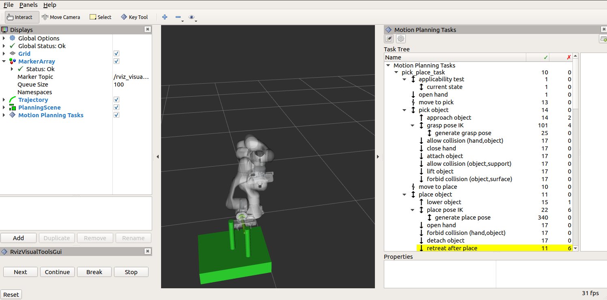
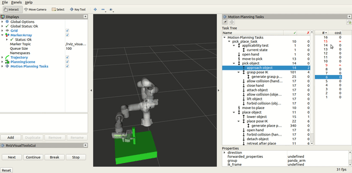

MoveIt Task Constructor
=======================

.. _introductory_image:

The Task Constructor framework provides a flexible and transparent way to define and plan actions that consist of multiple interdependent subtasks.
It draws on the planning capabilities of MoveIt to solve individual subproblems in black-box planning stages.
A common interface, based on MoveIt's PlanningScene is used to pass solution hypotheses between stages.
The framework enables the hierarchical organization of basic stages using containers, allowing for sequential as well as parallel compositions.
For more details, please refer to the associated `ICRA 2019 publication`_.

.. _ICRA 2019 publication: https://pub.uni-bielefeld.de/download/2918864/2933599/paper.pdf

Getting Started
---------------

If you have not already done so, make sure you have completed the steps in `Getting Started <../getting_started/getting_started.html>`_.

Installing MoveIt Task Constructor
----------------------------------

Install From Source
^^^^^^^^^^^^^^^^^^^

Go into your catkin workspace and initialize wstool if necessary (assuming `~/ws_moveit` as workspace path): ::

  cd ~/ws_moveit/src
  git clone https://github.com/ros-planning/moveit_task_constructor.git

Install missing packages with rosdep: ::

  rosdep install --from-paths . --ignore-src --rosdistro $ROS_DISTRO

Build the workspace: ::

  catkin build

Running the Demo
----------------

The MoveIt Task Constructor package contains several basic examples and a pick-and-place demo.
For all demos you should launch the basic environment: ::

  roslaunch moveit_task_constructor_demo demo.launch

Subsequently, you can run the individual demos: ::

  rosrun moveit_task_constructor_demo cartesian
  rosrun moveit_task_constructor_demo modular
  roslaunch moveit_task_constructor_demo pickplace.launch

.. tip::

  To debug your application code and
  generate a visual task representation,
  add a new panel to your `RViZ` display.
  If you use the provided launch file, this is already pre-configured.

  .. figure:: images/panel_1.png
    :width: 370px
    :alt: add mtc rviz panel_1
    :align: center

  Select the `Motion Planning Tasks` plugin from the
  ``moveit_task_constructor_visualization`` package.

  .. figure:: images/panel_2.png
    :width: 370px
    :alt: add mtc rviz panel_2
    :align: center

The `Motion Planning Tasks` panel outlines the hierarchical stage structure of the tasks.
When you select a particular stage, the list of successful and failed solutions will be
shown in the right-most window. Selecting one of those solutions will start its visualization.

.. _basic_concepts:
Basic Concepts
--------------

The fundamental idea of MTC is that complex motion planning problems can be composed into a set of simpler subproblems.
The top-level planning problem is specified as a **Task** while all subproblems are specified by **Stages**.
Stages can be arranged in any arbitrary order and hierarchy only limited by the individual stages types.
The order in which stages can be arranged is restricted by the direction in which results are passed.
There are three possible stages relating to the result flow: generator, propagator, and connector stages:

**Generators** compute their results independently of their neighbor stages and pass them in both directions, backwards and forwards.
An example is an IK sampler for geometric poses where approaching and departing motions (neighbor stages) depend on the solution.

**Propagators** receive the result of one neighbor stage, solve a subproblem and then propagate their result to the neighbor on the opposite site.
Depending on the implementation, propagating stages can pass solutions forward, backward or in both directions separately.
An example is a stage that computes a Cartesian path based on either a start or a goal state.

**Connectors** do not propagate any results, but rather attempt to bridge the gap between the resulting states of both neighbors.
An example is the computation of a free-motion plan from one given state to another.

Additional to the order types, there are different hierarchy types allowing to encapsulate subordinate stages.
Stages without subordinate stages are called **primitive stages**, higher-level stages are called **container stages**.
There are three container types:

**Wrappers** encapsulate a single subordinate stage and modify or filter the results.
For example, a filter stage that only accepts solutions of its child stage that satisfy a certain constraint can be realized as a wrapper.
Another standard use of this type includes the IK wrapper stage, which generates inverse kinematics solutions based on planning scenes annotated with a pose target property.

**Serial Containers** hold a sequence of subordinate stages and only consider end-to-end solutions as results.
An example is a picking motion that consists of a sequence of coherent steps.

**Parallel Containers** combine set of subordinate stages and can be used for passing the best of alternative results, running fallback solvers or for merging multiple independent solutions.
Examples are running alternative planners for a free-motion plan, picking objects with the right hand or with the left hand as a fallback, or moving the arm and opening the gripper at the same time.

.. image:: images/mtc_stage_types.png
   :width: 700px

Stages not only support solving motion planning problems.
They can also be used for all kinds of state transitions, as for instance modifying the planning scene.
Combined with the possibility of using class inheritance it is possible to construct very complex behavior while only relying on a well-structured set of primitive stages.

.. tip::

  In general, it is a good habit to encapsulate
  application-specific `MoveIt Task Constructor` code within a ros-node.

Demo: Pick and Place
--------------------

The following section discusses the pick and place demo in more detail.
It might give you some insight on the mechanics of the demo program and
inspire you in the design of your own task hierarchies.
To start, please follow the steps in section `Running the Demo`_.

The ``PickPlaceTask`` class encapsulates a ros node that runs MTC code.
For the purpose of this tutorial, we reduce the discussion of the class to
the following memberfunctions and attributes:

+------------------------+-----------------------------------------------------------------------------+
| ``loadParameters()``   |  | Initialize membervariables of the ``PickPlaceTask`` class from the ros   |
|                        |  | parameter server                                                         |
+------------------------+-----------------------------------------------------------------------------+
| ``init()``             |  | Construct the task hierarchy                                             |
+------------------------+-----------------------------------------------------------------------------+
| ``execute()``          |  | Wrapper around built-in task execution capabilities                      |
+------------------------+-----------------------------------------------------------------------------+

``loadParameters()`` operates on the following parameters:

+-----------------------------+------------------------------------------------------------------------+
| planning group properties   |  | ``arm_group_name_ : string``                                        |
|                             |  | ``eef_name_ : string``                                              |
|                             |  | ``hand_group_name_ : string``                                       |
|                             |  | ``hand_frame_ : string``                                            |
+-----------------------------+------------------------------------------------------------------------+
| object + surface properties |  | ``support_surfaces : vector<string>``                               |
|                             |  | ``object_reference_frame : string``                                 |
|                             |  | ``surface_link_ : string``                                          |
|                             |  | ``object_name_ : string``                                           |
|                             |  | ``world_frame_ : string``                                           |
|                             |  | ``object_dimensions_ : string``                                     |
+-----------------------------+------------------------------------------------------------------------+
| predefined pose targets     |  | ``hand_open_pose_ : string``                                        |
|                             |  | ``hand_close_pose_ : string``                                       |
|                             |  | ``arm_home_pose_ : string``                                         |
+-----------------------------+------------------------------------------------------------------------+
| pick metrics                |  | ``grasp_frame_transform_ : Isometry3d``                             |
|                             |  | ``approach_object_min_dist_ : string``                              |
|                             |  | ``approach_object_max_dist_ : string``                              |
|                             |  | ``lift_object_min_dist_ : string``                                  |
|                             |  | ``lift_object_max_dist_ : string``                                  |
+-----------------------------+------------------------------------------------------------------------+
| place metrics               |  | ``place_pose_ : Pose``                                              |
|                             |  | ``place_surface_offset_ : double``                                  |
+-----------------------------+------------------------------------------------------------------------+

The ``init`` function constructs the task hierarchy.
Consult the `introductory_image`_ for a visualization.
Lets discuss the structure briefly by going over some of the
highlights.

The MoveIt Task Constructor is able to plan bi-directionally through the task hierarchy.
By inspecting the planning direction, which is displayed to the left of the stage name in the
`introductory_image`_, we can examine the planning direction.
`Pick Container`_ and `Place Container`_ stages, as well as the `Initial Setup`_ stages propagate their results
bi-directionally. We can use ``connect`` stages to find motion plans between these intermediary solutions.

Initial Setup
^^^^^^^^^^^^^

First, start with a clean task by resetting the internal task pointer,
constructing a new task object for the temporal task hierarchy assembly
and load the robot model.

.. code-block:: c++

  task_.reset();
  task_.reset(new moveit::task_constructor::Task());

  Task& t = *task_;
  t.stages()->setName(task_name_);
  t.loadRobotModel();

Set up different planners to be available for stages later on.

.. code-block:: c++

  // Different planners plan robot movement: a cartesian , pipeline, or joint interpolation planner.
  auto sampling_planner = std::make_shared<solvers::PipelinePlanner>();
  sampling_planner->setProperty("goal_joint_tolerance", 1e-5);

  // Cartesian planner
  auto cartesian_planner = std::make_shared<solvers::CartesianPath>();
  cartesian_planner->setMaxVelocityScaling(1.0);
  cartesian_planner->setMaxAccelerationScaling(1.0);
  cartesian_planner->setStepSize(.01);

Set up general task properties. For a detailled discussion on stage
configuration with properties, see the section on `Stage Configuration`_.

Lets start with extracting the current state of a) the robot and b) the planning scene.
We will use the occasion and test if an object that we want to pick
is already attached to the robot by using a predicate filter wrapper stage.
The lambda expression evaluates if the wrapped-stage's solutions are rejected or passed.

.. code-block:: c++

  // maintain a pointer to this stage for later use in monitoring generator
  Stage* current_state_ptr = nullptr;
  {
    auto current_state = std::make_unique<stages::CurrentState>("current state");

    // Verify that object is not attached with a prediace filter wrapper
    auto applicability_filter = std::make_unique<stages::PredicateFilter>(
      "applicability test", std::move(current_state)
    );

    // Expression to test of object is already attached
    applicability_filter->setPredicate(
      [object](const SolutionBase& s, std::string& comment) {
        if (s.start()->scene()->getCurrentState().hasAttachedBody(object)) {
          comment = "object with id '" + object + "' is already attached and cannot be picked";
          return false;
        }
      return true;
    });

    // Add the wrapped stage to the task hierarchy
    current_state_ptr = applicability_filter.get();
    t.add(std::move(applicability_filter));
  }

Next, we prepare the manipulator by inserting a move stage to open the hand.
Note that we chose the sampling planner we defined earlier as an example.

.. code-block:: c++

  {
    auto stage = std::make_unique<stages::MoveTo>("open hand", sampling_planner);
    stage->setGroup(hand_group_name_);
    stage->setGoal(hand_open_pose_);
    t.add(std::move(stage));
  }

Pick Container
^^^^^^^^^^^^^^
Using a connect stage, we can join the solutions of the inital setup with
the solutions of the pick container stages by finding a valid motion plan
between the two.

.. code-block:: c++

  {
    auto stage = std::make_unique<stages::Connect>(
      "move to pick",
      stages::Connect::GroupPlannerVector{ { arm_group_name_, sampling_planner } }
    );
    stage->setTimeout(5.0);
    stage->properties().configureInitFrom(Stage::PARENT);
    t.add(std::move(stage));
  }

**Create the serial container to contain the pick-related stages**.
To reuse previously defined properties, we copy them from the
task into the pick serial container.

.. code-block:: c++

  auto grasp = std::make_unique<SerialContainer>("pick object");
  t.properties().exposeTo(grasp->properties(), { "eef", "hand", "group", "ik_frame" });
  grasp->properties().configureInitFrom(Stage::PARENT, { "eef", "hand", "group", "ik_frame" });

To carry out the pick movement, we first need to approach the desired object:
Note that we insert the following stages into our previously defined serial container, not in the
main task.

.. code-block:: c++

  {
    // The arm moves along the z-dimension and stops right before the object.
    auto stage = std::make_unique<stages::MoveRelative>("approach object", cartesian_planner);
    stage->properties().set("marker_ns", "approach_object");
    stage->properties().set("link", hand_frame_);
    stage->properties().configureInitFrom(Stage::PARENT, { "group" });
    stage->setMinMaxDistance(approach_object_min_dist_, approach_object_max_dist_);

    // Set hand forward direction
    geometry_msgs::Vector3Stamped vec;
    vec.header.frame_id = hand_frame_;
    vec.vector.z = 1.0;
    stage->setDirection(vec);
    grasp->insert(std::move(stage));
  }

Remember that the first stage in our task hierarchy was a wrapped ``current state`` stage.
We insert a monitoring generator that takes the solution of that stage (i.e. the current state)

Next, we insert a stage to generate the grasp pose.
``GenerateGraspPose`` is a derivation of the generic monitoring generator stage.
Thus it monitors another stage and processes its solutions.
In this case, the solution of the first stage of the task hierarchy (``CurrentState``)
is taken and possible grasp candidates are sampled around it in a specified interval.
Note how we configure most of the stage's properties using the preceding *Parent* stage.

.. code-block:: c++

  {
    // Sample grasp pose candidates in angle increments around the z-axis of the object.
    auto stage = std::make_unique<stages::GenerateGraspPose>("generate grasp pose");
    stage->properties().configureInitFrom(Stage::PARENT);
    stage->properties().set("marker_ns", "grasp_pose");
    stage->setPreGraspPose(hand_open_pose_);
    stage->setObject(object);
    stage->setAngleDelta(M_PI / 4);
    stage->setMonitoredStage(current_state_ptr);  // Hook into current state

    // Compute joint parameters for a target frame of the end effector. Each target frame equals a grasp pose
    // from the previous stage times the inverse of the user-defined grasp_frame_tansform.
    auto wrapper = std::make_unique<stages::ComputeIK>("grasp pose IK", std::move(stage));
    wrapper->setMaxIKSolutions(8);
    wrapper->setMinSolutionDistance(1.0);
    wrapper->setIKFrame(grasp_frame_transform_, hand_frame_);
    wrapper->properties().configureInitFrom(Stage::PARENT, { "eef", "group" });
    wrapper->properties().configureInitFrom(Stage::INTERFACE, { "target_pose" });
    grasp->insert(std::move(wrapper));
  }

Next up, once we found a grasping position, we need to ...

1. Allow collision between the gripper and the object.
2. Close the gripper.
3. Attach the object.

.. code-block:: c++

  {
    // Modify the planning scene (does not alter the robot's position) to permit picking up the object.
    auto stage = std::make_unique<stages::ModifyPlanningScene>("allow collision (hand,object)");
    stage->allowCollisions(
      object,
      t.getRobotModel()->getJointModelGroup(hand_group_name_)->getLinkModelNamesWithCollisionGeometry(),
      true
    );
    grasp->insert(std::move(stage));
  }

  {
    auto stage = std::make_unique<stages::MoveTo>("close hand", sampling_planner);
    stage->setGroup(hand_group_name_);
    stage->setGoal(hand_close_pose_);
    grasp->insert(std::move(stage));
  }

  // Attaching the object to the hand and lifting the object while guaranteeing that it does not touch the
  // ground happens in the next four stages.
  {
    auto stage = std::make_unique<stages::ModifyPlanningScene>("attach object");
    stage->attachObject(object, hand_frame_);
    attach_object_stage = stage.get();
    grasp->insert(std::move(stage));
  }

To lift the object up, the collisions with the object-supporting infrastructure have to be
temporarily disabled. That is because it is assumed that the object is placed onto, i.e. in
collision with a table surface.

To this end, we need to ...

1. Allow collision between the object and supporting infrastructure.
2. Perform the lifting motion the object up.
3. Forbid collision between the object and supporting infrastructure.

.. code-block:: c++

  {
    auto stage = std::make_unique<stages::ModifyPlanningScene>("allow collision (object,support)");
    stage->allowCollisions({ object }, support_surfaces_, true);
    grasp->insert(std::move(stage));
  }

  {
    auto stage = std::make_unique<stages::MoveRelative>("lift object", cartesian_planner);
    stage->properties().configureInitFrom(Stage::PARENT, { "group" });
    stage->setMinMaxDistance(lift_object_min_dist_, lift_object_max_dist_);
    stage->setIKFrame(hand_frame_);
    stage->properties().set("marker_ns", "lift_object");

    // Set upward direction
    geometry_msgs::Vector3Stamped vec;
    vec.header.frame_id = world_frame_;
    vec.vector.z = 1.0;
    stage->setDirection(vec);
    grasp->insert(std::move(stage));
  }

  {
    auto stage = std::make_unique<stages::ModifyPlanningScene>("forbid collision (object,surface)");
    stage->allowCollisions({ object }, support_surfaces_, false);
    grasp->insert(std::move(stage));
  }

Finally, the grasp container can be added to the main task hierarchy.

.. code-block:: c++

  // Add grasp container to task
  t.add(std::move(grasp));

Place Container
^^^^^^^^^^^^^^^

Similarly to the pick container, the place container gets parsed for planning asynchronously to the
rest of the stages. Using a connect stage, the outgoing interface of the place container can be
connected to the outgoing interface of the preceeding pick container.

.. code-block:: c++

  {
    // Define the `move to place` (as the `move to pick`) stage as a Connect object.
    auto stage = std::make_unique<stages::Connect>(
      "move to place", stages::Connect::GroupPlannerVector{ { arm_group_name_, sampling_planner } }
    );
    stage->setTimeout(5.0);
    stage->properties().configureInitFrom(Stage::PARENT);
    t.add(std::move(stage));
  }

Initialize a serial container to contain the subordinate stages that are related to the pick task.

.. code-block:: c++

  auto place = std::make_unique<SerialContainer>("place object");
  t.properties().exposeTo(place->properties(), { "eef", "hand", "group" });
  place->properties().configureInitFrom(Stage::PARENT, { "eef", "hand", "group" });

To place an object, first lower the manipulator.

.. code-block:: c++

  {
    auto stage = std::make_unique<stages::MoveRelative>("lower object", cartesian_planner);
    stage->properties().set("marker_ns", "lower_object");
    stage->properties().set("link", hand_frame_);
    stage->properties().configureInitFrom(Stage::PARENT, { "group" });
    stage->setMinMaxDistance(.03, .13);

    // Set downward direction
    geometry_msgs::Vector3Stamped vec;
    vec.header.frame_id = world_frame_;
    vec.vector.z = -1.0;
    stage->setDirection(vec);
    place->insert(std::move(stage));
  }

Using a `target` pose that the object shall obtain, generate inverse kinematic solutions in which
the robot arm achieves this pose.

.. code-block:: c++

  {
    // Generate Place Pose
    auto stage = std::make_unique<stages::GeneratePlacePose>("generate place pose");
    stage->properties().configureInitFrom(Stage::PARENT, { "ik_frame" });
    stage->properties().set("marker_ns", "place_pose");
    stage->setObject(object);

    // Set target pose
    geometry_msgs::PoseStamped p;
    p.header.frame_id = object_reference_frame_;
    p.pose = place_pose_;
    p.pose.position.z += 0.5 * object_dimensions_[0] + place_surface_offset_;
    stage->setPose(p);
    stage->setMonitoredStage(attach_object_stage);  // Hook into attach_object_stage

    // Compute IK
    auto wrapper = std::make_unique<stages::ComputeIK>("place pose IK", std::move(stage));
    wrapper->setMaxIKSolutions(2);
    wrapper->setIKFrame(grasp_frame_transform_, hand_frame_);
    wrapper->properties().configureInitFrom(Stage::PARENT, { "eef", "group" });
    wrapper->properties().configureInitFrom(Stage::INTERFACE, { "target_pose" });
    place->insert(std::move(wrapper));
  }

Next, perform the following steps to release the object from the manipulator.

1. Open the gripper.
2. Disable collisions between the gripper and the grasped-object.
3. Detach the object.

.. code-block:: c++

  {
    auto stage = std::make_unique<stages::MoveTo>("open hand", sampling_planner);
    stage->setGroup(hand_group_name_);
    stage->setGoal(hand_open_pose_);
    place->insert(std::move(stage));
  }

  {
    auto stage = std::make_unique<stages::ModifyPlanningScene>("forbid collision (hand,object)");
    stage->allowCollisions(
      object_name_,
      t.getRobotModel()->getJointModelGroup(hand_group_name_)->getLinkModelNamesWithCollisionGeometry(),
      false
    );
    place->insert(std::move(stage));
  }

  {
    auto stage = std::make_unique<stages::ModifyPlanningScene>("detach object");
    stage->detachObject(object_name_, hand_frame_);
    place->insert(std::move(stage));
  }

Using the robot manipulator, retreat the end effector manipulator from the object after placing it down.

.. code-block:: c++

  {
    auto stage = std::make_unique<stages::MoveRelative>("retreat after place", cartesian_planner);
    stage->properties().configureInitFrom(Stage::PARENT, { "group" });
    stage->setMinMaxDistance(.12, .25);
    stage->setIKFrame(hand_frame_);
    stage->properties().set("marker_ns", "retreat");
    geometry_msgs::Vector3Stamped vec;
    vec.header.frame_id = hand_frame_;
    vec.vector.z = -1.0;
    stage->setDirection(vec);
    place->insert(std::move(stage));
  }

To this end, add the place container to the task hierarchy.

.. code-block:: c++

  // Add place container to task
  t.add(std::move(place));

Final
^^^^^

To complete the sequence, the robot manipulator should be directed to
the starting position. This can, for example, be done by using a ``MoveTo``
stage and computing the motion with a probabilistic sampling planner.

.. code-block:: c++

  {
    auto stage = std::make_unique<stages::MoveTo>("move home", sampling_planner);
    stage->properties().configureInitFrom(Stage::PARENT, { "group" });
    stage->setGoal(arm_home_pose_);
    stage->restrictDirection(stages::MoveTo::FORWARD);
    t.add(std::move(stage));
  }

Programmatic Extension
----------------------

You may find that the available stages do not suffice the needs of your application.
Given this situation, you have the option to derive your own classes from core
stage types and implement custom functionality. Your choice of core class determines
the structure, i.e. the `flow path` of incoming and outgoing data with respect to
your new stage.

Overview of core classes
^^^^^^^^^^^^^^^^^^^^^^^^

The section :ref:`basic_concepts` in this tutorial provides an overview of the stage types
together with result propagation directions that are available for programmatic extension.
Remember: Core classes define result flow.
For example, to specify bi-directional result propagation, you might derive from the
``Generator`` class.
You will find this pattern if you take a look at the ``CurrentState`` stage,
which `generates` the current state of the planning scene and forwards it to both interfaces.

When deriving from one of the core classes, you need to implement your new computation in
the provided virtual functions. This ensures that the `MTC` backend can call your code
in the right place when traversing through the task hierarchy.
The following table provides an overview of these functions as well as giving more,
already implemented, examples of programmatic extension stages.

+------------------------+-----------------------+-------------------------+
| Core Class             | Virtual Functions     | Example Stages          |
+========================+=======================+=========================+
| Generator              | | ``compute``         | | *CurrentState*        |
|                        | | ``canCompute``      | | *FixedState*          |
+------------------------+-----------------------+-------------------------+
| Monitoring Generator   | | ``compute``         | | *FixedCartesianPoses* |
|                        | | ``canCompute``      | | *GeneratePickPose*    |
|                        | | ``onNewSolution``   | | *GeneratePlacePose*   |
+------------------------+-----------------------+-------------------------+
| Connecting             | | ``compute``         | | *Connect*             |
+------------------------+-----------------------+-------------------------+
| Propagating Either Way | | ``computeForward``  | | *MoveRelative*        |
|                        | | ``computeBackward`` | | *MoveTo*              |
|                        |                       | | *ModifyPlanningScene* |
+------------------------+-----------------------+-------------------------+

.. note::
  **compute()**
    The functionality of a stage is encapsulated in
    the ``compute()`` function.
    ``Interface`` classes are utilized as input and outputs of a stage.

  **canCompute()**
    To be able to gain control of the execution of the compute function, ``canCompute()`` acts as a guard.

Implementation
^^^^^^^^^^^^^^

In case you just want to insert the stage and check for the functions later, it is valid
to leave the function body with no contents, i.e.:

.. code-block:: c++

  void compute() override {};

Additionally, you may define a custom constructor for your derived stage class and forward the arguments like so:

.. code-block:: c++

  class MyGenerator : public Generator{
    public:
      MyGenerator(const std::string& name) : Generator(name) {};

Solutions of stages are propagated via ``InterfaceStates``.
An interface state can only propagate planning scene instances.
The next section presents code examples for all the core classes that you may use as a
basic implementation reference.

Generator
+++++++++
A template for a ``Generator`` stage is listed below.
As stated above the ``compute()`` function assembles a planning scene and spawns an interface, whilst the
``canCompute()`` function acts as an execution guard.

.. literalinclude:: src/extension_tutorial.cpp
  :language: cpp
  :lines: 48-84

The example above additionally implements a mechanism to call the ``compute`` function only once.
Create the stage:

.. code-block:: c++

  auto g = std::make_unique<MyGenerator>("myGenerator");

Monitoring Generator
++++++++++++++++++++
The ``MonitoringGenerator`` processes a solution that the monitored stage just computed.

.. literalinclude:: src/extension_tutorial.cpp
  :language: cpp
  :lines: 86-129

Create the stage:

.. code-block:: c++

  auto m = std::make_unique<MyMonitoringGenerator>("myMonitoringGenerator");

PropagatingEitherWay
++++++++++++++++++++

The ``PropagatingEitherWay`` stage forwards solutions between interface states of previous and
following stages in a forward and backward manner.

.. literalinclude:: src/extension_tutorial.cpp
  :language: cpp
  :lines: 9-46

Create the stage:

.. code-block:: c++

  auto pr = std::make_unique<MyPropagatingEitherWay>("myPropagatingEitherWay");

Connecting
++++++++++

The Connecting stage computes a solution between interface states
from the previous and following stages.

.. literalinclude:: src/extension_tutorial.cpp
  :language: cpp
  :lines: 131-155

Create the stage:

.. code-block:: c++

  auto c = std::make_unique<MyConnecting>("myConnecting");

Stage Configuration
-------------------

Stages are configured with properties.
A property is a ``boost::any`` value stored with key-value style inside the ``Property`` class, which provides the following
wrapper-like functionality:

- Maintain default and current values with get-/set-/reset-to-default functions.
- Provide descriptions.
- Serialization into strings.
- Check for type and if-defined status of the property.
- Initialization from an already existing property.

.. tutorial-formatter:: ./src/extension_tutorial.cpp

Notice, that when we initialize our properties from an external domain, we need to provide a property initializer source flag.
You can access these flags through the ``Stage::PropertyInitializerSource::`` scope.
They define a priority hierarchy in which initializations are carried out:

  ``MANUAL > DEFAULT > INTERFACE > PARENT``

Initialization of properties is carried out during planning of the entire
task hierarchy. You can therefore specify a priority hierarchy on a per-property-basis from where the stage should get
the information for its properties.

E.g. use the ``MANUAL`` flag if you want to explicitly configure a (set) of properties
from a property map. ``MANUAL`` takes precedence over all the other flags.
As another example, you can use ``INTERFACE`` and ``PARENT`` flags to let the stage be initialized
by its successor or predecessor.

To summarize, the property map allows you to:

- Declare properties for future use without providing values yet.
- Expose a subset of the properties to another property map.
- Reset all properties.
- Check if a key-value pair is present.
- Initialize still undefined properties using SourceFlags.
- Iterate over the property map.
- Forward property maps through the task hierarchy using established interfaces for planning.
