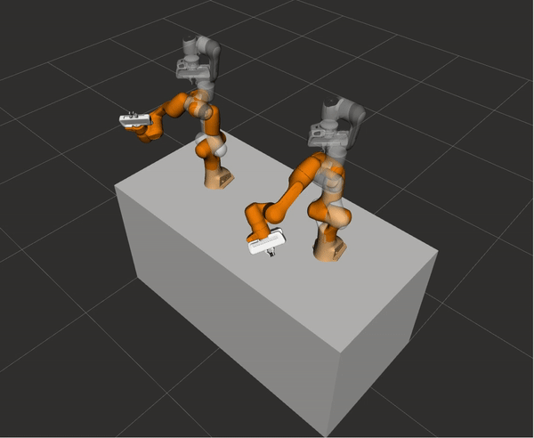
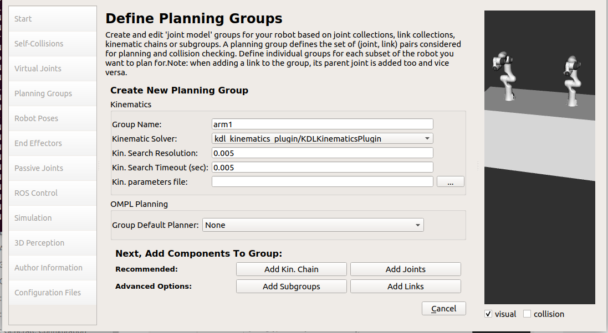
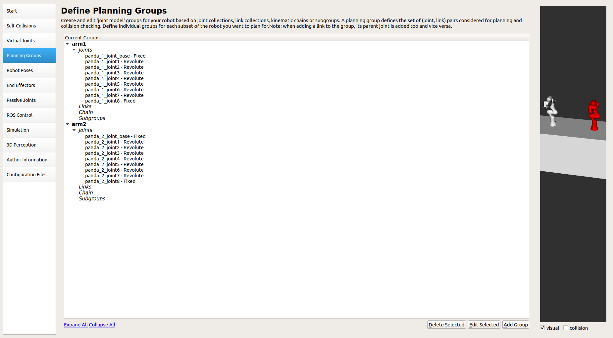

Run multiple robot arms
===============================

For running multiple robot arms in moveit, the following points need to be kept in mind - 
 1. All robot arms should be defined in the same URDF.
 2. Each arm should have its own move_group.
 3. If arms need to move in sync, they can be defined in a combined move_group.

Robot model used
----------------
This tutorial will use the two panda arms for demonstration. The urdf of the two panda arms can be seen `here <https://github.com/frankaemika/franka_ros/blob/kinetic-devel/franka_description/robots/dual_panda_example.urdf.xacro>`_.

Configuring the robot through the setup assistant
---------------------------------------------------

For moving the robot arms individually, we simply need to create two different move groups for each arm and then plan for the two groups separately. For synchronous movement, refer further down in the tutorial.

Subsequently add the joints of each arm into their respective groups.

Moving the two arms in sync
-----------------------------

For moving the two arms in sync we need to combine both the move groups into a common move group as shown below: ::

    <group name="arm1">
        <joint name="panda_1_joint_base" />
        <joint name="panda_1_joint1" />
        <joint name="panda_1_joint2" />
        <joint name="panda_1_joint3" />
        <joint name="panda_1_joint4" />
        <joint name="panda_1_joint5" />
        <joint name="panda_1_joint6" />
        <joint name="panda_1_joint7" />
        <joint name="panda_1_joint8" />
    </group>
    <group name="arm2">
        <joint name="panda_2_joint_base" />
        <joint name="panda_2_joint1" />
        <joint name="panda_2_joint2" />
        <joint name="panda_2_joint3" />
        <joint name="panda_2_joint4" />
        <joint name="panda_2_joint5" />
        <joint name="panda_2_joint6" />
        <joint name="panda_2_joint7" />
        <joint name="panda_2_joint8" />
    </group>
    <group name="both_arm">
        <group name="arm1"/>
        <group name="arm2"/>
    </group>

Moving multiple arms asynchronously
--------------------------------------

As of now, there is no accepted method provided by moveit to move multiple arms asynchronously. For more details kindly refer to this `issue <https://github.com/ros-planning/moveit/issues/2287>`_.