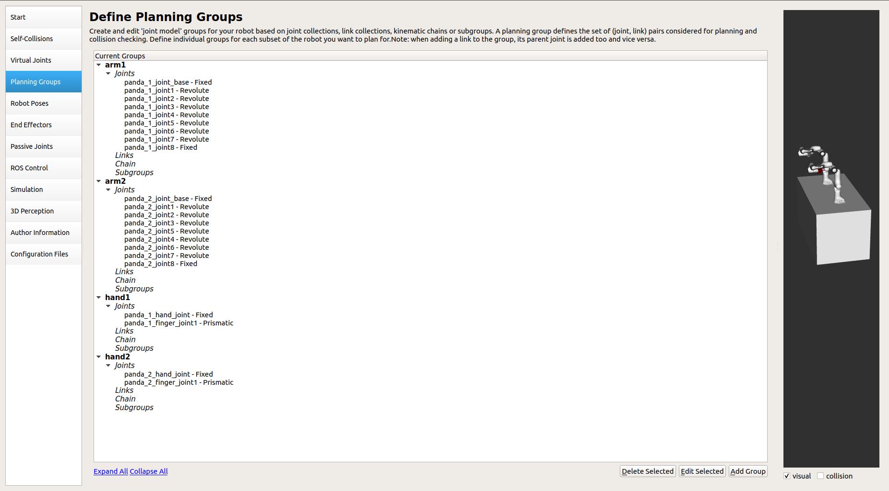
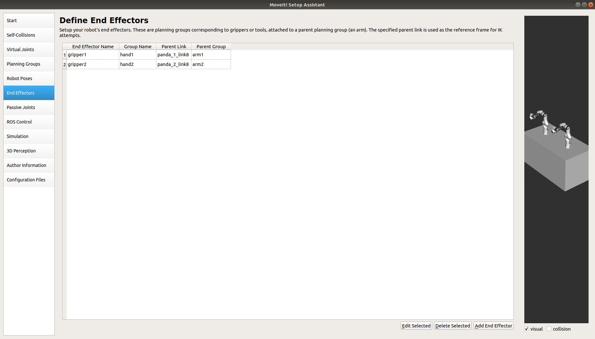
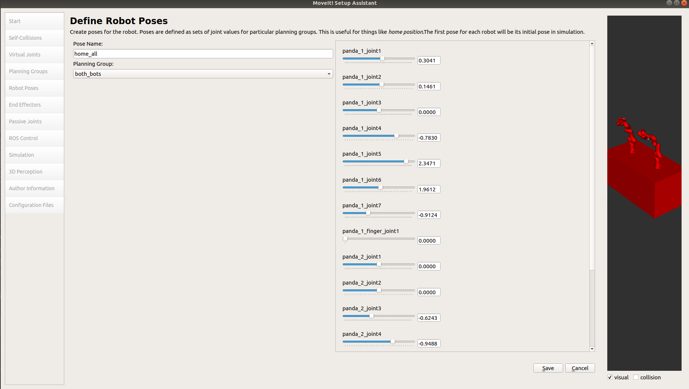

Run multiple robot arms
===============================
.. image:: multi_arm_tutorial.gif
   :width: 500px

For running multiple robot arms in MoveIt, the following points need to be kept in mind :
 1. All robot arms should be defined in the same URDF.
 2. Each arm should have its own planning_group.
 3. If arms need to move in sync, they can be defined in a combined planning_group.

But before starting with multiple arms, the concept of planning groups, there usage and significance of multiple planning groups for multiple end effectors
needs to be understood clearly. kindly go through `this <https://answers.ros.org/question/321843/how-is-moveit-planning-group-supposed-to-be-used/>`_ answer if you are a beginner/new to these concepts.

Robot model used
----------------
This tutorial will use the two panda arms for demonstration. The urdf of the two panda arms can be seen `here <https://github.com/frankaemika/franka_ros/blob/kinetic-devel/franka_description/robots/dual_panda_example.urdf.xacro>`_.

Configuring the robot through the setup assistant
---------------------------------------------------

For moving the robot arms individually, we need to create two different planning groups for each arm and then plan for the two groups separately. Refer to `MoveIt setup assistant tutorial <http://moveit2_tutorials.picknik.ai/doc/setup_assistant/setup_assistant_tutorial.html>`_
if you do not know the GUI based method for setting up your robot configuration for MoveIt. For synchronous movement, refer further down in the tutorial.

.. image:: arm1.png
   :width: 700px

Subsequently add the joints of each arm into their respective groups.

.. image:: arm_joint.png
   :width: 700px

Moving the two arms in sync
-----------------------------

First of all define the individual arms and their end-effectors in respective groups as shown -

Now define the end effectors -

Then combine all the planning groups into a common planning group, in this case - "both_bots" in the srdf file : ::

    <group name="arm1">
        <joint name="virtual_joint" />
        <joint name="panda_1_joint_base" />
        <joint name="panda_1_joint1" />
        <joint name="panda_1_joint2" />
        <joint name="panda_1_joint3" />
        <joint name="panda_1_joint4" />
        <joint name="panda_1_joint5" />
        <joint name="panda_1_joint6" />
        <joint name="panda_1_joint7" />
        <joint name="panda_1_joint8" />
        <chain base_link="panda_1_link0" tip_link="panda_1_link8" />
    </group>
    <group name="arm2">
        <joint name="panda_2_joint_base" />
        <joint name="panda_2_joint1" />
        <joint name="panda_2_joint2" />
        <joint name="panda_2_joint3" />
        <joint name="panda_2_joint4" />
        <joint name="panda_2_joint5" />
        <joint name="panda_2_joint6" />
        <joint name="panda_2_joint7" />
        <joint name="panda_2_joint8" />
        <chain base_link="panda_2_link0" tip_link="panda_2_link8" />
    </group>
    <group name="robot1">
        <group name="arm1" />
        <group name="hand1" />
    </group>
    <group name="robot2">
        <group name="arm2" />
        <group name="hand2" />
    </group>
    <group name="hand1">
        <joint name="panda_1_hand_joint" />
        <joint name="panda_1_finger_joint1" />
    </group>
    <group name="hand2">
        <joint name="panda_2_hand_joint" />
        <joint name="panda_2_finger_joint1" />
    </group>
    <group name="both_bots">
        <group name="arm1" />
        <group name="arm2" />
        <group name="hand1" />
        <group name="hand2" />
    </group>

We can then define the initial pose of the combined group -

Code for execution
-------------------------------------------------------
.. tutorial-formatter:: ./src/multi_group_tutorial.cpp

Moving multiple arms asynchronously
--------------------------------------

Currently we can not plan for two separate trajectories for two different arms and execute them separately using the ``MoveGroupInterface``.
The workaround to this is to take the planned trajectories for left and right arm and send them as a goal to the action server of the robot arm .The problem however,
is the fact that there is no collision checking between the two trajectories, since the plans were generated without any knowledge of the other arms movement.
Refer to `this answer <https://answers.ros.org/question/374907/multirobot-moveit-controller-management/>`_ for more details.