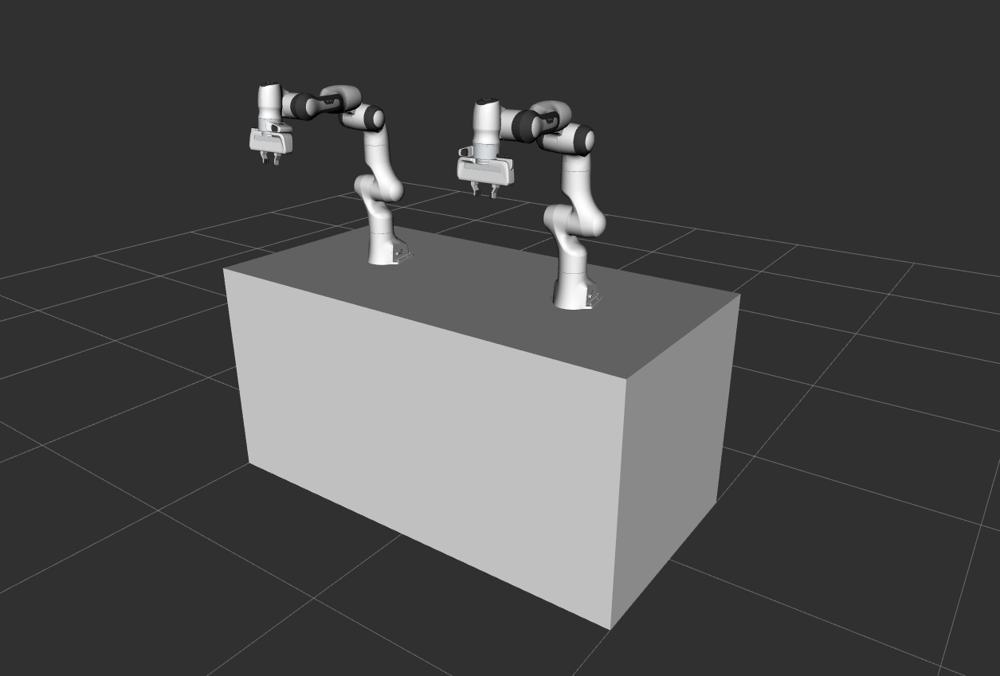
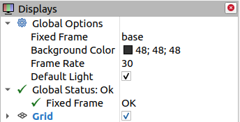
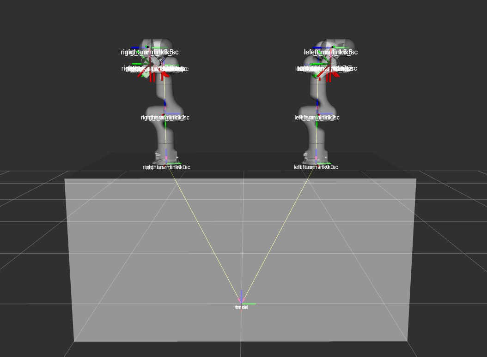
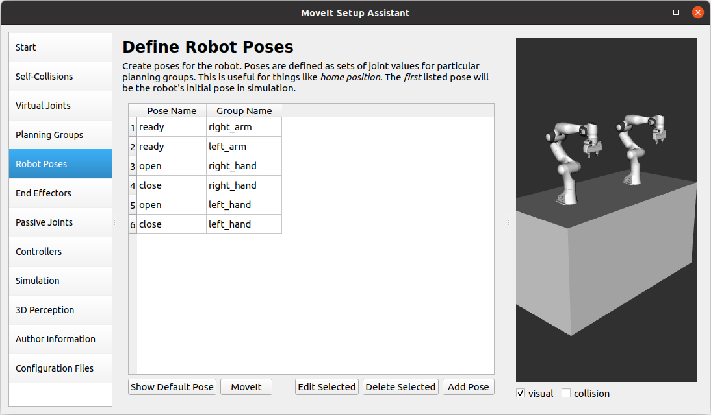

Multiple Robot Arms
==========================

Introduction
------------
In MoveIt, we can plan motions for multiple robot arms, but there are pre-required steps to prepare robot models and configure ROS controllers. This tutorial provides ROS beginners with the steps to model multiple arms, configure controllers, and plan motions using MoveIt.

Watch this `Quick YouTube video <https://www.youtube.com/watch?v=h8zlsuzeW3U>`_ of the multiple arms being controlled in Gazebo with the MoveIt Rviz plugin.

Getting Started
---------------
If you haven't already done so, make sure you've completed the steps in `Getting Started <https://ros-planning.github.io/moveit_tutorials/doc/getting_started/getting_started.html>`_.

The steps of setting multiple arms environments to use MoveIt motion planning are as follows:

1. Build the Xacro/URDF model of the multiple arms.

2. Prepare the MoveIt config package using MoveIt setup Assistant.

3. Write the ROS controllers configuration and launch files for the multiple arms.

4. Integrate the simulation in Gazebo with MoveIt motion planning.

5. Plan arm motions with the MoveIt Move Group Interface.

This tutorial explains every step to help set up your multiple robot arms.

Step 1: Build the Xacro/URDF model of the multiple arms
-------------------------------------------------------

The Panda robot arm is used in the following explanation, but the same applies to preparing other types of robot arms.

To start building your multiple arms model, create a new ``panda_multiple_arms`` package as follows: ::

    cd ~/ws_moveit/src
    catkin create pkg panda_multiple_arms
    cd panda_multiple_arms
    mkdir robot_description && cd robot_description
    touch panda_multiple_arms.xacro

To prepare your multiple robot arms xacro file (model), you need to have the single arm's xacro file. In the following part, we will build a multiple arms panda robot description file consisting of two identical arms.

Our multiple arms model has ``right_arm`` and ``left_arm`` robots. Each arm is equipped with a gripper. Here is a link to the `panda_multiple_arms.xacro <https://github.com/Robotawi/panda_arms_ws/blob/master/src/panda_multiple_arms/robot_description/panda_multiple_arms.xacro>`_ file. Please copy its XML code to your ``panda_multiple_arms.xacro`` file.

Notes:

1. Two arguments ``right_arm`` and ``left_arm`` are defined as prefixes to differentiate the arms and hands names.

2. The arms and hands models are loaded from the ``franka_description`` package, which is installed as a dependency of the ``panda_moveit_config`` package. Ensure the ``franka_description`` package is installed in your ROS environment.

3. We usually need to have a careful look at the robot's xacro macro to understand parameters to use. Here is an example from the ``franka_arm.xacro`` file in the ``franka_description`` package. It has the following macro for the robot model::

    <xacro:macro name="franka_arm" params="arm_id:='panda' description_pkg:='franka_description' connected_to:='' xyz:='0 0 0' rpy:='0 0 0' gazebo:=false safety_distance:=0 joint_limits" >

We can search those parameters in the macro to understand the function of each. The ``arm_id`` sets a prefix to the arm name to enable reusing the same model. This is essential for our purpose of modeling multiple robots. The ``connected_to`` parameter allows the robot base to be attached to a given link. In our multiple arms model, each robot is connected to a box-shaped base. The ``gazebo`` parameter determines whether to load the gazebo simulation required information (e.g links inertias and joints transmissions) or not.

After knowing the xacro macro for the arm, and understanding the input parameters, we can use it as follows to load the arms. ::

    <xacro:franka_arm arm_id="$(arg arm_id_1)" connected_to="base" xyz="0 -0.5 1" gazebo="true" safety_distance="0.03" joint_limits="${xacro.load_yaml('$(find franka_description)/robots/panda/joint_limits.yaml')}"/>

    <xacro:franka_arm arm_id="$(arg arm_id_2)" connected_to="base" xyz="0 0.5 1" gazebo="true" safety_distance="0.03" joint_limits="${xacro.load_yaml('$(find franka_description)/robots/panda/joint_limits.yaml')}"/>

The same applies to loading the robot grippers/hands models. Follow the tutorials of `URDF <http://wiki.ros.org/urdf/Tutorials>`_ and `xacro <http://wiki.ros.org/urdf/Tutorials/Using%20Xacro%20to%20Clean%20Up%20a%20URDF%20File>`_ to learn more about modeling robots with those formats.

At this point, it is recommended to check our xacro model is working as expected. This can be done in three simple steps; convert your xacro model to URDF, check the connections between links and joints are correct, and visualize the model. Run the following commands to build your ``panda_multiple_arms`` package and check the xacro model has no problems. ::

    cd ~/ws_moveit
    catkin build
    source devel/setup.bash
    roscd panda_multiple_arms/robot_description
    rosrun xacro xacro panda_multiple_arms.xacro -o panda_multiple_arms.urdf
    check_urdf panda_multiple_arms.urdf

The ``check_urdf`` command shows the links tree and indicates if there are any errors: ::

    robot name is: panda_multiple_arms
    ---------- Successfully Parsed XML ---------------
    root Link: world has 1 child(ren)
        child(1):  base
            child(1):  left_arm_link0
                child(1):  left_arm_link1
                    child(1):  left_arm_link2
                        child(1):  left_arm_link3
                            child(1):  left_arm_link4
                                child(1):  left_arm_link5
                                    child(1):  left_arm_link6
                                        child(1):  left_arm_link7
                                            child(1):  left_arm_link8
                                                child(1):  left_arm_hand
                                                    child(1):  left_arm_leftfinger
                                                    child(2):  left_arm_rightfinger
                                                    child(3):  left_arm_hand_sc
                                                    child(4):  left_arm_hand_tcp
                                            child(2):  left_arm_link7_sc
                                        child(2):  left_arm_link6_sc
                                    child(2):  left_arm_link5_sc
                                child(2):  left_arm_link4_sc
                            child(2):  left_arm_link3_sc
                        child(2):  left_arm_link2_sc
                    child(2):  left_arm_link1_sc
                child(2):  left_arm_link0_sc
            child(2):  right_arm_link0
                child(1):  right_arm_link1
                    child(1):  right_arm_link2
                        child(1):  right_arm_link3
                            child(1):  right_arm_link4
                                child(1):  right_arm_link5
                                    child(1):  right_arm_link6
                                        child(1):  right_arm_link7
                                            child(1):  right_arm_link8
                                                child(1):  right_arm_hand
                                                    child(1):  right_arm_leftfinger
                                                    child(2):  right_arm_rightfinger
                                                    child(3):  right_arm_hand_sc
                                                    child(4):  right_arm_hand_tcp
                                            child(2):  right_arm_link7_sc
                                        child(2):  right_arm_link6_sc
                                    child(2):  right_arm_link5_sc
                                child(2):  right_arm_link4_sc
                            child(2):  right_arm_link3_sc
                        child(2):  right_arm_link2_sc
                    child(2):  right_arm_link1_sc
                child(2):  right_arm_link0_sc

To visually check your multiple robot arm model, ensure that the ``urdf_tutorial`` ROS package is installed and run the command: ::

    roslaunch urdf_tutorial display.launch model:=panda_multiple_arms.urdf

Once the Rviz GUI starts, set the fixed frame on the upper left corner to ``world``.

If the previous steps are correctly done, the multiple arms model should show up as follows.

This concludes the first step of building the model and verifying it.

Step 2: Prepare the MoveIt config package using MoveIt Setup Assistant
----------------------------------------------------------------------

MoveIt Setup Assistant is used to configure our multiple robot arms for using the MoveIt pipeline.

- Start the MoveIt Setup Assistant: ::

    roslaunch moveit_setup_assistant setup_assistant.launch

Follow the MoveIt Setup Assistant `tutorial <https://ros-planning.github.io/moveit_tutorials/doc/setup_assistant/setup_assistant_tutorial.html>`_ to configure the arms. Note that we will be making a separate move group for each arm and hand. The groups are called ``right_arm``, ``left_arm``, ``right_hand``, and ``left_hand``.

Here are two more steps which are not required but often useful:

1. Define a practical `ready` pose for both arms with joint values {0.0, -0.785, 0.0, -2.356, 0.0, 1.571, 0.785}.

The arms should look as follows at the `ready` pose.

.. image:: images/arms_at_ready_poses.png
   :width: 500pt
   :align: center

2. Define ``open`` and ``close`` poses for the ``right_hand`` and ``left_hand`` move groups. The ``open`` pose with joint1 value set to 0.035, and the ``close`` has the joint1 set to 0.0. Notice that the **hand's** ``joint2`` mimics the value of ``joint1``.  Therefore, there is no need to include ``joint2`` in the **hand** move_group poses.  The defined poses for the arms and hands should look as follows. Feel free to add other poses of interest for the arms/hands.

Name the MoveIt config package ``panda_multiple_arms_moveit_config`` and generate the files using the Setup Assistant in the ``~/ws_moveit/src`` directory.

Step 3: Write the ROS controllers configuration and launch files for the multiple arms
--------------------------------------------------------------------------------------

This step creates ``ros_control`` configuration files and ``roslaunch`` files to start them. We need two controller types. The first is a *joint state controller*, which publishes the state of all joints. The second is *joint trajectory controller*, which executes joint-space trajectories on a group of robot joints.

In the following configuration files, the controllers names are ``joint_state_controller``, ``right_arm_trajectory_controller``, and ``left_arm_trajectory_controller``. Under each trajectory controller, we need to specify its hardware interface type, joint groups, and constraints. For more about ROS controllers,  refer to their documentation_. Let's create the controllers configuration and their launch file in systematic steps and with descriptive names.

.. _documentation: http://wiki.ros.org/ros_control

- The joint state controller:

1. Create the ``joint_state_controller.yaml`` configuration file inside the ``panda_multiple_arms/config`` directory as follows::

    cd ~/ws_moveit
    cd src/panda_multiple_arms
    mkdir config && cd config
    touch joint_state_controller.yaml

2. Open the ``joint_state_controller.yaml`` and copy the following controller configuration to it ::

    joint_state_controller:
        type: joint_state_controller/JointStateController
        publish_rate: 50

- The joint trajectory controller:

3. Create the ``trajectory_controller.yaml`` configuration file in the same directory ``panda_multiple_arms/config`` ::

    cd ~/ws_moveit
    cd src/panda_multiple_arms/config
    touch trajectory_controller.yaml

4. Open the ``trajectory_controller.yaml`` and copy the following controller configuration to it ::

    right_arm_trajectory_controller:
        type: "position_controllers/JointTrajectoryController"
        joints:
            - right_arm_joint1
            - right_arm_joint2
            - right_arm_joint3
            - right_arm_joint4
            - right_arm_joint5
            - right_arm_joint6
            - right_arm_joint7
        constraints:
            goal_time: 0.6
            stopped_velocity_tolerance: 0.05
            right_arm_joint1: {trajectory: 0.1, goal: 0.1}
            right_arm_joint2: {trajectory: 0.1, goal: 0.1}
            right_arm_joint3: {trajectory: 0.1, goal: 0.1}
            right_arm_joint4: {trajectory: 0.1, goal: 0.1}
            right_arm_joint5: {trajectory: 0.1, goal: 0.1}
            right_arm_joint6: {trajectory: 0.1, goal: 0.1}
            right_arm_joint7: {trajectory: 0.1, goal: 0.1}
        stop_trajectory_duration: 0.5
        state_publish_rate:  25
        action_monitor_rate: 10

    left_arm_trajectory_controller:
        type: "position_controllers/JointTrajectoryController"
        joints:
            - left_arm_joint1
            - left_arm_joint2
            - left_arm_joint3
            - left_arm_joint4
            - left_arm_joint5
            - left_arm_joint6
            - left_arm_joint7
        constraints:
            goal_time: 0.6
            stopped_velocity_tolerance: 0.05
            left_arm_joint1: {trajectory: 0.1, goal: 0.1}
            left_arm_joint2: {trajectory: 0.1, goal: 0.1}
            left_arm_joint3: {trajectory: 0.1, goal: 0.1}
            left_arm_joint4: {trajectory: 0.1, goal: 0.1}
            left_arm_joint5: {trajectory: 0.1, goal: 0.1}
            left_arm_joint6: {trajectory: 0.1, goal: 0.1}
            left_arm_joint7: {trajectory: 0.1, goal: 0.1}
        stop_trajectory_duration: 0.5
        state_publish_rate:  25
        action_monitor_rate: 10

    #notice that the grippers joint2 mimics joint1
    #this is why it is not listed under the hand controllers
    right_hand_controller:
        type: "effort_controllers/JointTrajectoryController"
        joints:
            - right_arm_finger_joint1
        gains:
            right_arm_finger_joint1:  {p: 50.0, d: 1.0, i: 0.01, i_clamp: 1.0}

    left_hand_controller:
        type: "effort_controllers/JointTrajectoryController"
        joints:
            - left_arm_finger_joint1
        gains:
            left_arm_finger_joint1:  {p: 50.0, d: 1.0, i: 0.01, i_clamp: 1.0}

5. Create a ``control_utils.launch`` file inside the ``panda_multiple_arms/launch`` directory to start the robot state publisher, and the controllers. Copy the following XML code to your ``control_utils.launch`` file::

    <?xml version="1.0"?>
    <launch>

    <!-- Robot state publisher -->
    <node pkg="robot_state_publisher" type="robot_state_publisher" name="robot_state_publisher">
        <param name="publish_frequency" type="double" value="50.0" />
        <param name="tf_prefix" type="string" value="" />
    </node>

    <!-- Joint state controller -->
    <rosparam file="$(find panda_multiple_arms)/config/joint_state_controller.yaml" command="load" />
    <node name="joint_state_controller_spawner" pkg="controller_manager" type="spawner" args="joint_state_controller" respawn="false" output="screen" />

    <!-- Joint trajectory controller -->
    <rosparam file="$(find panda_multiple_arms)/config/trajectory_controller.yaml" command="load" />
    <node name="arms_trajectory_controller_spawner" pkg="controller_manager" type="spawner" respawn="false" output="screen" args="right_arm_trajectory_controller left_arm_trajectory_controller right_hand_controller left_hand_controller" />

    </launch>

The joint state controller publishes the robot joint values on the ``/joint_states`` topic, and the robot state publisher uses them to calculate forward kinematics and publish the poses/transforms of the robot links. The joint trajectory controller enables executing joint-space trajectories on a group of joints.

The remaining part of this step explains how to modify the auto-generated controller files in the moveit config package to execute MoveIt-generated trajectories on Gazebo-simulated robots. Also in a systematic way, we need to modify two files, ``ros_controllers.yaml``, and ``simple_moveit_controllers.yaml``

- The ros_controllers.yaml

6. The ``ros_controllers.yaml`` file is auto-generated in the  ``panda_multiple_arms_moveit_config/config``. This file is for the ROS control configuration, which means its content should be the same as the content of both ``joint_state_controller.yaml`` and ``trajectory_controller.yaml``. Its contents should be as follows ::

    joint_state_controller:
        type: joint_state_controller/JointStateController
        publish_rate: 50

    right_arm_trajectory_controller:
        type: "position_controllers/JointTrajectoryController"
        joints:
            - right_arm_joint1
            - right_arm_joint2
            - right_arm_joint3
            - right_arm_joint4
            - right_arm_joint5
            - right_arm_joint6
            - right_arm_joint7
        constraints:
            goal_time: 0.6
            stopped_velocity_tolerance: 0.05
            right_arm_joint1: {trajectory: 0.1, goal: 0.1}
            right_arm_joint2: {trajectory: 0.1, goal: 0.1}
            right_arm_joint3: {trajectory: 0.1, goal: 0.1}
            right_arm_joint4: {trajectory: 0.1, goal: 0.1}
            right_arm_joint5: {trajectory: 0.1, goal: 0.1}
            right_arm_joint6: {trajectory: 0.1, goal: 0.1}
            right_arm_joint7: {trajectory: 0.1, goal: 0.1}
        stop_trajectory_duration: 0.5
        state_publish_rate:  25
        action_monitor_rate: 10

    left_arm_trajectory_controller:
        type: "position_controllers/JointTrajectoryController"
        joints:
            - left_arm_joint1
            - left_arm_joint2
            - left_arm_joint3
            - left_arm_joint4
            - left_arm_joint5
            - left_arm_joint6
            - left_arm_joint7
        constraints:
            goal_time: 0.6
            stopped_velocity_tolerance: 0.05
            left_arm_joint1: {trajectory: 0.1, goal: 0.1}
            left_arm_joint2: {trajectory: 0.1, goal: 0.1}
            left_arm_joint3: {trajectory: 0.1, goal: 0.1}
            left_arm_joint4: {trajectory: 0.1, goal: 0.1}
            left_arm_joint5: {trajectory: 0.1, goal: 0.1}
            left_arm_joint6: {trajectory: 0.1, goal: 0.1}
            left_arm_joint7: {trajectory: 0.1, goal: 0.1}
        stop_trajectory_duration: 0.5
        state_publish_rate:  25
        action_monitor_rate: 10

    #notice that the grippers joint2 mimics joint1
    #this is why it is not listed under the hand controllers
    right_hand_controller:
        type: "effort_controllers/JointTrajectoryController"
        joints:
            - right_arm_finger_joint1
        gains:
            right_arm_finger_joint1:  {p: 50.0, d: 1.0, i: 0.01, i_clamp: 1.0}

    left_hand_controller:
        type: "effort_controllers/JointTrajectoryController"
        joints:
            - left_arm_finger_joint1
        gains:
            left_arm_finger_joint1:  {p: 50.0, d: 1.0, i: 0.01, i_clamp: 1.0}

- The simple_moveit_controllers.yaml

7. This file is also auto-generated in ``panda_multiple_arms_moveit_config/config``. MoveIt requires a trajectory controller which has a FollowJointTrajectoryAction interface. After motion planning, the FollowJointTrajectoryAction interface sends the generated trajectory to the robot ROS controller (written above). This file configures the controllers to be used by MoveIt controller manager to execute planned trajectories. The controllers names should match the ROS controllers in the previous ``ros_controllers.yaml``. Copy the following to your ``simple_moveit_controllers.yaml`` file. ::

    controller_list:
      - name: right_arm_trajectory_controller
          action_ns: follow_joint_trajectory
          type: FollowJointTrajectory
          default: True
          joints:
          - right_arm_joint1
          - right_arm_joint2
          - right_arm_joint3
          - right_arm_joint4
          - right_arm_joint5
          - right_arm_joint6
          - right_arm_joint7
      - name: left_arm_trajectory_controller
          action_ns: follow_joint_trajectory
          type: FollowJointTrajectory
          default: True
          joints:
          - left_arm_joint1
          - left_arm_joint2
          - left_arm_joint3
          - left_arm_joint4
          - left_arm_joint5
          - left_arm_joint6
          - left_arm_joint7

      #notice that the gripper's joint2 mimics joint1
      #this is why it is not listed under the hand controllers

      - name: right_hand_controller
          action_ns: follow_joint_trajectory
          type: FollowJointTrajectory
          default: true
          joints:
          - right_arm_finger_joint1

      - name: left_hand_controller
          action_ns: follow_joint_trajectory
          type: FollowJointTrajectory
          default: true
          joints:
          - left_arm_finger_joint1

8. The last step is to make the auto-generated ``ros_controllers.launch`` spawn the ROS controllers configured in the ``ros_controller.yaml`` file. This launch file is inside the ``panda_multiple_arms_moveit_config/launch`` directory. Edit the file and add the controller names as arguments in the controller spawner node as shown below. ::

    <?xml version="1.0"?>
    <launch>

        <!-- Load joint controller configurations from YAML file to parameter server -->
        <rosparam file="$(find panda_multiple_arms_moveit_config)/config/ros_controllers.yaml" command="load"/>

        <!-- Load the controllers -->
        <node name="controller_spawner" pkg="controller_manager" type="spawner" respawn="false"
            output="screen" args=" right_arm_trajectory_controller left_arm_trajectory_controller right_hand_controller left_hand_controller"/>

    </launch>

Step 4: Integrate the simulation in Gazebo with MoveIt motion planning
----------------------------------------------------------------------

At the integration step, we need to ensure that ROS packages for ROS control, Gazebo ROS control, MoveIt ROS control interface, and MoveIt planners are installed and sourced on our ROS environment. Install the required ROS packages as follows, and **source** your ROS environment::

 sudo apt install ros-noetic-ros-control ros-noetic-ros-controllers ros-noetic-joint-state-controller ros-noetic-effort-controllers ros-noetic-position-controllers ros-noetic-velocity-controllers ros-noetic-gazebo-ros ros-noetic-gazebo-ros-control ros-noetic-moveit-ros-control-interface ros-noetic-moveit-simple-controller-manager ros-noetic-moveit-fake-controller-manager ros-noetic-moveit-planners

For the integration to work, we need to prepare a launch file to start three components. Those components are the simulated robot in Gazebo, ROS controllers, and MoveIt motion plannig executable. We have already prepared the ``control_utils.launch`` file to load the ROS controllers, and the required MoveIt motion planning file ``move_group.launch`` is auto-generated. Then, our tasks here are to start the simulated robot in a Gazebo world, and prepare a launch file that starts the mentioned three components.

1. Starting the simulated robot in an empty Gazebo world

To spawn the panda multiple arms model in Gazebo, we need to prepare a launch file in the ``panda_multiple_arms/launch`` directory. Let's call it ``panda_multiple_arms_empty_world.launch``. Here are the steps to prepar this file. ::

    cd ~/ws_moveit
    cd src/panda_multiple_arms/launch
    touch panda_multiple_arms_empty_world.launch

The ``panda_multiple_arms_empty_world.launch`` file launches an empty world file, loads the robot description, and spawns the robot in the empty world. Copy the following XML code to this file. ::

    <?xml version="1.0"?>
    <launch>
        <!-- Launch empty Gazebo world -->
        <include file="$(find gazebo_ros)/launch/empty_world.launch">
            <arg name="use_sim_time" value="true" />
            <arg name="gui" value="true" />
            <arg name="paused" value="false" />
            <arg name="debug" value="false" />
        </include>

        <!-- Find my robot Description-->
        <param name="robot_description" command="$(find xacro)/xacro  '$(find panda_multiple_arms)/robot_description/panda_multiple_arms.xacro'" />

        <!-- Spawn The robot over the robot_description param-->
        <node name="urdf_spawner" pkg="gazebo_ros" type="spawn_model" respawn="false" output="screen" args="-urdf -param robot_description -model panda_multiple_arms" />
    </launch>

2. Preparing a ``bringup_moveit.launch`` file to start the three integration components. Create the file in the ``panda_multiple_arms/launch`` directory. ::

    cd ~/ws_moveit
    cd src/panda_multiple_arms/launch
    touch bringup_moveit.launch

Copy the following XML code to the ``bringup_moveit.launch`` file. ::

    <?xml version="1.0"?>
    <launch>
        <!-- Run the main MoveIt executable with trajectory execution -->
        <include file="$(find panda_multiple_arms_moveit_config)/launch/move_group.launch">
            <arg name="allow_trajectory_execution" value="true" />
            <arg name="moveit_controller_manager" value="ros_control" />
            <arg name="fake_execution_type" value="interpolate" />
            <arg name="info" value="true" />
            <arg name="debug" value="false" />
            <arg name="pipeline" value="ompl" />
            <arg name="load_robot_description" value="true" />
        </include>

        <!-- Start the simulated robot in an empty Gazebo world -->
        <include file="$(find panda_multiple_arms)/launch/panda_multiple_arms_empty_world.launch" />

        <!-- Start the controllers and robot state publisher-->
        <include file="$(find panda_multiple_arms)/launch/control_utils.launch"/>

        <!-- Start moveit_rviz with the motion planning plugin -->
        <include file="$(find panda_multiple_arms_moveit_config)/launch/moveit_rviz.launch">
            <arg name="rviz_config" value="$(find panda_multiple_arms_moveit_config)/launch/moveit.rviz" />
        </include>

    </launch>

To start the MoveIt-Gazebo integration, build and source your ROS workspace, and run the ``bringup_moveit.launch`` file. ::

    cd ~/ws_moveit
    catkin build
    source devel/setup.bash
    roslaunch panda_multiple_arms bringup_moveit.launch

If all steps are done, this should bring up all the required components for the integration. Then, we can plan motions for the arms and hands using MoveIt's rviz plugin and execute those motions on the simulated robots in Gazebo as shown in `this video <https://www.youtube.com/watch?v=h8zlsuzeW3U>`_.

Step 5: Plan arms motions with MoveIt Move Group Interface.
-----------------------------------------------------------

When writing code for multiple move groups, motion planning works the same way it did in previous tutorials. There is an `example here for multiple move groups <https://github.com/Robotawi/panda_arms_ws/blob/master/src/panda_multiple_arms/src/plan_simple_motion.cpp>`_ and a `minimal CMakeLists.txt <https://github.com/Robotawi/panda_arms_ws/blob/master/src/panda_multiple_arms/CMakeLists.txt>`_ file with the dependencies to use Moveit Move Group Interface and describe the arms poses. This `short YouTube video <https://youtu.be/sxUQh91oQxM>`_ shows the resulting arms and hands motions. This example uses a separate move group for every arm, but we can make a new move group that contains both the ``right_arm`` and ``left_arm`` groups to plan and execute motions for them simultaneously.

Refer to MoveIt tutorials to learn more about the `Move Group Interface <https://ros-planning.github.io/moveit_tutorials/doc/move_group_interface/move_group_interface_tutorial.html>`_.
