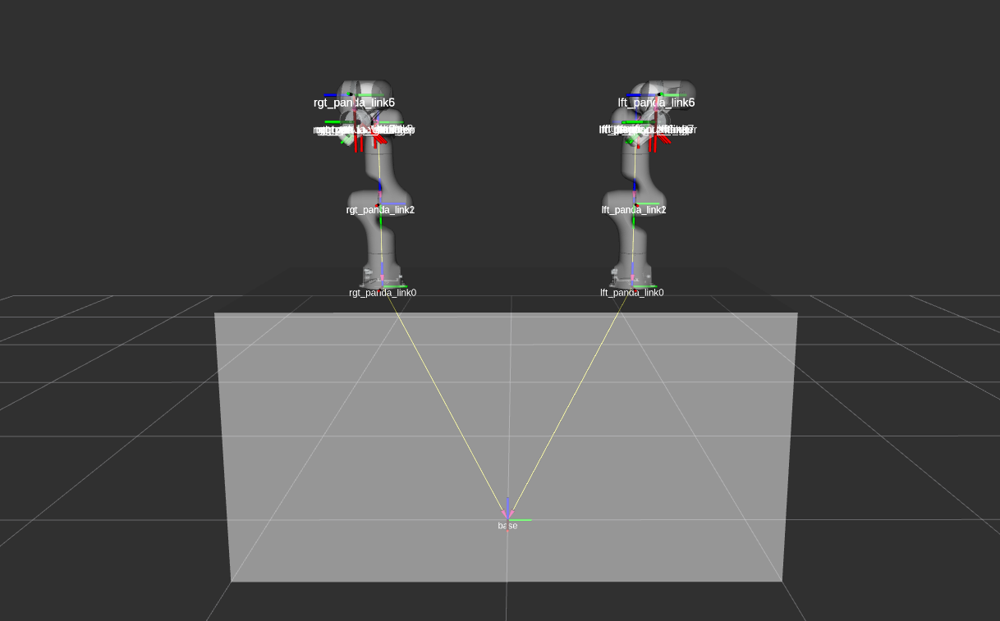
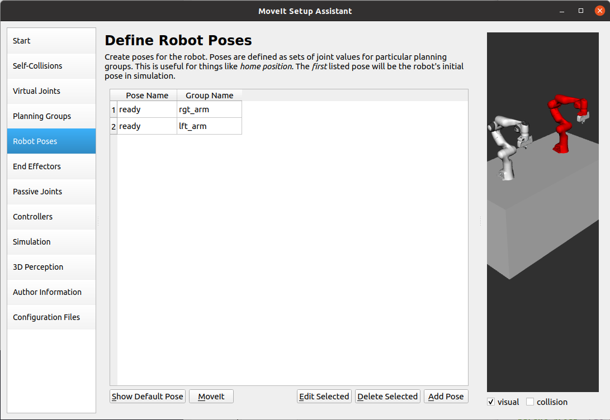
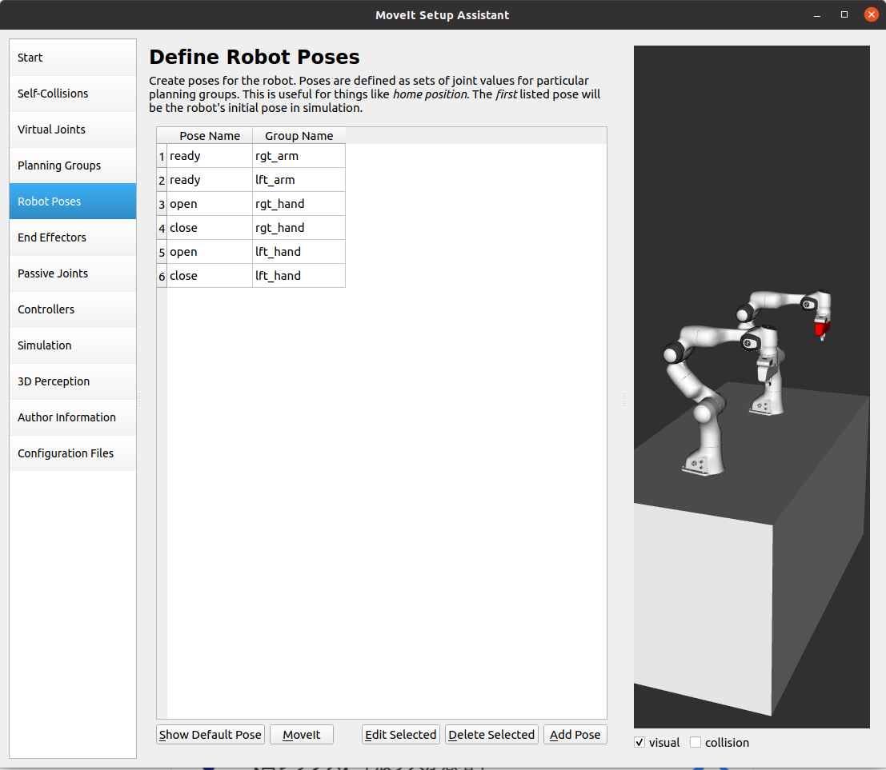

Introduction
------------
In MoveIt, we can plan motions for multiple robot arms, but there are pre-required steps to prepare robot models and configure ros controllers. This tutorial provides ROS beginners with the steps to model multiple arms, configure controllers, and plan motions using MoveIt.

.. image:: images/multiple_arms_start.png
   :width: 600pt
   :align: center

Watch this `Quick YouTube video <https://youtu.be/_5siHkFQPBQ>`_ of the multiple arms being controlled in Gazebo from Rviz.

Getting Started
---------------
If you haven't already done so, make sure you've completed the steps in `Getting Started <../getting_started/getting_started.html>`_.

The steps of setting multiple arms environments to use MoveIt motion planning are as follows:

1. Build the Xacro/URDF model of the multiple arms.

2. Prepare the MoveIt config package using MoveIt setup Assistant. 

3. Write the ros controllers configuration and launch files for the multiple arms. 

4. Integrate the simulation in Gazebo with MoveIt motion planning.

5. Plan arms motions with MoveIt Move Group Interface.

This tutorial explains every step to help set up your multiple robot arms environment. 

1. Build the Xacro/URDF model of the multiple arms
--------------------------------------------------

The Panda robot arm is used in the following explanation, but the same applies to preparing other types of robot arms.

To start building your multiple arms model, create a new ``panda_multiple_arms`` package as follows: :: 

    cd ~/ws_moveit
    catkin create pkg panda_multiple_arms
    cd panda_multiple_arms
    mkdir robot_description
    touch panda_multiple_arms.xacro

To prepare your multiple robot arms xacro file (model), you need to have the single arm's xacro file. In the following part, we will build a multiple arms panda robot description file consisting of two identical arms.

..
    It is worth mentioning that the difference between xacro and URDF is that TODO1. This property makes it easier to include multiple robot arms models in the same file, with a different prefix. 

Our multiple arms model has ``rgt_arm`` and ``lft_arm`` models. Each arm is equipped with a gripper. The xacro files can get lengthy. Here is a link to the multiple_arms_ xacro file. 

.. _multiple_arms: https://github.com/Robotawi/panda_arms_ws/blob/master/src/panda_multiple_arms/robot_description/panda_multiple_arms.xacro 

Notes: 

1. Two xacro arguments ``rgt_arm`` and ``lft_arm`` are defined as prefixes to differentiate the arms and hands names. 
   
2. The arms and hands models are loaded from the ``franka_description`` package, which is expected to be installed as a dependency. Similarly, when modeling your robots, make sure their robot_description packages are available in your ROS workspace.

3. We usually need to have a careful look at the robot's xacro file to understand the xacro parameters to use. Here is an example from the ``panda_arm.xacro`` in the ``franka_description`` package. ::
      
    <xacro:macro name="panda_arm" params="arm_id:='panda' description_pkg:='franka_description' connected_to:='' xyz:='0 0 0' rpy:='0 0 0' gazebo:=false safety_distance:=0">

We can search those parameters in the xacro macro to understand the function of each. The ``arm_id`` sets a prefix to the arm name to be enable reusing the same model. This is essential for our purpose of modeling multiple arms or robots. The ``connected_to`` parameter gives possibility to connect the robot base with a fixed joint to a given link. In our multiple arms model, each robot is connected to the box shaped base. The gazebo parameter decides whether to load the gazebo simulation required information (e.g links inertia and joints transmission) or not. 

After knowing the xacro macro for the arm, and understanding the input parameters, we can use it as follows to load the arms. ::

    <xacro:panda_arm arm_id="$(arg arm_id_1)" connected_to="base" xyz="0 -0.5 1" gazebo="true" safety_distance="0.03" />

    <xacro:panda_arm arm_id="$(arg arm_id_2)" connected_to="base" xyz="0 0.5 1" gazebo="true" safety_distance="0.03" />

The same applies to loading the grippers/hands models, and other robots that are defined with xacro macros. 

At this point, it is recommended to check our xacro model is working as expected. This can be done in three simple steps; convert your xacro model to URDF, check the connections between links and joints are correct, and if needed you can visualize it (as described before). Run the following commands to check the URDF has no problems. ::
    
    cd ~ws_moveit
    catkin build 
    source devel/setup.bash
    roscd dual_panda_arms/robot_description
    rosrun xacro xacro panda_multiple_arms.xacro -o panda_multiple_arms.urdf
    check_urdf panda_multiple_arms.urdf

The ``check_urdf`` shows the links tree and indicats if there are any errors: ::

    robot name is: panda_multiple_arms
    ---------- Successfully Parsed XML ---------------
    root Link: world has 1 child(ren)
        child(1):  base
            child(1):  lft_arm_link0
                child(1):  lft_arm_link1
                    child(1):  lft_arm_link2
                        child(1):  lft_arm_link3
                            child(1):  lft_arm_link4
                                child(1):  lft_arm_link5
                                    child(1):  lft_arm_link6
                                        child(1):  lft_arm_link7
                                            child(1):  lft_arm_link8
                                                child(1):  lft_arm_hand
                                                    child(1):  lft_arm_leftfinger
                                                    child(2):  lft_arm_rightfinger
                                                    child(3):  lft_arm_hand_sc
                                                    child(4):  lft_arm_hand_tcp
                                            child(2):  lft_arm_link7_sc
                                        child(2):  lft_arm_link6_sc
                                    child(2):  lft_arm_link5_sc
                                child(2):  lft_arm_link4_sc
                            child(2):  lft_arm_link3_sc
                        child(2):  lft_arm_link2_sc
                    child(2):  lft_arm_link1_sc
                child(2):  lft_arm_link0_sc
            child(2):  rgt_arm_link0
                child(1):  rgt_arm_link1
                    child(1):  rgt_arm_link2
                        child(1):  rgt_arm_link3
                            child(1):  rgt_arm_link4
                                child(1):  rgt_arm_link5
                                    child(1):  rgt_arm_link6
                                        child(1):  rgt_arm_link7
                                            child(1):  rgt_arm_link8
                                                child(1):  rgt_arm_hand
                                                    child(1):  rgt_arm_leftfinger
                                                    child(2):  rgt_arm_rightfinger
                                                    child(3):  rgt_arm_hand_sc
                                                    child(4):  rgt_arm_hand_tcp
                                            child(2):  rgt_arm_link7_sc
                                        child(2):  rgt_arm_link6_sc
                                    child(2):  rgt_arm_link5_sc
                                child(2):  rgt_arm_link4_sc
                            child(2):  rgt_arm_link3_sc
                        child(2):  rgt_arm_link2_sc
                    child(2):  rgt_arm_link1_sc
                child(2):  rgt_arm_link0_sc

To visually check your multiple robot model, run the command: ::

    roslaunch urdf_tutorial display.launch model:=panda_multiple_arms.urdf

Once Rviz GUI starts, set the fixed frame on the upper left corner to be ``base``. 

.. image:: images/rviz_fixed_frame.png
   :width: 300pt
   :align: center

If the model is correctly prepared, it should show up as follows. 

This concludes the step of building the model and verifying it. 

Step 2: Prepare MoveIt config package using MoveIt Setup Assistant 
-------------------------------------------------------------------

If you are not familiar with MoveIt Setup Assistant, please refer to this tutorial_. 

.. _tutorial: https://ros-planning.github.io/moveit_tutorials/doc/setup_assistant/setup_assistant_tutorial.html 

MoveIt Setup Assistant is used to configure our multiple robot arms for using the MoveIt pipeline. 

- Start the MoveIt Setup Assistant: ::

    roslaunch moveit_setup_assistant setup_assistant.launch

Follow the MoveIt Setup Assistant tutorial_ to configure the arms. Note that we will be making a separate move group for each arm and hand. The groups are called ``rgt_arm``, ``lft_arm``, ``rgt_hand``, and ``lft_hand``. 

.. _tutorial: https://ros-planning.github.io/moveit_tutorials/doc/setup_assistant/setup_assistant_tutorial.html 

I want to consider two more point along with the the Setup Assistant tutorial 

1. Define a practical `ready` pose for both arms with joint values {0.0, -0.785, 0.0, -2.356, 0.0, 1.571, 0.785}.

The arms should look as follows at the `ready` pose.

1. Define ``open`` and ``close`` poses for the ``rgt_hand`` and ``lft_hand`` move groups. The ``open`` pose with joint1 value set to 0.35, and the ``close`` has the joint1 set to 0.0. Note that the hand joint2 mimics the value of joint1.  Therefore, there is no need to fix joint2 in the hand move_group poses.  The defined poses for the arms and hand can be as follows. You can add other poses of interest for the arms, if needed.

Name the Moveit config package ``panda_multiple_arms_moveit_config`` and generate the files using the Setup Assistant. 

Step 3: Write the ros controllers configuration and launch files for the multiple arms 
--------------------------------------------------------------------------------------

This step creates ros_control configuration files and roslaunch files to start them. We need two controller types, the first is a *joint state controller* type, which publishes the state of all joints. The second is of the type *joint trajectory controller*, which executes joint-space trajectories on a group of robot joints.

Notice that in the following configuration files, the ``panda_multiple_arms`` is the controllers namespace. The controllers names are ``joint_state_controller``, ``rgt_arm_trajectory_controller``, and ``lft_arm_trajectory_controller``. Under each trajectory controller, we need to specify its hardware interface type, joint groups, and needed constraints. For more about ros controllers,  refer to their documentation_. Let's create the controllers configuration and their launch files in systematic steps and with descriptive names. 

.. _documentation: http://wiki.ros.org/ros_control  

- The joint state controller:
   
1. Create the controller configuration file ``joint_state_controller.yaml`` in the ``panda_multiple_arms`` package as follows::

    cd ~/ws_moveit
    cd src/panda_multiple_arms
    mkdir config
    touch joint_state_controller.yaml 

2. Open the ``joint_state_controller.yaml`` and copy the controller configuration to it ::

    panda_multiple_arms:
    joint_state_controller:
        type: joint_state_controller/JointStateController
        publish_rate: 50  

3. Create a launch file ``panda_multiple_arms_joint_state_controller.launch`` to load and spawn this controller :: 

    <?xml version="1.0"?>
    <launch>
        <!-- Load joint controller configurations from YAML file to parameter server -->
        <rosparam file="$(find panda_multiple_arms)/config/joint_state_controller.yaml" command="load" />
        <node name="joint_controller_spawner" pkg="controller_manager" type="spawner" respawn="false" output="screen" ns="/panda_multiple_arms" args="joint_state_controller" />

        <!-- Broadcast TF transforms for from joint states -->
        <node name="robot_state_publisher" pkg="robot_state_publisher" type="robot_state_publisher" respawn="false" output="screen">
            <remap from="/joint_states" to="/panda_multiple_arms/joint_states" />
        </node>

    </launch>

- The joint trajectory controller: 

1. Create the controller configuration file ``trajectory_controller.yaml`` in the ``panda_multiple_arms`` package as follows::

    cd ~/ws_moveit
    cd src/panda_multiple_arms
    mkdir config
    touch trajectory_controller.yaml 

2. Open the ``trajectory_controller.yaml`` and copy the controller configuration to it ::

    panda_multiple_arms:
    rgt_arm_trajectory_controller:
        type: "position_controllers/JointTrajectoryController"
        joints:
        - rgt_arm_joint1
        - rgt_arm_joint2
        - rgt_arm_joint3
        - rgt_arm_joint4
        - rgt_arm_joint5
        - rgt_arm_joint6
        - rgt_arm_joint7
        constraints:
            goal_time: 0.6
            stopped_velocity_tolerance: 0.05
            rgt_arm_joint1: {trajectory: 0.1, goal: 0.1}
            rgt_arm_joint2: {trajectory: 0.1, goal: 0.1}
            rgt_arm_joint3: {trajectory: 0.1, goal: 0.1}
            rgt_arm_joint4: {trajectory: 0.1, goal: 0.1}
            rgt_arm_joint5: {trajectory: 0.1, goal: 0.1}
            rgt_arm_joint6: {trajectory: 0.1, goal: 0.1}
            rgt_arm_joint7: {trajectory: 0.1, goal: 0.1}
        stop_trajectory_duration: 0.5
        state_publish_rate:  25
        action_monitor_rate: 10

    lft_arm_trajectory_controller:
        type: "position_controllers/JointTrajectoryController"
        joints:
        - lft_arm_joint1
        - lft_arm_joint2
        - lft_arm_joint3
        - lft_arm_joint4
        - lft_arm_joint5
        - lft_arm_joint6
        - lft_arm_joint7
        constraints:
            goal_time: 0.6
            stopped_velocity_tolerance: 0.05
            lft_arm_joint1: {trajectory: 0.1, goal: 0.1}
            lft_arm_joint2: {trajectory: 0.1, goal: 0.1}
            lft_arm_joint3: {trajectory: 0.1, goal: 0.1}
            lft_arm_joint4: {trajectory: 0.1, goal: 0.1}
            lft_arm_joint5: {trajectory: 0.1, goal: 0.1}
            lft_arm_joint6: {trajectory: 0.1, goal: 0.1}
            lft_arm_joint7: {trajectory: 0.1, goal: 0.1}
        stop_trajectory_duration: 0.5
        state_publish_rate:  25
        action_monitor_rate: 10

3. Create the  launch file ``panda_multiple_arms_trajectory_controller.launch`` to load the joint trajectory controller configurations and spawn it. ::

    <?xml version="1.0"?>
    <launch>
        <rosparam file="$(find panda_multiple_arms)/config/trajectory_controller.yaml" command="load" />

        <node name="arms_trajectory_controller_spawner" pkg="controller_manager" type="spawner" respawn="false" output="screen" ns="/panda_multiple_arms" args="rgt_arm_trajectory_controller lft_arm_trajectory_controller" />

    </launch>

Please be careful with the namespace (ns) and the controllers names when doing this step. Those names must match the names in the trajectory_controller.yaml file. 

The remaining part of this step presents guidance how to modify the auto-generated ros_controllers.yaml in the moveit config package for interfacing the arm using MoveIt to Gazebo. We need a trajectory controller which has a FollowJointTrajectoryAction interface. After motion planning, the FollowJointTrajectoryAction interface sends the generated trajectory to the robot ros controller (written above ``trajectory_controller.yaml``).

The ros_controllers.yaml is auto-generated in the path ``panda_multiple_arms_moveit_config/config/ros_controllers.yaml``. The file contents should be modified as follows ::

    controller_manager_ns: controller_manager
    controller_list:
    - name: panda_multiple_arms/rgt_panda_trajectory_controller
        action_ns: follow_joint_trajectory
        type: FollowJointTrajectory
        default: true
        joints:
        - rgt_panda_joint1
        - rgt_panda_joint2
        - rgt_panda_joint3
        - rgt_panda_joint4
        - rgt_panda_joint5
        - rgt_panda_joint6

    - name: panda_multiple_arms/lft_panda_trajectory_controller
        action_ns: follow_joint_trajectory
        type: FollowJointTrajectory
        default: true
        joints:
        - lft_panda_joint1
        - lft_panda_joint2
        - lft_panda_joint3
        - lft_panda_joint4
        - lft_panda_joint5
        - lft_panda_joint6
    
Notice that the namespace and controller names correspond to the names in ``trajectory_controller.yaml`` file.

In the same moveit config package, create two files ``panda_multiple_arms_moveit_controller_manager.launch.xml`` and ``moveit_planning_execution.launch``.
Make the first file load the ``ros_controllers.yaml`` as follows :: 

    <?xml version="1.0"?>
    <launch>
        <!-- loads moveit_controller_manager on the parameter server which is taken as argument
        if no argument is passed, moveit_simple_controller_manager will be set -->
        <arg name="moveit_controller_manager" default="moveit_simple_controller_manager/MoveItSimpleControllerManager" />
        <param name="moveit_controller_manager" value="$(arg moveit_controller_manager)"/>
    
        <!-- loads ros_controllers to the param server -->
        <rosparam file="$(find mylabworkcell_moveit_config)/config/ros_controllers.yaml"/>
    </launch>

The second file should start the planning, execution, and visualization components of MoveIt:: 

    <?xml version="1.0"?>
    <launch>
        <!-- The planning and execution components of MoveIt! configured to 
        publish the current configuration of the robot (simulated or real)
        and the current state of the world as seen by the planner -->
        <include file="$(find panda_multiple_arms_moveit_config)/launch/move_group.launch">
            <arg name="publish_monitored_planning_scene" value="true" />
        </include>
        
        <!-- The visualization component of MoveIt! -->
        <include file="$(find panda_multiple_arms_moveit_config)/launch/moveit_rviz.launch" />
    </launch>

Step 4: Integrate the simulation in Gazebo with Moveit motion planning
----------------------------------------------------------------------

We need to launch all the required files to start a simulated robot with the controllers and moveit motion planning context. 

To grasp the big picture, we need to prepare a ``panda_multiple_arms_bringup_moveit.launch`` file . This file loads the robot in a gazebo world, the ros controllers, moveit_planning_execution launch file, and the robot state publisher. 

To spawn the panda arms in a gazebo empty world, we need to prepare a launch file in the ``panda_multiple_arms`` package. Let's call this file ``view_panda_multiple_arms_empty_world.launch``. Here are the steps to prepar this file. :: 

    cd ~/ws_moveit
    cd src/panda_multiple_arms/launch 
    touch panda_multiple_arms_empty_world.launch

The ``panda_multiple_arms_empty_world.launch`` file launches an empty world file, loads the robot description, and spawns the robot in the empty world. Its contents are as follows::

    <?xml version="1.0"?>
    <launch>
        <!-- Launch empty Gazebo world -->
        <include file="$(find gazebo_ros)/launch/empty_world.launch">
            <arg name="use_sim_time" value="true" />
            <arg name="gui" value="true" />
            <arg name="debug" value="false" />
            <arg name="paused" value="true" />
        </include>

        <!-- Find my robot Description-->
        <param name="robot_description" command="$(find xacro)/xacro  '$(find panda_multiple_arms)/robot_description/panda_multiple_arms.xacro'" />

        <!-- convert joint states to TF transforms for rviz, etc -->
        <node name="robot_state_publisher" pkg="robot_state_publisher" type="robot_state_publisher" respawn="false" output="screen">
            <remap from="/joint_states" to="/panda_multiple_arms/joint_states" />
        </node>

        <!-- Spawn The Robot using the robot_description param-->
        <node name="urdf_spawner" pkg="gazebo_ros" type="spawn_model" respawn="false" output="screen" args="-urdf -param robot_description -model panda_multiple_arms" />

        <!-- spawn the controllers -->
        <include file="$(find panda_multiple_arms)/launch/panda_multiple_arms_trajectory_controller.launch" />

    </launch>

``Todo``: make the panda robot arm Gazebo-simulation ready. 

..
    Tutorial for multiple robot arms
    While there are some ROS Answers posts and examples floating around, there is no definitive resource on how to set up multiple manipulators with MoveIt (and especially MoveIt2). The goal of this project is to write a tutorial that should become the reference.
    Expected outcome: A ROS beginner can read the tutorial and set up a ros2_control / MoveIt pipeline without additional help.
    Project size: medium (175 hours)
    Difficulty: easy
    Preferred skills: Technical Writing, ROS, MoveIt, Python, and YAML
    Mentor: Andy Zelenak