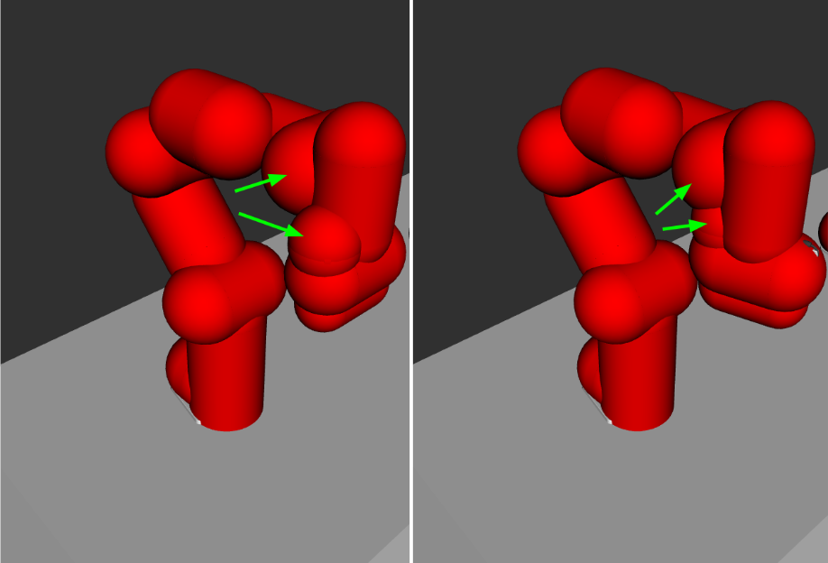

Introduction
------------
In MoveIt, we can plan motions for multiple robot arms, but we need to pre-required steps to prepare robot models and configure ros controllers. This tutorial provides ROS beginners with the steps to model multiple arms, configure controllers, and plan motions using MoveIt.

.. image:: images/multiple_arms_start.png
   :width: 300pt
   :align: center

Getting Started
---------------
If you haven't already done so, make sure you've completed the steps in `Getting Started <../getting_started/getting_started.html>`_.


The steps of setting multiple arms environments to use MoveIt motion planning are as follows:

1. Build the Xacro/URDF model of the multiple arms.

2. Prepare the MoveIt config package using MoveIt setup Assistant. 

3. Write the ros_control configuration for the multiple arms. 

4. Integrate the simulation in Gazebo with MoveIt motion planning.

5. Plan arms motions with MoveIt Move Group Interface.

This tutorial explains every step to help set up your multiple robot arms environment. 

1. Build the Xacro/URDF model of the multiple arms
--------------------------------------------------

The Panda robot arm is used in the following explanation, but the same applies to preparing other types of robot arms.

To start building your multiple arms model, create a new ``panda_multiple_arms`` package as follows: :: 

    cd ~/ws_moveit
    catkin create pkg panda_multiple_arms
    cd panda_multiple_arms
    mkdir robot_description
    touch panda_multiple_arms.xacro

To prepare your multiple robot arms xacro file (model), you need to have the single arm's xacro file. In the following part, we will build a multiple arms panda robot description file consisting of two identical arms.

..
    It is worth mentioning that the difference between xacro and URDF is that TODO1. This property makes it easier to include multiple robot arms models in the same file, with a different prefix. 

Our multiple arms model has a ``rgt_panda`` and ``lft_panda`` arms. Its structure is as follows: ::

    <?xml version="1.0"?>
    <robot name="multiple_panda_arms" xmlns:xacro="http://ros.org/wiki/xacro">

    <xacro:arg name="arm_id_1" default="rgt_panda" />
    <xacro:arg name="arm_id_2" default="lft_panda" />

    <xacro:include filename="$(find franka_description)/robots/panda_arm.xacro"/>
    <xacro:include filename="$(find franka_description)/robots/hand.xacro"/>

    <!-- box shaped table as base for the 2 Pandas -->
    <link name="base">
        <visual>
        <origin xyz="0 0 0.5" rpy="0 0 0"/>
        <geometry>
            <box size="1 2 1" />
        </geometry>
        <material name="White">
            <color rgba="1.0 1.0 1.0 1.0"/>
        </material>
        </visual>
        <collision>
        <origin xyz="0 0 0.5" rpy="0 0 0"/>
        <geometry>
            <box size="1 2 1" />
        </geometry>
        </collision>
    </link>

    <!-- right arm with gripper -->
    <xacro:panda_arm arm_id="$(arg arm_id_1)" connected_to="base"  xyz="0 -0.5 1" safety_distance="0.03"/>
    <xacro:hand arm_id="$(arg arm_id_1)" rpy="0 0 ${-pi/4}" connected_to="$(arg arm_id_1)_link8" safety_distance="0.03"/>

    <!-- left arm with gripper -->
    <xacro:panda_arm arm_id="$(arg arm_id_2)" connected_to="base"  xyz="0 0.5 1" safety_distance="0.03"/>
    <xacro:hand arm_id="$(arg arm_id_2)" rpy="0 0 ${-pi/4}" connected_to="$(arg arm_id_2)_link8" safety_distance="0.03"/>

    </robot>

Notes: 

1. The ``franka_description`` package is already installed as a dependency of the ``panda_moveit_config`` package. When modeling your robot, make sure the robot_descriptionb package is available in your ROS workspace.

2. We usually need to have a careful look at the arm's xacro file to understand the xacro parameters to use. Here is an example from the ``panda_arm.xacro`` in the ``franka_description`` package: ::
      
      <xacro:macro name="panda_arm" params="arm_id:='panda' description_pkg:='franka_description' connected_to:='' xyz:='0 0 0' rpy:='0 0 0' safety_distance:=0">

We can search those parameters in the xacro macro file to understand the function of each. The ``arm_id`` sets a prefix to the arm name to be enable reusing the same model. This is essential for our purpose of modeling multiple arms or robots. The ``connected_to`` parameter gives possibility to connect the robot base with a fixed joint to a given link. In our multiple arms model, each robot is connected to the box shaped base. 

At this point, it is recommended to check our xacro model is working as expected. This can be done in three simple steps; convert your xacro model to URDF, check the connections between links and joints are correct, and if needed you can visualize it (as described before). Run the following commands to check the URDF has no problems. 

    cd ~ws_moveit
    catkin build 
    source devel/setup.bash
    roscd dual_panda_arms/robot_description
    rosrun xacro xacro panda_multiple_arms.xacro -o panda_multiple_arms.urdf
    check_urdf panda_multiple_arms.urdf


The ``check_urdf`` shows the links tree and indicats if there are any errors: ::

    robot name is: multiple_panda_arms
    ---------- Successfully Parsed XML ---------------
    root Link: base has 2 child(ren)
        child(1):  lft_panda_link0
            child(1):  lft_panda_link1
                child(1):  lft_panda_link2
                    child(1):  lft_panda_link3
                        child(1):  lft_panda_link4
                            child(1):  lft_panda_link5
                                child(1):  lft_panda_link6
                                    child(1):  lft_panda_link7
                                        child(1):  lft_panda_link8
                                            child(1):  lft_panda_hand
                                                child(1):  lft_panda_leftfinger
                                                child(2):  lft_panda_rightfinger
                                                child(3):  lft_panda_hand_tcp
        child(2):  rgt_panda_link0
            child(1):  rgt_panda_link1
                child(1):  rgt_panda_link2
                    child(1):  rgt_panda_link3
                        child(1):  rgt_panda_link4
                            child(1):  rgt_panda_link5
                                child(1):  rgt_panda_link6
                                    child(1):  rgt_panda_link7
                                        child(1):  rgt_panda_link8
                                            child(1):  rgt_panda_hand
                                                child(1):  rgt_panda_leftfinger
                                                child(2):  rgt_panda_rightfinger
                                                child(3):  rgt_panda_hand_tcp

To visually check your multiple robot model, run the command: ::

    roslaunch urdf_tutorial display.launch model:=panda_multiple_arms.urdf

Once Rviz GUI starts, set the fixed frame on the upper left corner to be ``base``. 

.. image:: images/rviz_fixed_frame.png
   :width: 300pt
   :align: center

If the model is correctly prepared, it should show up as follows. 

.. image:: images/rviz_start.png
   :width: 500pt
   :align: center


This concludes the step of building the model and verifying it. 

Step 2: Prepare MoveIt config package using MoveIt Setup Assistant 
-------------------------------------------------------------------

If you are not familiar with MoveIt Setup Assistant, please refer to this tutorial_. 

.. _tutorial: https://ros-planning.github.io/moveit_tutorials/doc/setup_assistant/setup_assistant_tutorial.html 

We use the MoveIt Setup Assistant to configure our multiple robot arms for use with MoveIt. It generates necessary configuration files for using the Moveit pipeline. 

- Start the MoveIt Setup Assistant: ::

    roslaunch moveit_setup_assistant setup_assistant.launch

Follow the MoveIt Setup Assistant tutorial_ to condifure the arms. Note that we will be making a separate move group for each arm. For our example, we wil call them ``rgt_arm`` and ``lft_arm``. 

.. _tutorial: https://ros-planning.github.io/moveit_tutorials/doc/setup_assistant/setup_assistant_tutorial.html 


I will clarify two more steps over the previous tutorial to ensure your model is complete. 

When you generate the collision matrix, diable the collision between the pairs ``rgt_panda_link6`` & ``rgt_panda_link8``, and ``lft_panda_link6`` & ``lft_panda_link8``. The reason is that those pairs do not come into collision, but due to the collision geometry type, they come into collision. Have a look at the following figures for clear description.

The visual meshes descriping the real robot do not collide. 

.. image:: images/panda_arm_visual1-2.png
   :width: 500pt
   :align: center


But the collision sphere geometries do come into collision. However, this shold be corrected considering the real robot.




It is beyond the scope of this tutorial, but it is worth mentioning this is not the best representation of collision for panda_link8. I would suggest covering this hand link with a box type geometry, not a sphere.


The second point I want to add is about defining the ``rgt_hand`` and ``lft_hand`` move grous and their poses. The ``open`` state has the joint1 value set to 0.35, and the ``close`` has the joint1 set to 0.0. Note that the hand joint2 mimics the value of joint1, therefor there is no need to fix it in the hand move_group pose. The defined poses can be as follows. You can add more zero poses for the arms, if you want.

.. image:: images/move_groups_poses.png
   :width: 500pt
   :align: center

Name the package ``panda_multiple_arms_moveit_config`` and generate its files using the Setup Assistant. We have the multiple arms and their hands moveit configuration packages ready. 

Step 3: Write the ros_control configuration for the multiple arms 
-----------------------------------------------------------------

In this step, we will write ros_control configuration files and launch files to spawn those controllers. This step is very connected to the next step.

The type of controller we need to interface Moveit with Gazebo simulated robot is ``Joint Trajectory Controller``. To write the controller configuration ::

    cd ~/ws_moveit
    cd src/panda_multiple_arms
    mkdir config
    touch trajectory_controller.yaml 


Open the ``trajectory_controller.yaml`` and copy the next multiple_arms controllers configuration to it ::

    multiple_arms:
        rgt_panda_trajectory_controller:
            type: "position_controllers/JointTrajectoryController"
            joints:
            - rgt_panda_joint_1
            - rgt_panda_joint_2
            - rgt_panda_joint_3
            - rgt_panda_joint_4
            - rgt_panda_joint_5
            - rgt_panda_joint_6
            constraints:
                goal_time: 0.6
                stopped_velocity_tolerance: 0.05
                rgt_panda_joint_1: {trajectory: 0.1, goal: 0.1}
                rgt_panda_joint_2: {trajectory: 0.1, goal: 0.1}
                rgt_panda_joint_3: {trajectory: 0.1, goal: 0.1}
                rgt_panda_joint_4: {trajectory: 0.1, goal: 0.1}
                rgt_panda_joint_5: {trajectory: 0.1, goal: 0.1}
                rgt_panda_joint_6: {trajectory: 0.1, goal: 0.1}
            stop_trajectory_duration: 0.5
            state_publish_rate:  25
            action_monitor_rate: 10

        lft_panda_trajectory_controller:
            type: "position_controllers/JointTrajectoryController"
            joints:
            - lft_panda_joint_1
            - lft_panda_joint_2
            - lft_panda_joint_3
            - lft_panda_joint_4
            - lft_panda_joint_5
            - lft_panda_joint_6
            constraints:
                goal_time: 0.6
                stopped_velocity_tolerance: 0.05
                lft_panda_joint_1: {trajectory: 0.1, goal: 0.1}
                lft_panda_joint_2: {trajectory: 0.1, goal: 0.1}
                lft_panda_joint_3: {trajectory: 0.1, goal: 0.1}
                lft_panda_joint_4: {trajectory: 0.1, goal: 0.1}
                lft_panda_joint_5: {trajectory: 0.1, goal: 0.1}
                lft_panda_joint_6: {trajectory: 0.1, goal: 0.1}
            stop_trajectory_duration: 0.5
            state_publish_rate:  25
            action_monitor_rate: 10

Create a launch file to load the previous controller configurations. Let the names be descriptive such as ``multiple_panda_arms_trajectory_controller.launch`` ::

    cd ~/ws_moveit
    cd src/panda_multiple_arms
    mkdir launch
    touch multiple_panda_arms_trajectory_controller.launch

Edit ``the multiple_panda_arms_trajectory_controller.launch`` and add the following to it ::

    <launch>
    
        <rosparam file="$(find panda_multiple_arms)/config/trajectory_controller.yaml" command="load" />

        <node name="multiple_panda_arms_controller_spawner" pkg="controller_manager" type="spawner" respawn="false" output="screen" ns="/multiple_arms" args="rgt_panda_joint_controller lft_panda_joint_controller" />

    </launch>

Please be careful with the namespace (ns) and the controllers names when doing this step. The names must match the names in the trajectory_controller.yaml file. 

Next, we should modify the auto-generated ros_controllers.yaml in the path ``panda_multiple_arms_moveit_config/config/ros_controllers.yaml``. The file contents should be as follows ::

    controller_manager_ns: controller_manager
    controller_list:
    - name: multiple_arms/rgt_panda_trajectory_controller
      action_ns: follow_joint_trajectory
      type: FollowJointTrajectory
      default: true
      joints:
        - rgt_panda_joint_1
        - rgt_panda_joint_2
        - rgt_panda_joint_3
        - rgt_panda_joint_4
        - rgt_panda_joint_5
        - rgt_panda_joint_6

    - name: multiple_arms/lft_panda_trajectory_controller
      action_ns: follow_joint_trajectory
      type: FollowJointTrajectory
      default: true
      joints:
        - lft_panda_joint_1
        - lft_panda_joint_2
        - lft_panda_joint_3
        - lft_panda_joint_4
        - lft_panda_joint_5
        - lft_panda_joint_6
    
Notice that the controller names correspond to the names in the previous ``trajectory_controller.yaml`` file.
For example, the ``multiple_arms`` is the namespace, and the ``rgt_panda_trajectory_controller`` is the controller name. 

In the same moveit config package, create two files ``panda_multiple_arms_moveit_controller_manager.launch.xml`` and ``moveit_planning_execution.launch``.
Make the first file load the ``ros_controllers.yaml`` as follows :: 

    <?xml version="1.0"?>
    <launch>
        <!-- loads moveit_controller_manager on the parameter server which is taken as argument
        if no argument is passed, moveit_simple_controller_manager will be set -->
        <arg name="moveit_controller_manager" default="moveit_simple_controller_manager/MoveItSimpleControllerManager" />
        <param name="moveit_controller_manager" value="$(arg moveit_controller_manager)"/>
    
        <!-- loads ros_controllers to the param server -->
        <rosparam file="$(find mylabworkcell_moveit_config)/config/ros_controllers.yaml"/>
    </launch>

The second file should start the planning, execution, and visualization components of MoveIt as follows:: 

    <?xml version="1.0"?>
    <launch>
        <!-- The planning and execution components of MoveIt! configured to 
        publish the current configuration of the robot (simulated or real)
        and the current state of the world as seen by the planner -->
        <include file="$(find panda_multiple_arms_moveit_config)/launch/move_group.launch">
            <arg name="publish_monitored_planning_scene" value="true" />
        </include>
        
        <!-- The visualization component of MoveIt! -->
        <include file="$(find panda_multiple_arms_moveit_config)/launch/moveit_rviz.launch" />
    </launch>


Step 4: Integrate the simulation in Gazebo with Moveit motion planning
----------------------------------------------------------------------

The controllers are now ready. We need to launch all the required files to start a simulated robot with the controllers and motion planning context. 

To grasp the big picture, we need to prepare a ``panda_multiple_arms_bringup_moveit.launch`` file . This file loads The file loads the robot in a gazebo world, loads the two gazebo controllers, moveit_planning_execution launch file, and the robot state publisher. 

To spawn the panda arms in a gazebo empty world, we need to prepare a launch file in the ``panda_multiple_arms`` package. Let's call this file ``view_panda_multiple_arms_empty_world.launch``. Here are the steps to prepar this file. :: 

    cd ~/ws_moveit
    cd src/panda_multiple_arms/launch 
    touch view_panda_multiple_arms_empty_world.launch

The ``view_panda_multiple_arms_empty_world.launch`` file launches an empty world file, loads the robot description, and spawns the robot in the empty world. Its contents are as follows::
    
     


  
<launch>
  <!-- Launch Gazebo  -->
  <include file="$(find mylabworkcell_support)/launch/view_dual_arm_gazebo_empty_world.launch" />   

  <!-- ros_control seven dof arm launch file -->
  <include file="$(find mylabworkcell_support)/launch/dual_arm_gazebo_controller.launch" />   

  <!-- ros_control trajectory control dof arm launch file -->
  <include file="$(find mylabworkcell_support)/launch/dual_arm_trajectory_controller.launch" />    

  <!-- moveit launch file -->
  <include file="$(find mylabworkcell_moveit_config)/launch/moveit_planning_execution.launch" />    

	<!-- publish joint states -->
	<node name="joint_state_publisher" pkg="joint_state_publisher" type="joint_state_publisher">
		<param name="/use_gui" value="false"/>
		<rosparam param="/source_list">[/move_group/fake_controller_joint_states]</rosparam>
	</node>
</launch>

```
Tutorial for multiple robot arms
While there are some ROS Answers posts and examples floating around, there is no definitive resource on how to set up multiple manipulators with MoveIt (and especially MoveIt2). The goal of this project is to write a tutorial that should become the reference.
Expected outcome: A ROS beginner can read the tutorial and set up a ros2_control / MoveIt pipeline without additional help.
Project size: medium (175 hours)
Difficulty: easy
Preferred skills: Technical Writing, ROS, MoveIt, Python, and YAML
Mentor: Andy Zelenak
```