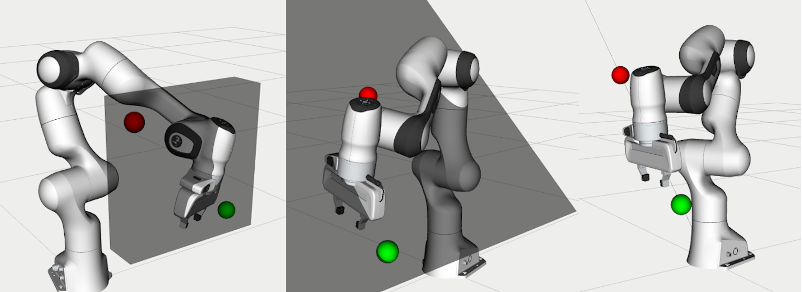

OMPL Constrained Planning
=========================

This tutorial shows you how to use OMPL's `Constrained planning capabilities`_ from MoveIt. To illustrate the capabilities of this planner, three planning problems are solved with different types of path constraints. It will be easier to follow if you have read through the tutorial on the `move group Python interface`_.

For a short walkthrough of running the tutorial, you can watch `this video`_.

When can I use this planner?
^^^^^^^^^^^^^^^^^^^^^^^^^^^^^^^^^^^^^^^^^^^
The interface currently only supports position constraints on any link of the robot, where the constrained region is represented using a box_. The planning approach provides an alternative for the `enforce_joint_model_state_space`_ option. It is expected to be most valuable for constraint regions that have a small (or zero) volume in Cartesian space, where the rejection sampling does not always works. For example, keeping the end-effector on a plane or along a line.

Configure OMPL
^^^^^^^^^^^^^^^^
OMPL reads configuration parameters from a file called :code:`ompl_planning.yaml`. This tutorial uses the Panda robot, for which this file can be found in :code:`panda_moveit_config/config/ompl_planning.yaml`. We will add a parameter to tell OMPL to plan in a constrained state space by setting :code:`enforce_constrained_state_space`. In addition, if the parameter `projection_evaluator`_ was not yet specified we also need to add it.

.. code-block:: yaml

   panda_arm:
      enforce_constrained_state_space: true
      projection_evaluator: joints(panda_joint1,panda_joint2)

Note that, as we are changing configuration files, you should also clone the repository `panda_moveit_config`_ in your workspace, instead of using the version installed with :code:`sudo apt install`.

.. code-block:: bash

  cd catkin_ws/src
  git clone https://github.com/ros-planning/panda_moveit_config.git
  cd ..
  catkin build

Run the tutorial
^^^^^^^^^^^^^^^^

After you change the configuration as explained in the previous section, launch the move group node for the panda robot: ::

   roslaunch panda_moveit_config demo.launch

Then add a Marker display to Rviz:

Open a new terminal window to run the tutorial node: ::

   rosrun moveit_tutorials ompl_constrained_planning_tutorial.py

A red and green sphere should appear in Rviz to show the start and goal states respectively. In addition, a grey box should appear that represents the position constraint on the link :code:`panda_link8`. If planning succeeds, you should see a preview of the trajectory that was planned.

The following message appears in the terminal: ::

   ============ Press enter to continue with the second planning problem.

After pressing enter, the next planning problem is solved.

Again, if planning succeeds, the trajectory is animated in RViz. And finally the last planning problem is solved after pressing enter again.

.. image:: case_3.gif
   :width: 300px

To see the output from the planner, look in the terminal window where you launched the Panda's move group node. To replay the planned trajectory, you can add a "Trajectory Slider" panel in Rviz.

The code explained
^^^^^^^^^^^^^^^^^^

.. tutorial-formatter:: ./scripts/ompl_constrained_planning_tutorial.py

.. _this video: https://youtu.be/RkPydgtIq-M
.. _panda_moveit_config: https://github.com/ros-planning/panda_moveit_config
.. _Constrained planning capabilities: http://ompl.kavrakilab.org/constrainedPlanning.html
.. _move group Python interface: ../move_group_python_interface/move_group_python_interface_tutorial.html
.. _box: http://docs.ros.org/latest/api/shape_msgs/html/msg/SolidPrimitive.html
.. _enforce_joint_model_state_space: ../ompl_interface/ompl_interface_tutorial.html#enforce-planning-in-joint-space
.. _projection_evaluator: ../ompl_interface/ompl_interface_tutorial.html#projection-evaluator
