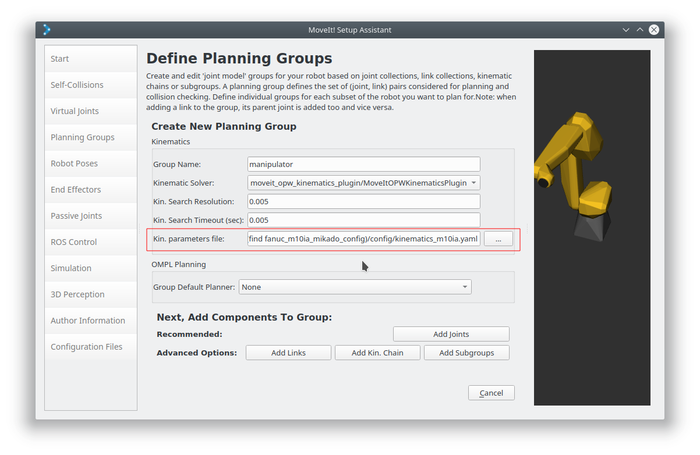

OPW Kinematics Solver for Industrial Manipulators
==================================================

Intro
------

Taken from `opw_kinematics <https://github.com/Jmeyer1292/opw_kinematics>`_: 
A simple, analytical inverse kinematic library for industrial robots with parallel bases and spherical wrists.
Based on the paper *An Analytical Solution of the Inverse Kinematics Problem of Industrial Serial Manipulators
with an Ortho-parallel Basis and a Spherical Wrist* by Mathias Brandstötter, Arthur Angerer, and Michael Hofbaur.

Purpose
-------

This package is meant to provide a simpler alternative to IK-Fast based solutions in situations where one has an
industrial robot with a parallel base and spherical wrist. This configuration is extremely common in industrial robots.

The kinematics are parameterized by 7 primary values taken directly from the robot's spec sheet and a set of
joint-zero offsets. Given this structure, no other setup is required.

Installation
-------------

The `opw_kinematics_plugin <https://github.com/JeroenDM/moveit_opw_kinematics_plugin>`_ can be installed using ``apt`` on Ubuntu and Debian: ::

  sudo apt install ros-noetic-opw-kinematics-plugin

Usage
------

- Find the MoveIt `kinematics.yaml <../kinematics_configuration/kinematics_configuration_tutorial.html>`_ file created for your robot.
- Replace ``kinematics_solver: kdl_kinematics_plugin/KDLKinematicsPlugin`` (or similar) with ``kinematics_solver: moveit_opw_kinematics_plugin/MoveItOPWKinematicsPlugin``.
- Set parameters to describe the geometry of your manipulator.

The following is an example of the parameters needed for the KUKA KR 6 R700:

.. code-block:: yaml

   manipulator:
     kinematics_solver: moveit_opw_kinematics_plugin/MoveItOPWKinematicsPlugin
     opw_kinematics_geometric_parameters:
       a1:  0.025
       a2: -0.035
       b:   0.000
       c1:  0.400
       c2:  0.315
       c3:  0.365
       c4:  0.080
     opw_kinematics_joint_offsets: [0.0, -1.57079632679, 0, 0, 0, 0]
     opw_kinematics_joint_sign_corrections: [-1, 1, 1, -1, 1, -1]

The meaning of the parameters can best be understood with a sketch and some tinkering. The plugin will print a ``ROS_ERROR`` on startup if they
do not match your URDF, so you can safely guess and test if needed:

.. image:: images/opw.png
    
Sharing OPW descriptions
-------------------------

We plan to collect OPW parameter sets as part of the ROS-Industrial robot support packages. This has already started for FANUC.
Taking the `M-10iA <https://github.com/ros-industrial/fanuc/blob/3ea2842baca3184cc621071b785cbf0c588a4046/fanuc_m10ia_support/config/opw_parameters_m10ia.yaml>`_ as
an example you can reduce your ``kinematics.yaml`` to the following:

.. code-block:: yaml

   manipulator:
     kinematics_solver: moveit_opw_kinematics_plugin/MoveItOPWKinematicsPlugin

and then add a ``rosparam`` ``load`` line to your ``launch/planning_context.launch`` which causes the parameters in that file to be loaded onto the parameter server:

.. code-block:: xml

   <!-- Load default settings for kinematics; these settings are overridden by settings in a node's namespace -->
   <group ns="$(arg robot_description)_kinematics">
     <rosparam command="load" file="$(find opw_tutorial)/config/kinematics.yaml"/>
     <rosparam command="load" ns="manipulator" file="$(find fanuc_lrmate200ib_support)/config/opw_parameters_lrmate200ib.yaml"/>
   </group>

Note that the ``ns`` parameter has to match the name you gave your planning group during the setup.

The MoveIt Setup Assistant can automatically insert that line, removing the need to manually edit the ``planning_context.launch`` file. On the *Define Planning Group* page, select the *opw_parameters*
file for your robot in the *Kin. parameters file* field

