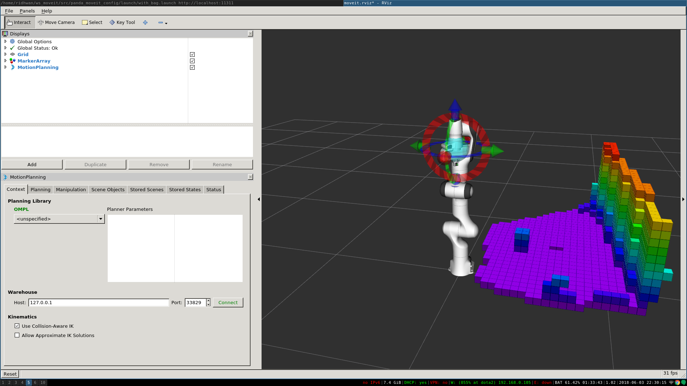
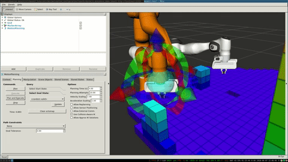

Perception Pipeline Tutorial
============================

MoveIt allows for seamless integration of 3D sensors using `Octomap <http://octomap.github.io/>`_.
Once properly configured, you should see something like this in RViz:

Getting Started
---------------

If you haven't already done so, make sure you've completed the steps in `Getting Started <../getting_started/getting_started.html>`_.

Configuration
-------------

In this section, we will walk through configuring the 3D sensors on your robot with MoveIt. The primary component in MoveIt that deals with 3D perception is the Occupancy Map Updater. The updater uses a plugin architecture to process different types of input. The currently available plugins in MoveIt are:

* The PointCloud Occupancy Map Updater: which can take as input point clouds (``sensor_msgs/PointCloud2``)

* The Depth Image Occupancy Map Updater: which can take as input Depth Images (``sensor_msgs/Image``)

To use the Occupancy Map Updater, it is only necessary to set the appropriate parameters on the ROS parameter server and to call ``startWorldGeometryMonitor`` from your ``PlanningSceneMonitor``.  This latter step is performed automatically when using Move Group functionality like in this tutorial's example, so in that case it is only necessary to set the parameters for the octomap and octomap updater.

YAML Configuration file (Point Cloud)
+++++++++++++++++++++++++++++++++++++

We will have to generate a YAML configuration file for configuring the 3D sensors. Please see :panda_codedir:`this example file<config/sensors_kinect_pointcloud.yaml>` for processing point clouds.

Save this file in the config folder in the robot's moveit_config package with name "sensors_kinect_pointcloud.yaml": ::

 sensors:
   - sensor_plugin: occupancy_map_monitor/PointCloudOctomapUpdater
     point_cloud_topic: /camera/depth_registered/points
     max_range: 5.0
     point_subsample: 1
     padding_offset: 0.1
     padding_scale: 1.0
     max_update_rate: 1.0
     filtered_cloud_topic: filtered_cloud

**The general parameters are:**

* *sensor_plugin*: The name of the plugin that we are using.
* *max_update_rate*: The octomap representation will be updated at rate less than or equal to this value.

**Parameters specific to the Point cloud updater are:**

* *point_cloud_topic*: This specifies the topic to listen on for a point cloud.

* *max_range*: (in m) Points further than this will not be used.

* *point_subsample*: Choose one of every *point_subsample* points.

* *padding_scale*: Should always be >= 1.0. Scale up collision shapes in the scene before excluding them from the octomap.

* *padding_offset*: Absolute padding (in m) around scaled collision shapes when excluding them from the octomap.

* *filtered_cloud_topic*: The topic on which the filtered cloud will be published (mainly for debugging). The filtering cloud is the resultant cloud after self-filtering has been performed.

YAML Configuration file (Depth Map)
+++++++++++++++++++++++++++++++++++

We will have to generate a YAML configuration file for configuring the 3D sensors. An :panda_codedir:`example file for processing depth images <config/sensors_kinect_depthmap.yaml>` can be found in the panda_moveit_config repository as well.
Save this file in the config folder in the robot's moveit_config package with name "sensors_kinect_depthmap.yaml": ::

 sensors:
   - sensor_plugin: occupancy_map_monitor/DepthImageOctomapUpdater
     image_topic: /camera/depth_registered/image_raw
     queue_size: 5
     near_clipping_plane_distance: 0.3
     far_clipping_plane_distance: 5.0
     shadow_threshold: 0.2
     padding_scale: 4.0
     padding_offset: 0.03
     max_update_rate: 1.0
     filtered_cloud_topic: filtered_cloud

**The general parameters are:**

* *sensor_plugin*: The name of the plugin that we are using.
* *max_update_rate*: The octomap representation will be updated at rate less than or equal to this value.

**Parameters specific to the Depth Map updater are:**

* *image_topic*: This specifies the topic to listen on for a depth image.

* *queue_size*: The number of images to queue up.

* *near_clipping_plane_distance*: The minimum distance before lack of visibility.

* *far_clipping_plane_distance*: The maximum distance before lack of visibility.

* *shadow_threshold*: The minimum brightness of the shadow map below an entity for its dynamic shadow to be visible

* *padding_scale*: Should always be >= 1.0. Scale up collision shapes in the scene before excluding them from the octomap.

* *padding_offset*: Absolute padding (in m) around scaled collision shapes when excluding them from the octomap.

* *filtered_cloud_topic*: The topic on which the filtered cloud will be published (mainly for debugging). The filtering cloud is the resultant cloud after self-filtering has been performed.

Update the launch file
++++++++++++++++++++++

Add the YAML file to the launch script
^^^^^^^^^^^^^^^^^^^^^^^^^^^^^^^^^^^^^^

You will now need to update the *sensor_manager.launch* file in the "launch" directory of your panda_moveit_config directory with this sensor information (this file is auto-generated by the Setup Assistant but is empty). You will need to add the following line into that file to configure the set of sensor sources for MoveIt to use: ::

 <rosparam command="load" file="$(find panda_moveit_config)/config/sensors_kinect_pointcloud.yaml" />

If you are using depthmap change the name of the yaml file to ``sensors_kinect_depthmap.yaml``.
Note that you will need to input the path to the right file you have created above.

Octomap Configuration
^^^^^^^^^^^^^^^^^^^^^

You will also need to configure the `Octomap <http://octomap.github.io/>`_ by adding the following lines into the *sensor_manager.launch*: ::

 <param name="octomap_frame" type="string" value="odom_combined" />
 <param name="octomap_resolution" type="double" value="0.05" />
 <param name="max_range" type="double" value="5.0" />

MoveIt uses an octree-based framework to represent the world around it. The *Octomap* parameters above are configuration parameters for this representation:
 * *octomap_frame*: specifies the coordinate frame in which this representation will be stored. If you are working with a mobile robot, this frame should be a fixed frame in the world.
 * *octomap_resolution*: specifies the resolution at which this representation is maintained (in meters).
 * *max_range*: specifies the maximum range value to be applied for any sensor input to this node.

Obstacle Avoidance
------------------

If you set the initial and the final location of the robot in a way that there is no straight path between them, then the planner will automatically avoid the octomap and plan around it.

Running the Interface
+++++++++++++++++++++

Launch the prepared launch file in moveit_tutorials to see the planning scene integrating sample point cloud data into an octomap: ::

 roslaunch moveit_tutorials obstacle_avoidance_demo.launch

You should see something like the image shown at the beginning of this tutorial.
If not, you may have run into a `known OpenGL rendering issue <http://wiki.ros.org/rviz/Troubleshooting>`_. To work around the issue, you can force CPU-based rendering with this command:

 export LIBGL_ALWAYS_SOFTWARE=1

You can test obstacle avoidance with the generated octomap for yourself by setting the goal state manually and then planning and executing. To learn how to do that look at `MoveIt Quickstart in RViz <../quickstart_in_rviz/quickstart_in_rviz_tutorial.html>`_

Detecting and Adding Object as Collision Object
-----------------------------------------------

In this section, we will demonstrate an example of extracting a cylinder from a pointcloud, computing relevant values and adding it as a collision object to the planning scene.
We will be working with point clouds but it can be implemented similarly with depth maps.

After running the code, you should be able to see something like this in RViz:

Running the Code
++++++++++++++++

Keep the launch file from above running and run the code directly from moveit_tutorials: ::

 rosrun moveit_tutorials detect_and_add_cylinder_collision_object_demo

Relevant Code
+++++++++++++

The entire code can be seen :codedir:`here<perception_pipeline>` in the moveit_tutorials GitHub project.

The details regarding the implementation of each of the perception pipeline function have been omitted in this tutorial as they are well documented `here <http://wiki.ros.org/pcl/Tutorials>`_.

.. |br| raw:: html

    

.. |code_start| raw:: html

   <code>

.. |code_end| raw:: html

   </code>

.. tutorial-formatter:: ./src/detect_and_add_cylinder_collision_object_demo.cpp
