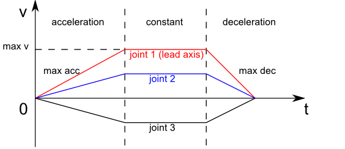
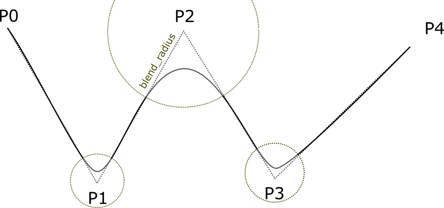

Pilz Industrial Motion Planner
==============================

``pilz_industrial_motion_planner`` provides a trajectory generator to plan standard robot
motions like PTP, LIN, CIRC with the interface of a MoveIt PlannerManager
plugin.

User Interface MoveGroup
------------------------

This package implements the ``planning_interface::PlannerManager``
interface of MoveIt. By loading the corresponding planning pipeline
(``pilz_industrial_motion_planner_planning_pipeline.launch.xml`` in your
``*_moveit_config`` package), the trajectory generation
functionalities can be accessed through the user interface (c++, python
or rviz) provided by the ``move_group`` node, e.g.
``/plan_kinematics_path`` service and ``/move_group`` action. For
detailed usage tutorials please refer to :doc:`/doc/move_group_interface/move_group_interface_tutorial`.

Joint Limits
------------

For all commands the planner uses maximum velocities and accelerations from
the parameter server. Using the MoveIt setup assistant the file ``joint_limits.yaml``
is auto-generated with proper defaults and loaded during startup.

The limits on the parameter server override the limits from the URDF robot description.
Note that while setting position limits and velocity limits is possible
in both the URDF and the parameter server setting acceleration limits is
only possible via the parameter server. In extension to the common
``has_acceleration`` and ``max_acceleration`` parameter we added the
ability to also set ``has_deceleration`` and
``max_deceleration``\ (<0.0).

The limits are merged under the premise that the limits from the
parameter server must be stricter or at least equal to the parameters
set in the URDF.

Currently the calculated trajectory will respect the limits by using the
strictest combination of all limits as a common limit for all joints.

Cartesian Limits
----------------

For cartesian trajectory generation (LIN/CIRC) the planner needs an
information about the maximum speed in 3D cartesian space. Namely
translational/rotational velocity/acceleration/deceleration need to be
set on the parameter server like this:

.. code:: yaml

    cartesian_limits:
      max_trans_vel: 1
      max_trans_acc: 2.25
      max_trans_dec: -5
      max_rot_vel: 1.57

The planners assume the same acceleration ratio for translational and
rotational trapezoidal shapes. So the rotational acceleration is
calculated as ``max\_trans\_acc / max\_trans\_vel \* max\_rot\_vel`` (and
for deceleration accordingly).

Planning Interface
------------------

This package uses ``moveit_msgs::MotionPlanRequest`` and ``moveit_msgs::MotionPlanResponse``
as input and output for motion planning. The parameters needed for each planning algorithm
are explained below.

For a general introduction on how to fill a ``MotionPlanRequest`` see
:ref:`move_group_interface-planning-to-pose-goal`.

You can specify "PTP", "LIN" or "CIRC" as the ``planner\_id``of the ``MotionPlanRequest``.

The PTP motion command
----------------------

This planner generates fully synchronized point-to-point trajectories
with trapezoidal joint velocity profiles. All joints are assumed to have
the same maximal joint velocity/acceleration/deceleration limits. If
not, the strictest limits are adopted. The axis with the longest time to
reach the goal is selected as the lead axis. Other axes are decelerated
so that they share the same acceleration/constant velocity/deceleration
phases as the lead axis.

         determines the maximum velocity

Input parameters in ``moveit_msgs::MotionPlanRequest``
~~~~~~~~~~~~~~~~~~~~~~~~~~~~~~~~~~~~~~~~~~~~~~~~~~~~~~

- ``planner_id``: PTP
- ``group_name``: name of the planning group
- ``max_velocity_scaling_factor``: scaling factor of maximal joint velocity
- ``max_acceleration_scaling_factor``: scaling factor of maximal joint acceleration/deceleration
- ``start_state/joint_state/(name, position and velocity``: joint name/position/velocity(optional) of the start state.
- ``goal_constraints`` (goal can be given in joint space or Cartesian space)
- for a goal in joint space
    - ``goal_constraints/joint_constraints/joint_name``: goal joint name
    - ``goal_constraints/joint_constraints/position``: goal joint position
- for a goal in Cartesian space
    - ``goal_constraints/position_constraints/header/frame_id``: frame this data is associated with
    - ``goal_constraints/position_constraints/link_name``: target link name
    - ``goal_constraints/position_constraints/constraint_region``: bounding volume of the target point
    - ``goal_constraints/position_constraints/target_point_offset``: offset (in the link frame) for the target point on
      the target link (optional)

Planning results in ``moveit_msg::MotionPlanResponse``
~~~~~~~~~~~~~~~~~~~~~~~~~~~~~~~~~~~~~~~~~~~~~~~~~~~~~~

-  ``trajectory_start``: first robot state of the planned trajectory
-  ``trajectory/joint_trajectory/joint_names``: a list of the joint
   names of the generated joint trajectory
-  ``trajectory/joint_trajectory/points/(positions,velocities,accelerations,time_from_start)``:
   a list of generated way points. Each point has
   positions/velocities/accelerations of all joints (same order as the
   joint names) and time from start. The last point will have zero
   velocity and acceleration.
-  ``group_name``: name of the planning group
-  ``error_code/val``: error code of the motion planning

The LIN motion command
----------------------

This planner generates linear Cartesian trajectory between goal and
start poses. The planner uses the Cartesian limits to generate a
trapezoidal velocity profile in Cartesian space. The translational
motion is a linear interpolation between start and goal position vector.
The rotational motion is quaternion slerp between start and goal
orientation. The translational and rotational motion is synchronized in
time. This planner only accepts start state with zero velocity. Planning
result is a joint trajectory. The user needs to adapt the Cartesian
velocity/acceleration scaling factor if the motion plan fails due to
violation of joint space limits.

Input parameters in ``moveit_msgs::MotionPlanRequest``
~~~~~~~~~~~~~~~~~~~~~~~~~~~~~~~~~~~~~~~~~~~~~~~~~~~~~~

-  ``planner_id``: LIN
-  ``group_name``: name of the planning group
-  ``max_velocity_scaling_factor``: scaling factor of maximal Cartesian
   translational/rotational velocity
-  ``max_acceleration_scaling_factor``: scaling factor of maximal
   Cartesian translational/rotational acceleration/deceleration
-  ``start_state/joint_state/(name, position and velocity``: joint
   name/position of the start state.
-  ``goal_constraints`` (goal can be given in joint space or Cartesian
   space)

   -  for a goal in joint space

      -  ``goal_constraints/joint_constraints/joint_name``: goal joint
         name
      -  ``goal_constraints/joint_constraints/position``: goal joint
         position

   -  for a goal in Cartesian space

      -  ``goal_constraints/position_constraints/header/frame_id``:
         frame this data is associated with
      -  ``goal_constraints/position_constraints/link_name``: target
         link name
      -  ``goal_constraints/position_constraints/constraint_region``:
         bounding volume of the target point
      -  ``goal_constraints/position_constraints/target_point_offset``:
         offset (in the link frame) for the target point on the target
         link (optional)

Planning results in ``moveit_msg::MotionPlanResponse``
~~~~~~~~~~~~~~~~~~~~~~~~~~~~~~~~~~~~~~~~~~~~~~~~~~~~~~

-  ``trajectory_start``: first robot state of the planned trajectory
-  ``trajectory/joint_trajectory/joint_names``: a list of the joint
   names of the generated joint trajectory
-  ``trajectory/joint_trajectory/points/(positions,velocities,accelerations,time_from_start)``:
   a list of generated way points. Each point has
   positions/velocities/accelerations of all joints (same order as the
   joint names) and time from start. The last point will have zero
   velocity and acceleration.
-  ``group_name``: name of the planning group
-  ``error_code/val``: error code of the motion planning

The CIRC motion command
-----------------------

This planner generates a circular arc trajectory in Cartesian space
between goal and start poses. There are two options for giving a path
constraint:

- the *center* point of the circle: The planner always
  generates the shorter arc between start and goal and cannot generate a
  half circle,
- an *interim* point on the arc: The generated trajectory
  always goes through the interim point. The planner cannot generate a
  full circle.

The Cartesian limits, namely translational/rotational
velocity/acceleration/deceleration need to be set and the planner uses
these limits to generate a trapezoidal velocity profile in Cartesian
space. The rotational motion is quaternion slerp between start and goal
orientation. The translational and rotational motion is synchronized in
time. This planner only accepts start state with zero velocity. Planning
result is a joint trajectory. The user needs to adapt the Cartesian
velocity/acceleration scaling factor if motion plan fails due to
violation of joint limits.

Input parameters in ``moveit_msgs::MotionPlanRequest``
~~~~~~~~~~~~~~~~~~~~~~~~~~~~~~~~~~~~~~~~~~~~~~~~~~~~~~

-  ``planner_id``: CIRC
-  ``group_name``: name of the planning group
-  ``max_velocity_scaling_factor``: scaling factor of maximal Cartesian
   translational/rotational velocity
-  ``max_acceleration_scaling_factor``: scaling factor of maximal
   Cartesian translational/rotational acceleration/deceleration
-  ``start_state/joint_state/(name, position and velocity``: joint
   name/position of the start state.
-  ``goal_constraints`` (goal can be given in joint space or Cartesian
   space)

   -  for a goal in joint space

      -  ``goal_constraints/joint_constraints/joint_name``: goal joint
         name
      -  ``goal_constraints/joint_constraints/position``: goal joint
         position

   -  for a goal in Cartesian space

      -  ``goal_constraints/position_constraints/header/frame_id``:
         frame this data is associated with
      -  ``goal_constraints/position_constraints/link_name``: target
         link name
      -  ``goal_constraints/position_constraints/constraint_region``:
         bounding volume of the target point
      -  ``goal_constraints/position_constraints/target_point_offset``:
         offset (in the link frame) for the target point on the target
         link (optional)

-  ``path_constraints`` (position of the interim/center point)

   -  ``path_constraints/name``: interim or center
   -  ``path_constraints/position_constraints/constraint_region/primitive_poses/point``:
      position of the point

Planning results in ``moveit_msg::MotionPlanResponse``
~~~~~~~~~~~~~~~~~~~~~~~~~~~~~~~~~~~~~~~~~~~~~~~~~~~~~~

-  ``trajectory_start``: first robot state of the planned trajectory
-  ``trajectory/joint_trajectory/joint_names``: a list of the joint
   names of the generated joint trajectory
-  ``trajectory/joint_trajectory/points/(positions,velocities,accelerations,time_from_start)``:
   a list of generated way points. Each point has
   positions/velocities/accelerations of all joints (same order as the
   joint names) and time from start. The last point will have zero
   velocity and acceleration.
-  ``group_name``: name of the planning group
-  ``error_code/val``: error code of the motion planning

Example
-------

By running

::

    roslaunch prbt_moveit_config demo.launch

the user can interact with the planner through rviz.

.. figure:: rviz_planner.png
   :alt: rviz figure

Using the planner
-----------------

The *pilz_industrial_motion_planner::CommandPlanner* is provided as a MoveIt Motion Planning
Pipeline and, therefore, can be used with all other manipulators using
MoveIt. Loading the plugin requires the param
``/move_group/planning_plugin`` to be set to ``pilz_industrial_motion_planner::CommandPlanner``
before the ``move_group`` node is started.

To use the command planner cartesian limits have to be defined. The
limits are expected to be under the namespace
``<robot_description>_planning``. Where ``<robot_description>`` refers
to the parameter under which the URDF is loaded. E.g. if the URDF was
loaded into ``/robot_description`` the cartesian limits have to be
defined at ``/robot_description_planning``.

An example showing the cartesian limits which have to be defined can be
found in `prbt_moveit_config
<https://github.com/ros-planning/moveit_resources/blob/master/prbt_moveit_config/config/cartesian_limits.yaml>`_.

Sequence of multiple segments
=============================

To concatenate multiple trajectories and plan the trajectory at once,
you can use the sequence capability. This reduces the planning overhead
and allows to follow a pre-desribed path without stopping at
intermediate points.

**Please note:** In case the planning of a command in a sequence fails,
non of the commands in the sequence are executed.

**Please note:** Sequences commands are allowed to contain commands for
multiple groups (e.g. "Manipulator", "Gripper")

User interface sequence capability
----------------------------------

A specialized MoveIt capability takes a
``moveit_msgs::MotionSequenceRequest`` as input. The request contains a
list of subsequent goals as described above and an additional
``blend_radius`` parameter. If the given ``blend_radius`` in meter is
greater than zero, the corresponding trajectory is merged together with
the following goal such that the robot does not stop at the current
goal. When the TCP comes closer to the goal than the given
``blend_radius``, it is allowed to travel towards the next goal already.
When leaving a sphere around the current goal, the robot returns onto
the trajectory it would have taken without blending.

Implementation details are available `as pdf
<https://github.com/ros-planning/moveit/blob/master/moveit_planners/pilz_industrial_motion_planner/doc/MotionBlendAlgorithmDescription.pdf>`_.

Restrictions for ``MotionSequenceRequest``
~~~~~~~~~~~~~~~~~~~~~~~~~~~~~~~~~~~~~~~~~~

-  Only the first goal may have a start state. Following trajectories
   start at the previous goal.
-  Two subsequent ``blend_radius`` spheres must not overlap.
   ``blend_radius``\ (i) + ``blend_radius``\ (i+1) has to be smaller
   than the distance between the goals.

Action interface
~~~~~~~~~~~~~~~~

In analogy to the ``MoveGroup`` action interface the user can plan and
execute a ``moveit_msgs::MotionSequenceRequest`` through the action server
at ``/sequence_move_group``.

In one point the ``MoveGroupSequenceAction`` differs from the standard
MoveGroup capability: If the robot is already at the goal position, the
path is still executed. The underlying PlannerManager can check, if the
constraints of an individual ``moveit_msgs::MotionPlanRequest`` are
already satisfied but the ``MoveGroupSequenceAction`` capability doesn't
implement such a check to allow moving on a circular or comparable path.

See the ``pilz_robot_programming`` package for an `example python script
<https://github.com/PilzDE/pilz_industrial_motion/blob/melodic-devel/pilz_robot_programming/examples/demo_program.py>`_
that shows how to use the capability.

Service interface
~~~~~~~~~~~~~~~~~

The service ``plan_sequence_path`` allows the user to generate a joint
trajectory for a ``moveit_msgs::MotionSequenceRequest``. The trajectory is
returned and not executed.
