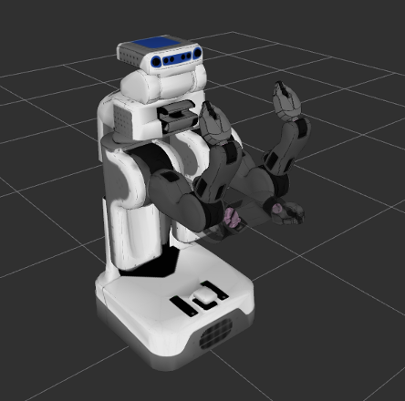
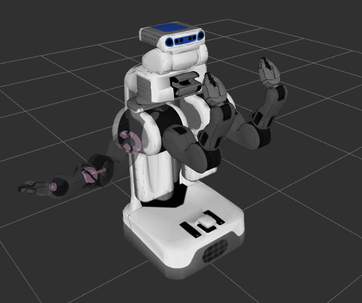

Motion Planners Tutorial
==================================

In MoveIt!, the motion planners are loaded using a plugin infrastructure. This
allows MoveIt! to load motion planners at runtime. In this example, we will
run through the C++ code required to do this.

.. tutorial-formatter:: ../motion_planning_api_tutorial.cpp

The entire code
^^^^^^^^^^^^^^^
The entire code can be seen :codedir:`here in the moveit_tutorials github project<planning>`.

Compiling the code
^^^^^^^^^^^^^^^^^^
Follow the `instructions for compiling code from source <http://moveit.ros.org/install/source/>`_.

The launch file
^^^^^^^^^^^^^^^
The entire launch file is `here <https://github.com/ros-planning/moveit_tutorials/tree/kinetic-devel/doc/pr2_tutorials/planning/launch/planning_pipeline_tutorial.launch>`_ on github. All the code in this tutorial can be compiled and run from the moveit_tutorials package.

Running the code
^^^^^^^^^^^^^^^^

Roslaunch the launch file to run the code directly from moveit_tutorials::

 roslaunch moveit_tutorials motion_planning_api_tutorial.launch

Expected Output
^^^^^^^^^^^^^^^

In Rviz, we should be able to see four trajectories being replayed eventually:

 1. The robot moves its right arm to the pose goal in front of it,
    |A|

 2. The robot moves its right arm to the joint goal to the side,
 3. The robot moves its right arm back to the original pose goal in front of it,
 4. The robot moves its right arm to a new pose goal while maintaining the end-effector level.
    |B|

