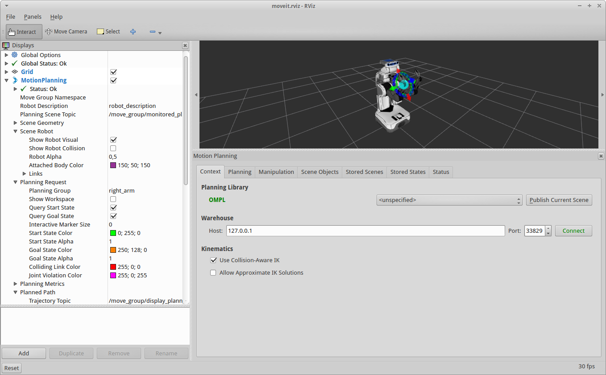
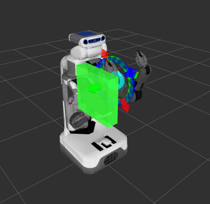

Move Group Interface Tutorial
==================================

In MoveIt!, the primary user interface is through the :move_group_interface:`MoveGroup` class. It provides easy to use functionality for most operations that a user may want to carry out, specifically setting joint or pose goals, creating motion plans, moving the robot, adding objects into the environment and attaching/detaching objects from the robot. This interface communicates over ROS topics, services, and actions to the `MoveGroup Node <http://docs.ros.org/indigo/api/moveit_ros_move_group/html/annotated.html>`_.

Watch the `YouTube video demo <https://youtu.be/4FSmZRQh37Q>`_

Create A Catkin Workspace
^^^^^^^^^^^^^^^^^^^^^^^^^
You do not need to build all of MoveIt! from source, but you do need to have a catkin workspace setup. If you do not have a workspace already setup, follow the "Prerequisites" section on the  `MoveIt! source install page <http://moveit.ros.org/install/source/>`_ and be sure to then source the workspace as documented at the bottom of that page under "Source the Catkin Workspace."

Compiling the Example Code
^^^^^^^^^^^^^^^^^^^^^^^^^^

Within your catkin workspace (``cd ~/ws_moveit/src``), download this tutorial::

  git clone https://github.com/ros-planning/moveit_tutorials.git

Temporary PR2 on Kinetic Instructions
-------------------------------------

You will also need a **pr2_moveit_config** package to run this tutorial. Currently this is unreleased in ROS Kinetic but the following is a temporary workaround::

  git clone https://github.com/PR2/pr2_common.git -b kinetic-devel
  git clone https://github.com/davetcoleman/pr2_moveit_config.git

Install Dependencies and Build
--------------------------------------

Scans your catkin workspace for missing packages before compiling new code::

  rosdep install --from-paths . --ignore-src --rosdistro kinetic
  catkin build

Start Rviz and MoveGroup node
^^^^^^^^^^^^^^^^^^^^^^^^^^^^^

Start Rviz and wait for everything to finish loading::

  roslaunch pr2_moveit_config demo.launch

Running the demo
^^^^^^^^^^^^^^^^

In a new terminal window, run the `move_group_interface_tutorial.launch <https://github.com/ros-planning/moveit_tutorials/tree/kinetic-devel/doc/pr2_tutorials/planning/launch/move_group_interface_tutorial.launch>`_ roslaunch file::

  roslaunch moveit_tutorials move_group_interface_tutorial.launch

After a short moment, the Rviz window should appear and look similar to the one at the top of this page. Press the **Next** button at the bottom of the screen or press 'N' on your keyboard while Rviz is focused to progress through each demo step.

Expected Output
^^^^^^^^^^^^^^^

Watch the `YouTube video demo <https://youtu.be/4FSmZRQh37Q>`_ for expected output. In Rviz, we should be able to see the following:

 1. The robot moves its right arm to the pose goal to its right front.
 2. The robot moves its right arm to the joint goal at its right side.
 3. The robot moves its right arm back to a new pose goal while maintaining the end-effector level.
 4. The robot moves its right arm along the desired cartesian path (a triangle up+forward, left, down+back).
 5. A box object is added into the environment to the right of the right arm.
    |B|

 6. The robot moves its right arm to the pose goal, avoiding collision with the box.
 7. The object is attached to the wrist (its color will change to purple/orange/green).
 8. The object is detached from the wrist (its color will change back to green).
 9. The object is removed from the environment.
 10. The robot moves both arms to two different pose goals at the same time

Explaining the Demo
^^^^^^^^^^^^^^^^^^^
The entire code is located in the moveit_tutorials github repo under the subfolder :codedir:`pr2_tutorials/planning<planning>`. Next we step through the code piece by piece to explain its functionality.

.. tutorial-formatter:: ../move_group_interface_tutorial.cpp
