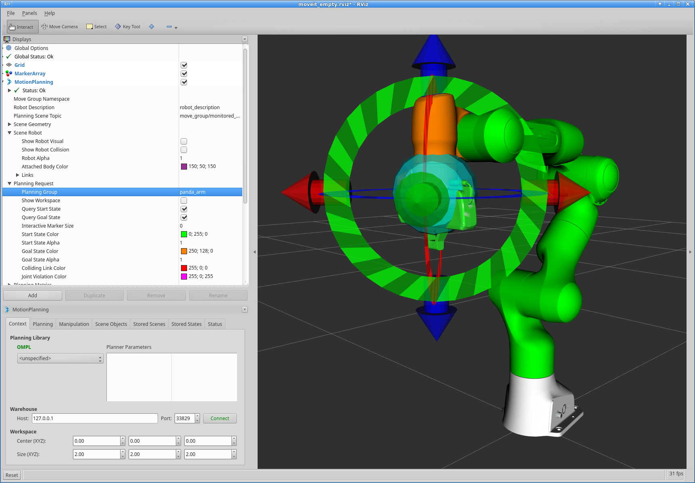
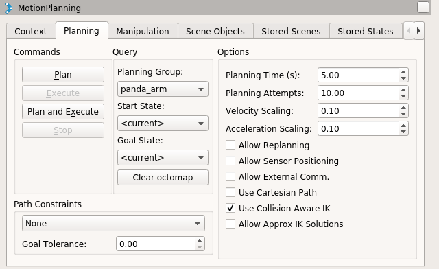

MoveIt Quickstart in RViz
==========================
.. image:: rviz_plugin_head.png
   :width: 700px

This tutorial will quickly get you motion planning using MoveIt via RViz and the MoveIt plugin. Rviz is the primary visualizer in ROS and an incredibly useful tool for debugging robotics. The MoveIt Rviz plugin allows you to setup virtual environments (scenes), create start and goal states for the robot interactively, test various motion planners, and visualize the output. Let's go!

Getting Started
---------------
If you haven't already done so, make sure you've completed the steps in `Getting Started <../getting_started/getting_started.html>`_.

Step 1: Launch the Demo and Configure the Plugin
------------------------------------------------

* Launch the demo: ::

   roslaunch panda_moveit_config demo.launch rviz_tutorial:=true

* If you are doing this for the first time, you should see an empty world in RViz and will have to add the Motion Planning Plugin:

  * You should see an empty world in RViz:

  |A|

  * In the RViz Displays Tab, press *Add*:

  |B|

  * From the moveit_ros_visualization folder, choose "MotionPlanning" as the DisplayType. Press "Ok".

  |C|

  * You should now see the Panda robot in RViz:

  |D|

.. |A| image:: rviz_empty.png
               :width: 700px

.. |C| image:: rviz_plugin_motion_planning_add.png
               :width: 300px

* Once you have the Motion Planning Plugin loaded, we can configure it. In the "Global Options" tab of the "Displays" subwindow, set the **Fixed Frame** field to ``/panda_link0``

* Now, you can start configuring the Plugin for your robot (the Panda in this case). Click on "MotionPlanning" within "Displays".

  * Make sure the **Robot Description** field is set to ``robot_description``.

  * Make sure the **Planning Scene Topic** field is set to ``/planning_scene``.
    Click on topic name to expose topic-name drop-down.

  * In **Planning Request**, change the **Planning Group** to ``panda_arm``.

  * In **Planned Path**, change the **Trajectory Topic** to ``/move_group/display_planned_path``.

Step 2: Play with the Visualized Robots
---------------------------------------
There are four different overlapping visualizations:

#. The robot's configuration in the ``/planning scene`` planning environment (active by default).

#. The planned path for the robot (active by default).

#. Green: The start state for motion planning (disabled by default).

#. Orange: The goal state for motion planning (active by default).

The display states for each of these visualizations can be toggled on and off using checkboxes:

#. The planning scene robot using the **Show Robot Visual** checkbox in the **Scene Robot** tab.

#. The planned path using the **Show Robot Visual** checkbox in the **Planned Path** tab.

#. The start state using the **Query Start State** checkbox in the **Planning Request** tab.

#. The goal state using the **Query Goal State** checkbox in the **Planning Request** tab.

* Play with all these checkboxes to switch on and off different visualizations.

Step 3: Interact with the Panda
-------------------------------

For the next steps we will want only the scene robot, start state and goal state:

#. Check the **Show Robot Visual** checkbox in the **Planned Path** tab

#. Un-check the **Show Robot Visual** checkbox in the **Scene Robot** tab

#. Check the **Query Goal State** checkbox in the **Planning Request** tab.

#. Check the **Query Start State** checkbox in the **Planning Request** tab.

There should now be two interactive markers. One marker corresponding to the orange colored arm will be used to set the "Goal State" for motion planning and the other marker corresponding to a green colored arm are used to set the "Start State" for motion planning. If you don't see the interactive markers press **Interact** in the top menu of RViz (Note: some tools may be hidden, press **"+"** in the top menu to add the **Interact** tool as shown below).

.. image:: rviz_plugin_interact.png
   :width: 700px

You should now be able to use these markers to drag the arm around and change its orientation. Try it!

Moving into collision
+++++++++++++++++++++
Note what happens when you try to move one of the arms into collision with the other. The two links that are in collision will turn red.

.. image:: rviz_plugin_collision.png
   :width: 700px

The "Use Collision-Aware IK" checkbox found within the MotionPlanning plugin under the Planning tab allows you to toggle the behavior of the IK solver. When the checkbox is ticked, the solver will keep attempting to find a collision-free solution for the desired end-effector pose. When it is not checked, the solver will allow collisions to happen in the solution. The links in collision will always still be visualized in red, regardless of the state of the checkbox.

Moving out of Reachable Workspace
+++++++++++++++++++++++++++++++++
Note what happens when you try to move an end-effector out of its reachable workspace.

.. image:: rviz_plugin_invalid.png
   :width: 700px

Moving Joints or in Null Space
++++++++++++++++++++++++++++++
You can use the **Joints** tab to move single joints and the redundant joints of 7-DOF robots. Try moving the "null space exploration" slider as shown in the animation below.

.. image:: rviz_joints_nullspace.webm
   :width: 700px

Step 4: Use Motion Planning with the Panda
-------------------------------------------

* Now, you can start motion planning with the Panda in the MoveIt RViz Plugin.

  * Move the Start State to a desired location.

  * Move the Goal State to another desired location.

  * Make sure both states are not in collision with the robot itself.

  * Make sure the Planned Path is being visualized. Also check the
    **Show Trail** checkbox in the **Planned Path** tab.

* In the **MotionPlanning** window under the **Planning** tab, press the **Plan** button. You
  should be able to see a visualization of the arm moving and a trail.

.. image:: rviz_plugin_planned_path.png
   :width: 700px

Introspecting Trajectory Waypoints
++++++++++++++++++++++++++++++++++

You can visually introspect trajectories point by point in RViz.

* From "`Panels`" menu, select "`MotionPlanning - Slider`". You'll see a new Slider panel on RViz.

* Set your goal pose, then run `Plan`.

* Play with the "`Slider`" panel, e.g. move the slider, push "`Play`" button.

NOTE: Once you placed your EEF to a new goal, be sure to run `Plan` before running `Play` -- otherwise you'll see the waypoints for the previous goal if available.

.. image:: rviz_plugin_slider.png
   :width: 700px

Plan Cartesian motions
++++++++++++++++++++++

If the "Use Cartesian Path" checkbox is activated, the robot will attempt to move the end effector linearly in cartesian space.

Executing Trajectories, Adjusting Speed
+++++++++++++++++++++++++++++++++++++++

Clicking "Plan & Execute" or "Execute" after a successful plan will send the trajectory to the robot - in this tutorial, since you used `demo.launch`, the robot is only simulated.

Initially, the default velocity and acceleration are scaled to 10% (`0.1`) of the robot's maximum. You can change these scaling factors in the Planning tab shown below, or change these default values in the `moveit_config` of your robot (in `joint_limits.yaml`).

Next Steps
----------

RViz Visual Tools
+++++++++++++++++
Many of the tutorials use ``moveit_visual_tools`` to step through a demo. Before continuing on to the next tutorials it is a good idea to enable the **RvizVisualToolsGui**.

From "`Panels`" menu, select "`RvizVisualToolsGui`". You'll see the new panel added to RViz.

.. image:: rviz_panels.png
   :width: 700px

Saving Your Configuration
+++++++++++++++++++++++++
RViz enables you to save your configuration under ``File->Save Config``. You should do this before continuing on to the next tutorials.

Next Tutorials
++++++++++++++
* To easily control your robot using C++, check out the `Move Group C++ Interface <../move_group_interface/move_group_interface_tutorial.html>`_

* To easily control your robot using Python, check out the `Move Group Python Interface <../move_group_python_interface/move_group_python_interface_tutorial.html>`_

* To create your own ``*_moveit_config`` package, check out the `Setup Assistant <../setup_assistant/setup_assistant_tutorial.html>`_
