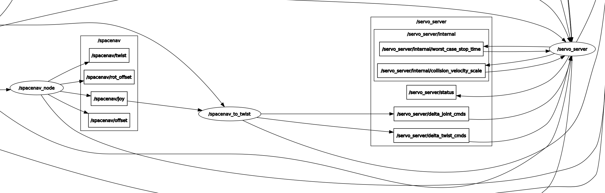

Realtime Arm Servoing
=====================

This tutorial shows how to send real-time servo commands to a ROS-enabled robot. Some nice features of the servo node are singularity handling and collision checking that prevents the operator from breaking the robot.

.. raw:: html

    <object width="700" height="400">
      <embed
        src="https://www.youtube.com/v/8sOucNloJeI&hl=en_US&fs=1&rel=0"
        type="application/x-shockwave-flash" allowscriptaccess="always"
        allowfullscreen="true" width="700"
        height="385">
      </embed>
    </object>

Getting Started
---------------
This tutorial demonstrates the servo node with a UR5 Gazebo simulation. If you haven't already done so, make sure you've completed the steps in `Getting Started <../getting_started/getting_started.html>`_.

Clone `universal_robot melodic-devel branch <https://github.com/ros-industrial/universal_robot.git>`_ into the same catkin workspace from `Getting Started`: ::

    cd ~/ws_moveit/src

    git clone -b melodic-devel https://github.com/ros-industrial/universal_robot

Install any new dependencies that may be missing: ::

    rosdep install -y --from-paths . --ignore-src --rosdistro $ROS_DISTRO

Re-build and re-source the workspace. ::

    cd ~/ws_moveit/

    catkin build

    source devel/setup.bash

Launch the Gazebo simulation: ::

    roslaunch ur_gazebo ur5.launch

    roslaunch ur5_moveit_config ur5_moveit_planning_execution.launch sim:=true

    roslaunch ur5_moveit_config moveit_rviz.launch config:=true

In RViz, grab the red/blue/green "interactive marker" and drag the robot to a non-singular position (not all zero joint angles) that is not close to a joint limit. Click "plan and execute" to move the robot to that pose.

Switch to a compatible type of `ros-control` controller. It should be a `JointGroupVelocityController` or a `JointGroupPositionController`, not a trajectory controller like MoveIt usually requires. ::

    rosservice call /controller_manager/switch_controller "start_controllers: ['joint_group_position_controller']
    stop_controllers: ['arm_controller']
    strictness: 0
    start_asap: false
    timeout: 0.0"

Launch the servo node. This example uses commands from a `SpaceNavigator <https://www.3dconnexion.com/spacemouse_compact/en/>`_ joystick-like device: ::

    roslaunch moveit_servo spacenav_cpp.launch

If you do not have a SpaceNav 3D mouse, you can publish example servo commands from the command line with: ::

    rostopic pub -r 100 -s /servo_server/delta_twist_cmds geometry_msgs/TwistStamped "header: auto
    twist:
      linear:
        x: 0.0
        y: 0.01
        z: -0.01
      angular:
        x: 0.0
        y: 0.0
        z: 0.0"

The `-r 100` sends new commands at a 100 Hz rate. The combination of `-s` and `auto` updates the timestamp automatically.

Settings
--------
User-configurable settings of the servo node are well-documented in ``servo/config/ur_simulated_config.yaml``.

Changing Control Dimensions
---------------------------
The dimensions being controlled may be changed with the ``change_control_dimensions`` (``moveit_msgs/ChangeControlDimensions``) service. The service consists of the 6 booleans representing the manipulator's degrees of freedom (3 translation and 3 rotation), defined in the input velocity command frame. Setting one of these booleans to ``false`` will result in the user input in that direction being overwritten with a 0, thus disallowing motion in the direction.

Robot Requirements
------------------
The servo node streams an array of position or velocity commands to the robot controller. This is compatible with ros\_control ``position_controllers/JointGroupPositionControllers`` or ``velocity_controllers/JointGroupVelocityControllers``. You can check if these controllers are available for your robot by searching for the controller config file (typically named ``controllers.yaml``). After launching the robot, you can check if any ros_control controllers are available with: ::

    rosservice call /controller_manager/list_controllers

And switch to the desired controller with: ::

    rosservice call /controller_manager/switch_controllers controller_to_start controller_to_stop

**NOTE:** You can tab-complete to help fill these commands.

Servoing may work on other robots that have a different control scheme but there is no guarantee. It has been tested heavily on UR robots using the `ur_modern_driver <https://github.com/ros-industrial/ur_modern_driver>`_. The servo node currently does not limit joint jerk so may not be compatible with most heavy industrial robots.

The servo node can publish ``trajectory_msgs/JointTrajectory`` or ``std_msgs/Float64MultiArray`` message types. This is configured in a yaml file (see ``config/ur_simulated_config.yaml`` for an example). Most robots that use ros_control will use the Float64MultiArray type. Some UR robots using older driver versions can require the JointTrajectory message type.

ROS Signals
-----------
An `rqt_graph` of the servo node is shown below (Enlarge by clicking it). Most of these connections can be ignored. The important ones are:

- **servo_server** node: Does the core calculations.

- **spacenav_to_twist** node: Converts incoming commands from the joystick to Cartesian commands or joint angle commands, depending on which buttons are pressed.

- **joint_group_position_controller/command** topic: This is the outgoing command that causes the robot to move.

- **change_control_dimensions** service: This is the service to change which dimensions servoing is allowed in

Configuring Control Devices (Gamepads, Joysticks, etc)
------------------------------------------------------
The ``moveit_servo/config`` folder contains two examples of converting `SpaceNavigator <https://www.3dconnexion.com/spacemouse_compact/en/>`_ 3D mouse commands to servo commands. ``spacenav_teleop_tools.launch`` loads a config file then publishes commands to the servo node on the ``spacenav/joy topic``. It is easy to create your own config file for a particular joystick or gamepad.

``spacenav_cpp.launch`` launches a C++ node that does the same thing but with less latency. We do not plan to accept C++ pull requests for more controller types because there is a lot of overhead involved in supporting them.

Integration Testing
-------------------
There is a Python integration test in ``test/integration``. Run it by:

.. code-block:: bash

  roscd moveit_servo
  catkin run_tests --this
