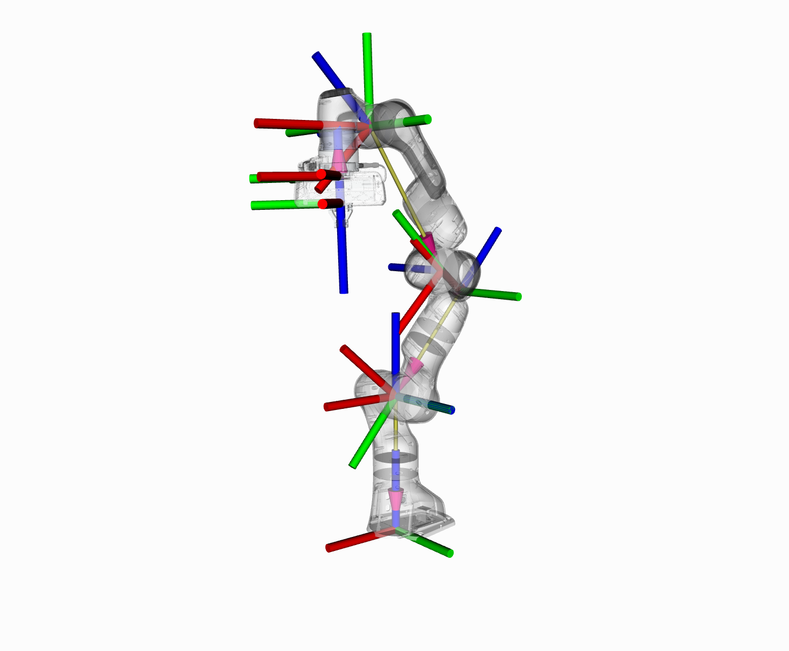

Robot Model and Robot State
===========================

In this section, we will walk you through the C++ API for using kinematics in MoveIt.

The RobotModel and RobotState Classes
-------------------------------------
The :moveit_core:`RobotModel` and :moveit_core:`RobotState` classes are the core classes that give you access to a robot's kinematics.

The :moveit_core:`RobotModel` class contains the relationships between all links and joints including their joint limit properties as loaded from the URDF. The RobotModel also separates the robot's links and joints into planning groups defined in the SRDF. A separate tutorial on the URDF and SRDF can be found here: `URDF and SRDF Tutorial <../urdf_srdf/urdf_srdf_tutorial.html>`_

The :moveit_core:`RobotState` contains information about the robot at a certain point in time, storing vectors of joint positions and optionally velocities and accelerations. This information can be used to obtain kinematic information about the robot that depends on its current state, such as the Jacobian of an end effector.

RobotState also contains helper functions for setting the arm location based on the end effector location (Cartesian pose) and for computing Cartesian trajectories.

In this example, we will walk through the process of using these classes with the Panda.

Getting Started
---------------
If you haven't already done so, make sure you've completed the steps in `Getting Started <../getting_started/getting_started.html>`_.

Running the Code
----------------
All the code in this tutorial can be compiled and run from the
``moveit_tutorials`` package that you have as part of your MoveIt
setup.

Roslaunch the launch file to run the code directly from moveit_tutorials::

 roslaunch moveit_tutorials robot_model_and_robot_state_tutorial.launch

Expected Output
---------------
The expected output will be in the following form. The numbers will not match since we are using random joint values: ::

 ros.moveit_tutorials: Model frame: /panda_link0
 ros.moveit_tutorials: Joint panda_joint1: 0.000000
 ros.moveit_tutorials: Joint panda_joint2: 0.000000
 ros.moveit_tutorials: Joint panda_joint3: 0.000000
 ros.moveit_tutorials: Joint panda_joint4: 0.000000
 ros.moveit_tutorials: Joint panda_joint5: 0.000000
 ros.moveit_tutorials: Joint panda_joint6: 0.000000
 ros.moveit_tutorials: Joint panda_joint7: 0.000000
 ros.moveit_tutorials: Current state is not valid
 ros.moveit_tutorials: Current state is valid
 ros.moveit_tutorials: Translation:
 -0.541498
 -0.592805
  0.400443

 ros.moveit_tutorials: Rotation:
 -0.395039  0.600666 -0.695086
  0.299981 -0.630807 -0.715607
 -0.868306 -0.491205 0.0690048

 ros.moveit_tutorials: Joint panda_joint1: -2.407308
 ros.moveit_tutorials: Joint panda_joint2: 1.555370
 ros.moveit_tutorials: Joint panda_joint3: -2.102171
 ros.moveit_tutorials: Joint panda_joint4: -0.011156
 ros.moveit_tutorials: Joint panda_joint5: 1.100545
 ros.moveit_tutorials: Joint panda_joint6: 3.230793
 ros.moveit_tutorials: Joint panda_joint7: -2.651568
 ros.moveit_tutorials: Jacobian:
     0.592805   -0.0500638    -0.036041     0.366761   -0.0334361     0.128712 -4.33681e-18
    -0.541498   -0.0451907    0.0417049    -0.231187    0.0403683   0.00288573  3.46945e-18
            0    -0.799172    0.0772022    -0.247151    0.0818336    0.0511662            0
            0     0.670056    -0.742222     0.349402    -0.748556    -0.344057    -0.695086
            0     -0.74231    -0.669976    -0.367232    -0.662737     0.415389    -0.715607
            1  4.89669e-12    0.0154256     0.862009     0.021077     0.842067    0.0690048

**Note:** Don't worry if your output has different ROS console format. You can customize your ROS console logger by following `this blog post <http://dav.ee/blog/notes/archives/898>`_.

The Entire Code
---------------
The entire code can be seen :codedir:`here in the MoveIt GitHub project<robot_model_and_robot_state/src/robot_model_and_robot_state_tutorial.cpp>`.

.. tutorial-formatter:: ./src/robot_model_and_robot_state_tutorial.cpp

The Launch File
^^^^^^^^^^^^^^^
To run the code, you will need a launch file that does two things:
 * Loads the Panda URDF and SRDF onto the parameter server, and
 * Puts the kinematics_solver configuration generated by the MoveIt Setup Assistant onto the ROS parameter server in the namespace of the node that instantiates the classes in this tutorial.

.. literalinclude:: ./launch/robot_model_and_robot_state_tutorial.launch

Debugging the Robot State
-------------------------
To aid in debugging robot state, a command-line tool will help introspect your system: ::

  rosrun moveit_ros_planning moveit_print_planning_model_info
