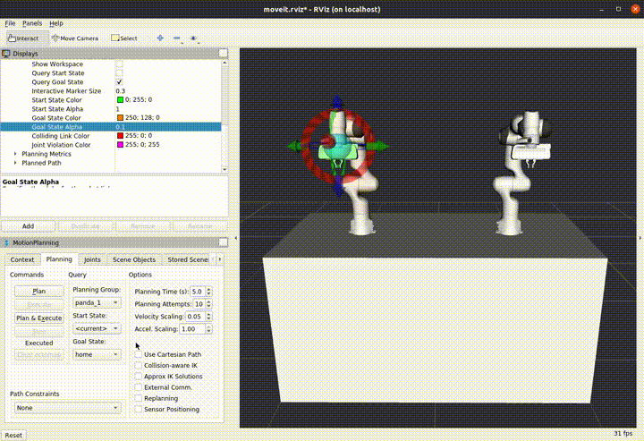

Simultaneous Trajectory Execution
==================================

Introduction
------------
MoveIt allows simultaneous execution of trajectories, as long as each trajectory uses a different set of controllers. For example, in a dual arm environment, each arm can execute a different set of trajectories without needing to wait for the other arm to finish moving or manually synchronizing the motion of both arm into a single trajectory. Optionally, a collision check is performed right before execution of new trajectories to prevent collisions with active trajectories.

The following GIF shows a simple example of simultaneous execution of trajectories through the **Rviz Motion Planning** plugin.

This tutorial presents how to use the Simultaneous Trajectory Execution feature through the `Move Group C++ Interface <../move_group_interface/move_group_interface_tutorial.html>`_ but it can be similarly used through the `Move Group Python Interface <../move_group_python_interface/move_group_python_interface_tutorial.html>`_ or `MoveIt Cpp <../moveit_cpp/moveitcpp_tutorial.html>`_.

Getting Started
---------------
If you haven't already done so, make sure you've completed the steps in `Getting Started <../getting_started/getting_started.html>`_.

(Optional) Setup
---------------
The simultaneous execution feature is active by default. However, through the following dynamic reconfigure parameter, it can be disabled, **/move_group/trajectory_execution/enable_simultaneous_execution**.
Similarly, an extra layer of collision checking, performed right before execution of trajectories has been added to the `TrajectoryExecutionManager`, which can also be disabled through the dynamic reconfigure parameter **/move_group/trajectory_execution/enable_collision_checking**.

Running the code
----------------
Open two shells. In the first shell start RViz and wait for everything to finish loading: ::

  roslaunch moveit_resources_dual_panda_moveit_config demo.launch

In the second shell, run the launch file for this demo: ::

  roslaunch moveit_tutorials simultaneous_trajectory_execution_tutorial.launch

Expected Output
---------------
In a robotic environment with two Franka Panda robot arms, two different trajectories are planned, one for each robot arm. Then both trajectory are simultaneously executed.

The entire code
---------------
The entire code can be seen :codedir:`here in the MoveIt GitHub project<simultaneous_trajectory_execution>`.

.. tutorial-formatter:: ./src/simultaneous_trajectory_execution_tutorial.cpp

The launch file
---------------
The entire launch file is :codedir:`here <simultaneous_trajectory_execution/launch/simultaneous_trajectory_execution_tutorial.launch>` on GitHub. All the code in this tutorial can be compiled and run from the moveit_tutorials package.
