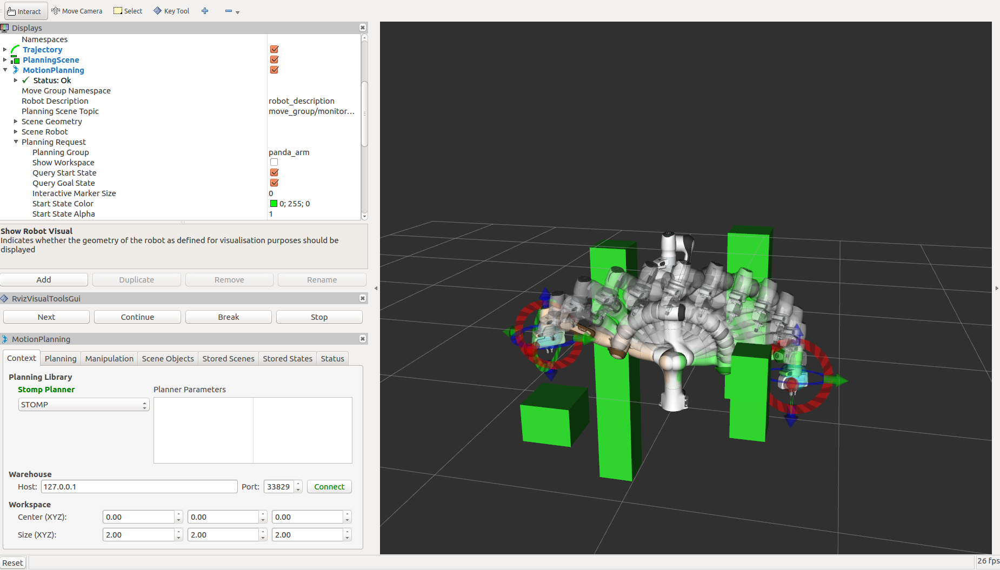

STOMP Planner
=============



Stochastic Trajectory Optimization for Motion Planning (STOMP) is a probabilistic optimization framework (Kalakrishnan et al. 2011). STOMP produces smooth well behaved collision free paths within reasonable times. The approach relies on generating noisy trajectories to explore the space around an initial (possibly infeasible) trajectory which are then combined to produce an updated trajectory with lower cost. A cost function based on a combination of obstacle and smoothness cost is optimized in each iteration. No gradient information is required for the particular optimization algorithm that we use and so general costs for which derivatives may not be available (e.g. costs corresponding to constraints and motor torques) can be included in the cost function. Some of the strengths of STOMP include: it can incorporate additional objective functions such as torque limits, energy and tool constraints. STOMP can handle cost functions which do not need to be differentiable. It uses distance field and spherical approximations to quickly compute distance queries and collision costs. Integration into Kinetic and Melodic version of MoveIt is work in progress. `More info <https://personalrobotics.ri.cmu.edu/files/courses/papers/Kalakrishnan11-stomp.pdf>`_

Getting Started
---------------
If you haven't already done so, make sure you've completed the steps in `Getting Started <../getting_started/getting_started.html>`_.

You should also have gone through the steps in `Visualization with MoveIt RViz Plugin <../quickstart_in_rviz/quickstart_in_rviz_tutorial.html>`_

Prerequisites
-------------
 1. You must have the latest version of MoveIt installed. On ROS Melodic you will need to build MoveIt from source. A build from source is required as STOMP is not part of the official release yet. It is therefore not included in the binary packages. We will go through the steps for doing this below.
 2. To use STOMP with your robot you must already have a MoveIt configuration package for your robot already. For example, if you have a Panda robot, it's probably called ``panda_moveit_config``. This is typically built using the `MoveIt Setup Assistant <../setup_assistant/setup_assistant_tutorial.html>`_.
 3. You must also have built `ros-industrial/industrial_moveit package <https://github.com/ros-industrial/industrial_moveit>`_ from source. This needs to be built from source since industrial_moveit is not released as a debian yet. You only need to build the `stomp_core <https://github.com/ros-industrial/industrial_moveit/tree/kinetic-devel/stomp_core>`_ package from industrial_moveit as other packages are not required for the functionality of STOMP with moveIt.

Installing MoveIt from Source
------------------------------
As you add and remove packages from your workspace you will need to clean your workspace and re-run the command to install new missing dependencies. Clean your workspace to remove references to the system wide installation of MoveIt: ::

  cd ~/ws_moveit/src
  catkin clean

Now follow the instructions on the MoveIt homepage for `installing MoveIt Melodic from source <http://moveit.ros.org/install/source/>`_. Note that you can skip the **Prerequisites** section since you should already have a Catkin workspace.

Re-source the setup files: ::

  source ~/ws_moveit/devel/setup.bash

Using STOMP with Your Robot
---------------------------
**Note:** if you are following this demo using the ``panda_moveit_config`` from the `ros-planning/panda_moveit_config <https://github.com/ros-planning/panda_moveit_config>`_ repository, these steps are already done for you and you can skip steps 1-3 and you only need to do step 4.

#. Simply download `stomp_planning_pipeline.launch.xml <https://github.com/ros-planning/panda_moveit_config/blob/melodic-devel/launch/stomp_planning_pipeline.launch.xml>`_ file into the launch directory of your MoveIt config package. In our case, we will save this file in the ``panda_moveit_config/launch`` directory. Place the file "*stomp_planning_pipeline.launch.xml*" file in the **launch** directory of your **moveit_config** package. **Note:** The latest version of MoveIt Setup Assistant will generate this launch file for you. The file should contain the following: ::

    <launch>
      <!-- Stomp Plugin for MoveIt -->
      <arg name="planning_plugin" value="stomp_moveit/StompPlannerManager" />

      <!-- The request adapters (plugins) ORDER MATTERS -->
      <arg name="planning_adapters" value="default_planner_request_adapters/AddTimeParameterization
                                           default_planner_request_adapters/FixWorkspaceBounds
                                           default_planner_request_adapters/FixStartStateBounds
                                           default_planner_request_adapters/FixStartStateCollision
                                           default_planner_request_adapters/FixStartStatePathConstraints" />
      <arg name="start_state_max_bounds_error" value="0.1" />
      <param name="planning_plugin" value="$(arg planning_plugin)" />
      <param name="request_adapters" value="$(arg planning_adapters)" />
      <param name="start_state_max_bounds_error" value="$(arg start_state_max_bounds_error)" />
      <rosparam command="load" file="$(find panda_moveit_config)/config/stomp_planning.yaml"/>
    </launch>

#. Adjust the line ``<rosparam command="load" file="$(find panda_moveit_config)/config/stomp_planning.yaml" />`` to ``<rosparam command="load" file="$(find <robot_moveit_config>)/config/stomp_planning.yaml" />`` replacing ``<robot_moveit_config>`` with the name of your MoveIt configuration package.
#. Download `stomp_planning.yaml <https://github.com/ros-planning/panda_moveit_config/blob/melodic-devel/config/stomp_planning.yaml>`_ file into the config directory of your MoveIt config package. In our case, we will save this file in the ``panda_moveit_config/config`` directory. Create the "*stomp_planning.yaml*" configuration file. This file contains the parameters required by STOMP.  The parameters are specific to each ''planning group'' defined in   the SRDF file.  So if there are three planning groups, then the configuration file defines a specific set of parameters for each  planning group. In our case there is only one planning group, i.e., the "panda_arm".

   **>** *Save this file in the* **config** *directory of the moveit_config package*. Also make sure that the dimensionality of the `stddev` array parameter is the same as the number of joints present in the planning group name of your robot.

#. Modify the **move_group.launch** file. Open the **move_group.launch** in the launch directory and change the ```pipeline``` parameter value to ```stomp``` as shown below: ::

    <!-- move_group settings -->
    <arg name="allow_trajectory_execution" default="true"/>
    <arg name="fake_execution" default="false"/>
    <arg name="max_safe_path_cost" default="1"/>
    <arg name="jiggle_fraction" default="0.05" />
    <arg name="publish_monitored_planning_scene" default="true"/>

    <!-- Planning Functionality -->
    <include ns="move_group" file="$(find myworkcell_moveit_config)/launch/planning_pipeline.launch.xml">
      <arg name="pipeline" value="stomp" />
    </include>

Running the Demo
----------------
If you have the ``panda_moveit_config`` from the `ros-planning/panda_moveit_config <https://github.com/ros-planning/panda_moveit_config>`_ repository you should be able to simply run the demo: ::

  roslaunch panda_moveit_config demo.launch

Running STOMP with Obstacles in the Scene
+++++++++++++++++++++++++++++++++++++++++
To run STOMP in an evironment with obstacles, you can run the sample python script:

  :codedir:`collision_scene_example.py<collision_environments/scripts/collision_scene_example.py>`.

This scripts creates a cluttered scene with four ostacles or a simple scene with one obstacle depending on the argument given to the script. One can also change the position/size of the obstacles to change the scene.

To run the STOMP planner with obstacles, open two terminals. In the first terminal start RViz and wait for everything to finish loading: ::

  roslaunch panda_moveit_config demo_stomp.launch

In the second terminal, run either of the two commands: ::

  rosrun moveit_tutorials collision_scene_example.py cluttered

or: ::

  rosrun moveit_tutorials collision_scene_example.py sparse

Next, in RViz, select STOMP in the MotionPlanning pannel under the Context tab. Set the desired start and goal states by moving the end-effector around with the imarker and then click on the Plan button under the Planning tab in the MotionPlanning pannel to start planning. The planner will now attempt to find a feasible solution between the given start and end position. STOMP performs better than CHOMP in avoiding obstacles. This is due to STOMP's stochastic nature which produces non-jerky trajectories as opposed to CHOMP which often produces jerky paths to avoid obstacles.

Tweaking some of the parameters for STOMP
-----------------------------------------
STOMP has some parameters associated with it. These can be modified for the given environment/robot you are working with and is normally present in the `stomp_planning.yaml <https://github.com/ros-planning/panda_moveit_config/blob/melodic-devel/config/stomp_planning.yaml>`_ file in config folder of the robot you are working with. If this file does not exist for your robot, you can create it and set the parameter values as you want. The following are the insights to set up these parameter values for some of them:

**Optimization Parameters**:

- *num_timesteps*: the number of timesteps the optimizer can take to find a solution before terminating.

- *num_iterations*: this is the number of iterations that the planner can take to find a good solution while optimization.

- *num_iterations_after_valid*: maximum iterations to be performed after a valid path has been found.

- *num_rollouts*: this is the number of noisy trajectories.

- *max_rollouts*: the combined number of new and old rollouts during each iteration should not exceed this value.

- *initialization method*: this is the initialization method chosen to select the means to initialize the trajectory.

- *control_cost_weight*: this is the percentage of the trajectory accelerations cost to be applied in the total cost calculation.

**Noise Generator Parameters**:

- *class*: this can be set to "NormalDistributionSampling" (default) or "GoalGuidedMultivariateGaussian". Depending on what class is used specific parameters need to be set. Have a look at `this link <https://github.com/ros-industrial/industrial_moveit/blob/kinetic-devel/stomp_plugins/example_pages.dox>`_ for setting parameters if using the "GoalGuidedMultivariateGaussian".

- *stddev*: this is the degree of noise that can be applied to the joints. Each value in this array is the amplitude of the noise applied to the joint at that position in the array. For instace, the leftmost value in the array will be the value used to set the noise of the first joint of the robot (panda_joint1 in our case). The dimensionality of this array should be equal to the number of joints in the planning group name. Larger "stddev" values correspond to larger motions of the joints.

**Cost Function Parameters**:

- *class*: here you can set the cost function you want to use. You could set this to "CollisionCheck", "ObstacleDistanceGradient" or "ToolGoalPose". Depending on what you put here, you need to set the appropriate cost function class's parameters: For "CollisionCheck", you need to set the parameters (collision_penalty, cost_weight, kernel_window_percentage, longest_valid_joint_nove); for "ObstacleDistanceGradient", you should set the parameters (cost_weight, max_distance, longest_valid_joint_move) and for "ToolGoalPose", you should set the parameters (constrained_dofs, position_error_range, orientation_error_range, position_cost_weight, orientation_cost_weight). Have a look at `this link <https://github.com/ros-industrial/industrial_moveit/blob/kinetic-devel/stomp_plugins/example_pages.dox>`_ for setting parameters for "ToolGoalPose" class.

- *collision_penalty*: this is the value assigned to a collision state.

- *cost_weight*: unused parameter.

- *kernel_window_percentage*: the multiplicative factor used to compute the window_size for doing kernel smoothing.

- *longest_valid_joint_move*: this parameter indicates how far can a joint move in between consecutive trajectory points.

**Update Filter parameters**:

- class: this can be set to "PolynomialSmoother" or "ConstrainedCartesianGoal". Specific paramters need to be set depending on the chosen class. For setting parameters for "ConstrainedCartesianGoal", have a look at `this link <https://github.com/ros-industrial/industrial_moveit/blob/kinetic-devel/stomp_plugins/example_pages.dox>`_.

- *poly_order*: this is the order of the polynomial function used for smoothing trajectories.


Choosing parameters for STOMP requires lesser intuition than CHOMP. One can have the default parameters for STOMP and this works well in most environments. However you could increase the number of timesteps, number of rollouts and play around with the stddev array for STOMP to perform well under complicated environments so that STOMP can find an optimal path in these situations. Alternatively you can try different cost functions, noise generators, update filter classes by setting whichever ones you want in the stomp_config.yaml file.


Difference between plans obtained by STOMP, CHOMP and OMPL
----------------------------------------------------------

In this section a distinction is made between paths obtained from STOMP, CHOMP and OMPL. STOMP. Some of the moveIt planners tend to produce jerky trajectories and may introduce unnecessary robot movements. A post processing smoothing step is usually needed. In contrast as STOMP tends to produce smooth well behaved motion plans in a short time, there is no need for a post processing smoothing step as required by some other motion planners. CHOMP optimizes a given initial naive trajectory based on convarient and functional gradient approaches. CHOMP is entirely based on trajectory optimization. OMPL is an open source library for sampling based / randomized motion planning algorithms.  Sampling based algorithms are probabilistically complete: a solution would be eventually found if one exists, however non-existence of a solution cannot be reported. These algorithms are efficient and usually find a solution quickly. Now a qualitative analysis is performed for these planners below:

- **Local Minima Handling**: STOMP can avoid local minima due to its stochastic nature. CHOMP however is prone to and gets often stuck in local minima, thereby avoiding an optimal solution. As per the STOMP and CHOMP papers, STOMP performs better. CHOMP however due to its gradient based nature gets stuck in local minima and is often not able to find solution or returns sub-optimal solutions.

- **Time requirements**: the execution times are comparable, even though CHOMP requires more iterations to achieve success than STOMP. This is mainly because each iteration of STOMP requires multiple trajectory cost evaluations, but can make larger steps in a more stable fashion than the CHOMP gradient update rule. OMPL algorithms are efficient and usually find a solution quickly.

- **Parameter tuning**: CHOMP generally requires additional parameter tuning than STOMP to obtain a successful solution. OMPL does not require a lot of parameter tuning, the default parameters do a good job in most situations.

- **Obstacle Handling**: For scenes containing obstacles, STOMP often is able to successfully avoid obstacles due to its stochastic nature. CHOMP however generates paths which do not prefer smooth trajectories by addition of some noise (*ridge_factor*) in the cost function for the dynamical quantities of the robot (like acceleration, velocity). OMPL also generates collision free smooth paths in the presence of obstacles.

Running STOMP Unit Tests
------------------------

For running the unit tests, you must have the `stomp_core <https://github.com/ros-industrial/industrial_moveit/tree/kinetic-devel/stomp_core>`_ package from `ros-industrial/industrial_moveit <https://github.com/ros-industrial/industrial_moveit>`_ repository. If these tests run successfully, this implies STOMP is successfully built and running on your system. To run the STOMP unit tests, open a terminal and do the following in your catkin workspace: ::

  catkin_make run_tests_stomp_moveit stomp_moveit_utest
