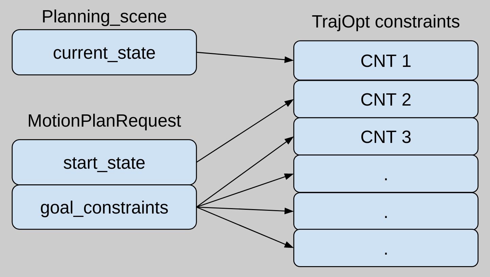
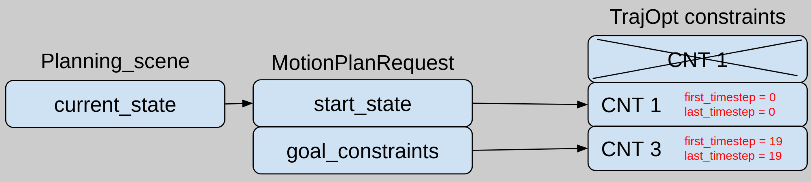

TrajOpt Planner
===============

.. note:: The TrajOpt planner is still an alpha feature of MoveIt from a summer 2019 intern project, and needs further hardening. Please contact hello@picknik.ai if you are interested in further development.

TrajOpt is a sequential convex optimization algorithm for motion planning problems where the non-convex, non-affine equality, and non-equality constraints are relaxed, approximately linearized and convexified to create an objective function. This work has been done based on [schulman2013]_ and the `original implementation <https://github.com/ros-industrial-consortium/trajopt_ros>`_. Sequential convex programming, simply refers to using a convex model and repeatedly minimizing it. Consider the following non-convex problem:

.. image:: non_convex.png
   :width: 220px

where *f(x)* is the minimum-length path given by

The basic idea is to iterate by maintaining an estimate of the solution and a convex trust region over which we trust our solution. The two key points are:

- convex approximation of *f(x)* and *g(x)* over the trust region. Then the approximated ones are converted to penalty functions.
- affine approximation of *h(x)* over the trust region. Then the approximated *h(x)* is convetered to penalty function by considering its absolute value.

 The following figure shows how TrajOpt algorithm works

.. image:: algorithm.png
   :width: 400px

The bold italic parameters are the ones loaded from yaml file. All the constraints including obstacle avoidance, joint limits and target poses in joint space or Cartesian space are converted to penalty functions so they make the final objective function. The most inner loop is where sequential quadratic programming is used as a trust region method. It calculates the second-order Taylor approximation in a box trust region.

One important part of TrajOpt is how the obstacle avoidance constraint is formulated. In discrete case, the constraint is basically the difference between the signed distance (between robot link with itself or with obstacles) and a safe value and in the continuous case, the signed distance is between convex hull of two waypoints and obstacles.

**Note:** The current implementation of TrajOpt supports constraints in joint space only.

Getting Started
---------------
If you haven't already done so, make sure you've completed the steps in `Getting Started <../getting_started/getting_started.html>`_.

You should also have gone through the steps in `Visualization with MoveIt RViz Plugin <../quickstart_in_rviz/quickstart_in_rviz_tutorial.html>`_

Prerequisites
--------------
To use TrajOpt with your robot you must already have a MoveIt configuration package for your robot. For example, if you have a Panda robot, it's called ``panda_moveit_config``. This is typically configured using the `MoveIt Setup Assistant <../setup_assistant/setup_assistant_tutorial.html>`_.

**Note:** in this tutorial, we use ``panda_moveit_config`` from the `ros-planning/panda_moveit_config <https://github.com/ros-planning/panda_moveit_config>`_ repository which contains the necessary config files for trajopt planner.

Running the Demo
----------------
To run the example, you need to run ``panda_moveit_config`` from the `ros-planning/panda_moveit_config <https://github.com/ros-planning/panda_moveit_config>`_ repository at first by passing ``trajopt`` as the planner: ::

  roslaunch panda_moveit_config demo.launch  pipeline:=trajopt

Then you can run the trajopt example from `ros-planning/moveit_tutorials <https://github.com/ros-planning/moveit_tutorials>`_: ::

  roslaunch moveit_tutorials trajopt_example_launch.launch

How TrajOpt works
-----------------
Motion planning problem in TrajOpt is defined by a set of cost (COST) and constraints (CNT) functions that are added to ``TrajOptProblem`` through ``ConstructProblem`` function. This function gets the information regarding to the problem (``ProblemInfo``) which carries different types of information explained below:

- **BasicInfo**: This type holds general information of the optimization algorithm. (These parameters are further investigated in the following section):
  * `n_steps`: The number of steps from start to goal
  * `convex_solver`: Which convex solver is to be used
  * `use_time`: Set to `false` value to use a unitless timestep. x1-x0 is the velocity
  * `start_fixed`: Set to `true` to add a constraint for the current joint value

- **InitInfo**: It defines how to initialize the optimization problem by setting a guessed trajectory in a matrix whose number of rows is the same as number of timesteps and whose number of columns is equal to the degrees of freedom. There are three different types for initialization:

  - *STATIONARY*: the initialization matrix has joint values of the current state for all timesteps.

  - *JOINT_INTERPOLATED*: the initialization matrix is a trajectory interpolated between the current state and the joint state that the user provides for ``data`` member.

  - *GIVEN_TRAJ*: the user provides the entire trajectory for ``data`` member.

- **TermInfo**: This is the base struct for all types of COST and CNT functions that are carried by ``cost_infos`` and ``cnt_infos`` members. COST functions are the objectives that are supposed to be minimized and CNT are the ones that must be satisfied. The current implementation containts ``JointPoseTermInfo``, ``JointVelTermInfo`` (hard-coded) and ``CartPoseTermInfo`` (is partially implemented). Member *term_type* dictates the type of the term we are adding; it could be ``TT_COST`` or ``TT_CNT`` which means a cost term or constraint term respectively. Also ``TT_USE_TIME`` can be selected for this member which allows time parameterization. In this case *use_time* of ``BasicInfo`` should be set to ``true`` as well.  The other parameters of these terms which need to be set are loaded from ``trajopt_planning.yaml`` file. The following list describes these parametrs:

  - *coeffs*: weight coefficients for joints

  - *targets*: the values of the joints at the constraint

  - *upper_tols*: the upper limits for joint values at the constraint

  - *lower_tols*: the lower limits for joint values at the constraint

  - *first_step*: the first step that is the term is applied to

  - *last_step*: the last step that is the term is applied to

Moreover, the algorithm needs parameters specific to ``BasicTrustRegionSQP`` which are defined in a yaml file under *trajopt_param*.

The following flowchart illustrates how the problem gets constructed:

.. image:: trajopt.png
   :width: 700px

How to use TrajOpt
------------------
In this section, we describe how to convert the request in MoveIt to TrajOpt constraints. The first important point is that in TrajOpt, we can have the start state to be different than current state. Basically, any joint state that we want the robot pass through is just a constraint that should be added to the objective function. This joint state can be received from start state in MoveIt ``MotionPlanRequest`` or the current state from Planning Scene. The designed architecture for TrajOpt in MoveIt creates *JointPoseTermInfo* for all the constraints in *goal_constraints* and *start_state* of ``MotionPlanRequest``. On the other hand, current state of the robot also can be a constraint to add as a *JointPoseTermInfo* if the user wants the robot to start from the current state. Look at the following figure for a an example with two goal constraints:

*start_fixed* is the parameter that determines the relation between current state and start state. If it is set to true, then the algorithm adds a constraint to restrict the trajectory to start from the current state. If it is false, then the trajectory will start from request start state. The following two gifs show the above example in action; notice the difference between starting from the current state and starting from the request start state, left and right respectively:

.. image:: start_fixed_true.gif
   :width: 250px

.. image:: start_fixed_false.gif
   :width: 250px

The use case example of this is when we are trying to execute a process like sanding, the critical part is the actual process path not how we get to the start of the process path. So we plan the process path first leaving the start free to hopefully get the most optimal and then we plan from the current location start fixed to the start of the process path.

Two other important parameters are *first_timestep* and *last_timestep*. These are the steps that we want a specific ``TermInfo`` gets applied to. For our example in this section, we have one constraint from request start state and two goal constraints as well as the current state constraint. If the number of steps (*num_stpes*) is set to 20, then the index that our last goal constraint applied to is 19.  The user does not set the parameters of current state constraint that is created by *start_fixed=true*; its timestep is set to 0 by default. So basically the figure above changes to the following if we add the steps the constraints are applied to:

.. image:: req_traj_steps.png
   :width: 400px

*term_type* of the above constraint should be set to *TT_CNT* as we want the robot pass through all those states exactly.

Note that if we want to use TrajOpt through MotionPlanning Display in RViz, we should set *start_fixed* to false as the current state of the robot is sent through request start state, meaning current and start are the same so we do not need two constraints (that are the same) for the same state. In this case, do not forget to set the *first_timestep* and *last_timestep* of the start state constraint to zero. So our example above changes to the following:

For any new joint constraint, the corresponding information should be added to the yaml file. The current implementatoin can only handle the joint space constraints as ``JointPoseTermInfo`` from ``TermInfo``. The some of the remaining constraints to add are ``JointAccTermInfo``, ``JointJerkTermInfo``, ``CartPoseTermInfo``, ``TotalTimeTermInfo`` and ``CollisionTermInfo``.

References
---------------------------------------------------

.. [schulman2013] Schulman, John & Ho, Jonathan & Lee, Alex & Awwal, Ibrahim & Bradlow, Henry & Abbeel, Pieter. (2013). Finding Locally Optimal, Collision-Free Trajectories with Sequential Convex Optimization. 10.15607/RSS.2013.IX.031.
