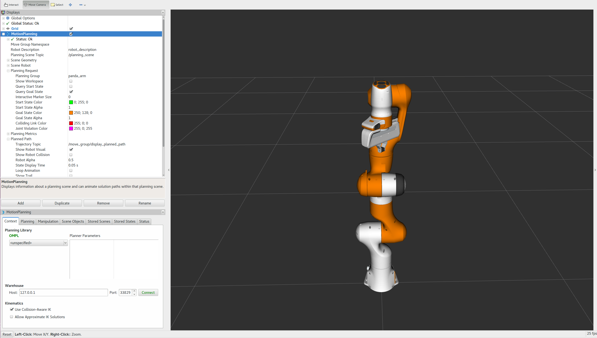
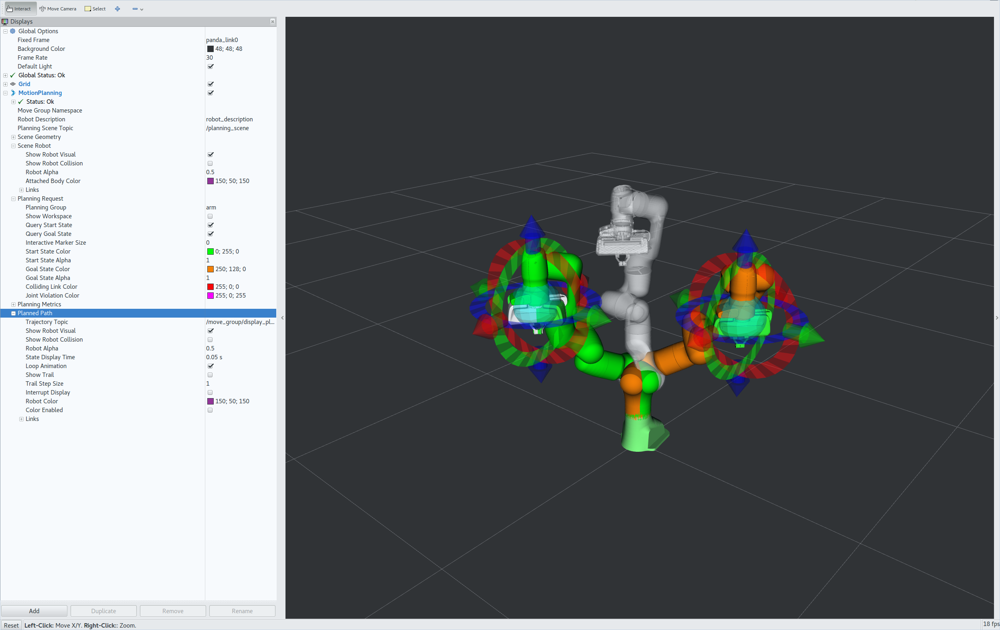
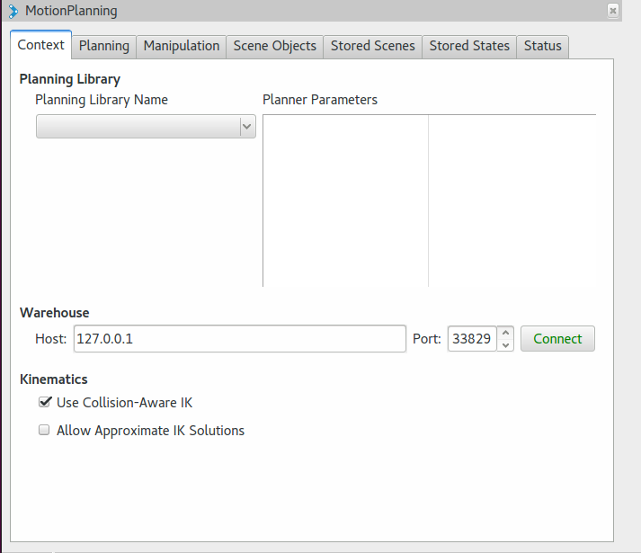
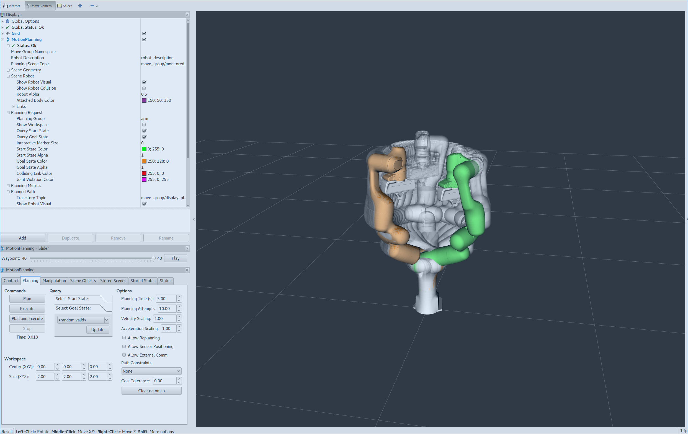
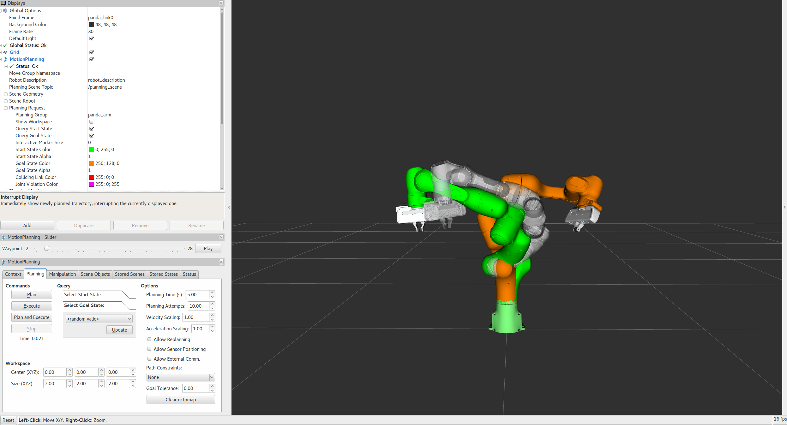

Visualization with the MoveIt! RViz Plugin
===============================================

MoveIt! comes with a plugin for the ROS Visualizer (RViz). The plugin allows you to setup scenes in which the robot will work, generate plans, visualize the output and interact directly with a visualized robot. We will explore the plugin in this tutorial.

Getting Started
---------------
If you haven't already done so, make sure you've completed the steps in `Getting Started <../getting_started/getting_started.html>`_.

Step 1: Launch the Demo and Configure the Plugin
------------------------------------------------

* Launch the demo: ::

   roslaunch panda_moveit_config demo.launch

* If you are doing this for the first time, you may have to add the Motion Planning Plugin.

  * In the RViz Displays Tab, press *Add*

  * From the moveit_ros_visualization folder, choose "MotionPlanning" as the DisplayType. Press "Ok".

.. image:: rviz_plugin_motion_planning_add.png
   :width: 300px

* In the "Global Options" tab of the "Displays" subwindow, set the **Fixed Frame** field to "/panda_link0"

.. image:: rviz_motion_planning.png
   :width: 700px

* Now, you can start configuring the Plugin for your robot (the Panda in this case). Click on "MotionPlanning" within "Displays".

  * Make sure the **Robot Description** field is set to ``robot_description``

  * Make sure the **Planning Scene Topic** field is set to ``/planning_scene``.

  * In **Planning Request**, change the **Planning Group** to ``panda_arm``.

  * In **Planned Path**, change the **Trajectory Topic** to ``/move_group/display_planned_path``.

Step 2: Play with the Visualized Robots
---------------------------------------
There are four different overlapping visualizations:

#. The robot's configuration in the ``/planning scene`` planning environment (active by default).

#. The planned path for the robot (active by default).

#. Orange: The goal state for motion planning (active by default).

#. Green: The start state for motion planning (disabled by default).

The display states for each of these visualizations can be toggled on and off using checkboxes.

#. The start state using the **Query Start State** checkbox in the **Planning Request** tab.

#. The goal state using the **Query Goal State** checkbox in the **Planning Request** tab.

#. The planning scene robot using the **Show Robot Visual** checkbox in the **Scene Robot** tab.

#. The planned path using the **Show Robot Visual** checkbox in the **Planned Path** tab.

* Play with all these checkboxes to switch on and off different visualizations.

.. image:: rviz_plugin_visualize_robots.png
   :width: 400px

Step 3: Interact with the Panda
-------------------------------

* Press **Interact** in the top menu of RViz (Note: some tools may be hidden, press **+** in the top menu to add the **Interact** tool as shown below). You should see a couple of interactive markers appear for the arm of the Panda.

    * One marker (corresponding to the orange colored right arm) will be used to set the "Goal State" for motion planning. Another marker corresponding to a green colored representation of the right arm will be used to set the "Start State" for motion planning.

    * You will be able to use these markers (which are attached to the tip link of each arm) to drag the arm around and change its orientation.

Moving into Collision
+++++++++++++++++++++

Note what happens when you try to move one of the arms into collision with the other. The two links that are in collision will turn red.

.. image:: rviz_plugin_collision.png
   :width: 700px

The "Use Collision-Aware IK" checkbox found within the MotionPlanning plugin allows you to toggle the behavior of the IK solver. When the checkbox is ticked, the solver will keep attempting to find a collision-free solution for the desired end-effector pose. When it is not checked, the solver will allow collisions to happen in the solution. The links in collision will always still be visualized in red, regardless of the state of the checkbox.

Moving out of Reachable Workspace
+++++++++++++++++++++++++++++++++

Note also what happens when you try to move an end-effector out of its reachable workspace.

.. image:: rviz_plugin_invalid.png
   :width: 700px

Step 4: Use Motion Planning with the Panda
-------------------------------------------

* Now, you can start motion planning with the Panda in the MoveIt! RViz Plugin.

  * Move the Start State to a desired location.

  * Move the Goal State to another desired location.

  * Make sure both states are not in collision with the robot itself.

  * Make sure the Planned Path is being visualized. Also check the
    **Show Trail** checkbox in the **Planned Path** tab.

* In the **MotionPlanning** window under the **Planning** tab, press the **Plan** button. You
  should be able to see a visualization of the arm moving and a trail.

Introspecting Trajectory Waypoints
++++++++++++++++++++++++++++++++++

*Available since: Indigo 0.7.10, Kinetic and Lunar 0.9.7*

You can visually introspect trajectory point by point on RViz.

* From "`Panel`" menu, enable "`MotionPlanning - Slider`" that is disabled by default. You'll see a new Slider panel on RViz.

* Set your goal pose, then run `Plan`.

* Play with the "`Slider`" panel, e.g. move the slider, push "`Play`" button.

NOTE: Once you placed your EEF to a new goal, be sure to run `Plan` before running `Play` -- otherwise you'll see the waypoints for the previous goal if available.

