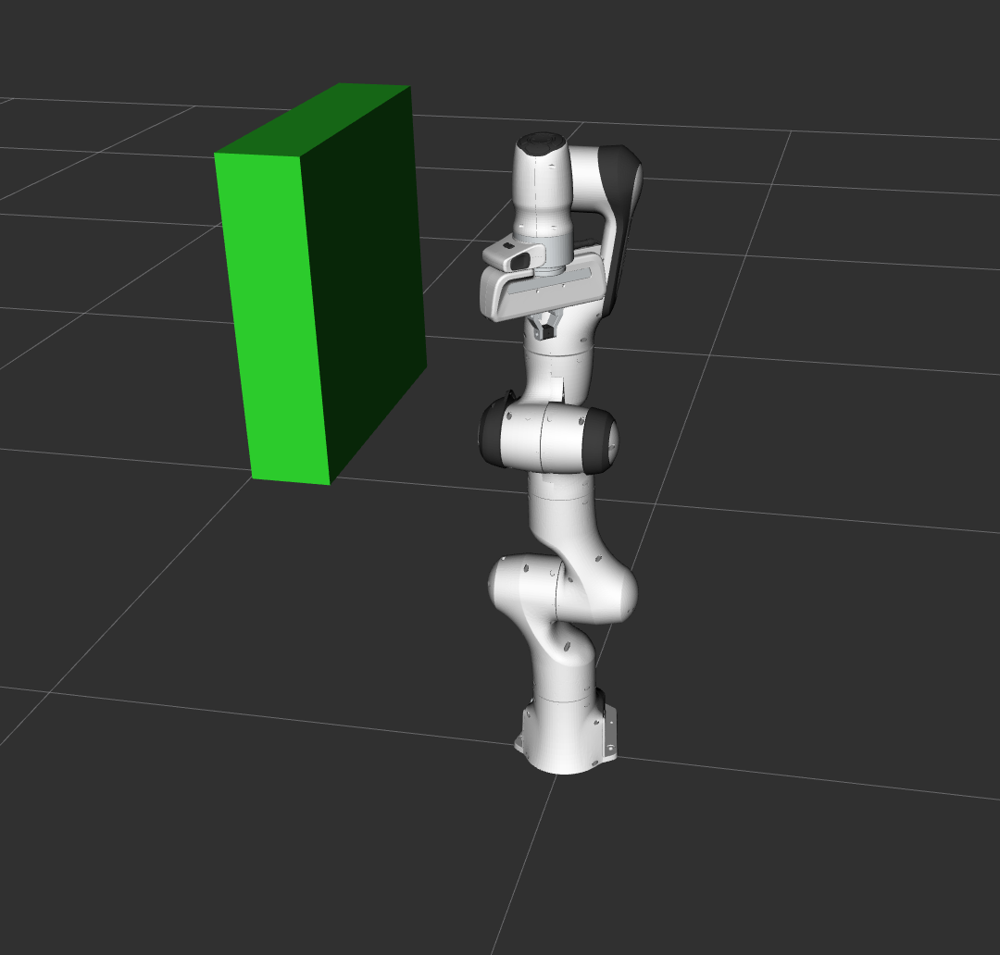

Move Group C++ インタフェース
==================================
.. image:: move_group_interface_tutorial_start_screen.png
   :width: 700px

MoveItにおける最も簡単なインタフェースは :move_group_interface:`MoveGroupInterface` クラスです．このクラスから，特定の関節角度や姿勢の設定，モーションプランニングの設定，ロボットの動作，環境への物体の追加とロボットへの取り付け/取り外し等様々な機能を利用することができます．このインタフェースはROSのトピック，サービス，アクションを通して `MoveGroup ノード <http://docs.ros.org/indigo/api/moveit_ros_move_group/html/annotated.html>`_ と通信しています．

`YouTubeデモビデオ <https://youtu.be/_5siHkFQPBQ>`_ をご覧いただければ，Move Group インタフェースの強力な機能を理解していただけるかと思います！

はじめに
---------------
まだ `はじめに <../getting_started/getting_started.html>`_ を終わらせていない方は，先にそちらをご覧ください．

コードを実行する
----------------
まずは２つの端末を開いてください．そして１つめの端末で下記コマンドを実行し，RVizが開いてすべてのロードが完了するまで待機してください． ::

  roslaunch panda_moveit_config demo.launch

完了したら，２つめの端末で下記コマンドを実行してください． ::

  roslaunch moveit_tutorials move_group_interface_tutorial.launch

.. note:: 本チュートリアルではすべてのデモで"**RvizVisualToolsGui**"パネルを利用して行います．このパネルを追加するには， `MoveItクイックスタート with RViz <../quickstart_in_rviz/quickstart_in_rviz_tutorial.html#rviz-visual-tools>`_ をご覧ください．

しばらくすると，ページ冒頭のようなウィンドウが表示されます． デモを次のステップへ進める場合には，"**RVizVisualToolsGui**"パネルの"**Next**"ボタンを押下するか，RVizウィンドウが選択されてる状態で"**Tools**"パネルの"**Key Tool**"を選択し，キーボードの"**N**"を押してください．

動作確認
---------------
ページの冒頭にも記載した `YouTubeデモビデオ <https://youtu.be/_5siHkFQPBQ>`_ が，うまくいった場合の動作の様子です．"**Next**"を押下する度にRViz上で下記の動作が行われるか確認してください．:
 1. ロボットアームが初期姿勢から前に動く動作．（姿勢目標に到達する動作です．）
 2. ロボットアームが初期姿勢から横に動く動作．（目標関節角度に到達する動作です．）
 3. ロボットアームの初期姿勢が変更され，そこからエンドエフェクタを上向きに保ったまま動く動作．
 4. ロボットアームが直線軌道（三角形を描くような軌道）で動く動作．
 5. 下図のようにロボットアームの右に緑色のボックスが追加されるような動作．
    |B|

 6. ロボットアームが，追加された箱を避けて初期姿勢から目標姿勢まで動く動作．
 7. 追加された箱をロボットの手首に取り付ける動作．（箱の色がオレンジ色に変われば正解です．）
 8. 取り付けた箱を取り外す動作．（箱の色が緑色に戻ります．）
 9. 箱を環境から削除する動作．

コードの全容
---------------
すべてのソースコードは :codedir:`MoveIt GitHub プロジェクト内のこちら<move_group_interface/src/move_group_interface_tutorial.cpp>` から確認することができます．ここから先では，このソースコードの内容を一つずつ確認しながら，その機能を紹介します．

.. tutorial-formatter:: ./src/move_group_interface_tutorial.cpp

Launchファイル
---------------
すべてのLaunchファイルはGitHub上の :codedir:`こちら<move_group_interface/launch/move_group_interface_tutorial.launch>` から確認できます．また，本チュートリアルに記載されているすべてのソースコードは，MoveItのセットアップ時にダウンロードしてきた"**moveit_tutorials**"パッケージに格納されているものを実行しています．

公差の設定方法について
----------------------------
`MoveGroupInterface <http://docs.ros.org/melodic/api/moveit_ros_planning_interface/html/classmoveit_1_1planning__interface_1_1MoveGroupInterface.html>`_ の `setGoalTolerance()` メソッドとその関連メソッドはプランニングにしか適用されません．実行時の公差の設定ではないので注意してください．

もし，実行時の公差を設定したい場合で，"FollowJointTrajectory"コントローラを利用している場合は `controller.yaml` ファイルを編集してください．このコントローラを使用していない場合は，MoveItの動作計画から生成された"Trajectory"メッセージを直接編集してください．
