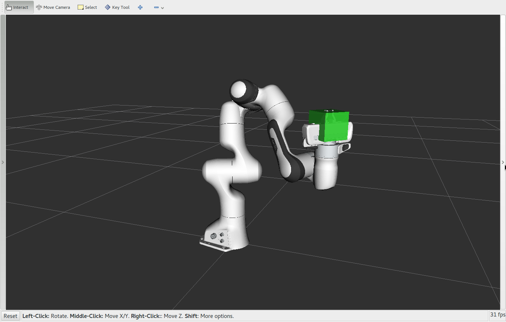

Move Group Python Interface
================================================

One of the simplest MoveIt user interfaces is through the Python-based Move Group Interface. These wrappers
provide functionality for most operations that the average user will likely need,
specifically setting joint or pose goals, creating motion plans, moving the
robot, adding objects into the environment and attaching/detaching objects from
the robot.

Watch this quick `YouTube video demo <https://youtu.be/3MA5ebXPLsc>`_ to see the power of the Move Group Python interface!

Getting Started
---------------
If you haven't already done so, make sure you've completed the steps in `Getting Started <../getting_started/getting_started.html>`_.

Start RViz and MoveGroup node
-----------------------------
Open two shells. Start RViz and wait for everything to finish loading in the first shell: ::

  roslaunch panda_moveit_config demo.launch

Now run the Python code directly in the other shell using ``rosrun``.
Note in some instances you may need to make the python script executable: ::

 rosrun moveit_tutorials move_group_python_interface_tutorial.py

Expected Output
---------------
In RViz, we should be able to see the following:

Press *<enter>* in the shell terminal where you ran the ``rosrun`` command in between each step
 #. The robot plans and moves its arm to the joint goal.
 #. The robot plans a path to a pose goal.
 #. The robot plans a Cartesian path.
 #. The robot displays the Cartesian path plan again.
 #. The robot executes the Cartesian path plan.
 #. A box appears at the location of the Panda end effector.
 #. The box changes colors to indicate that it is now attached.
 #. The robot plans and executes a Cartesian path with the box attached.
 #. The box changes colors again to indicate that it is now detached.
 #. The box disappears.

The Entire Code
---------------
Note: the entire code can be seen :codedir:`here in the tutorials GitHub repository<move_group_python_interface/scripts/move_group_python_interface_tutorial.py>`.

.. tutorial-formatter:: ./scripts/move_group_python_interface_tutorial.py

The Launch File
---------------
The entire launch file is :codedir:`here<move_group_python_interface/launch/move_group_python_interface_tutorial.launch>`
on GitHub. All the code in this tutorial can be run from the
``moveit_tutorials`` package that you have as part of your MoveIt setup.
